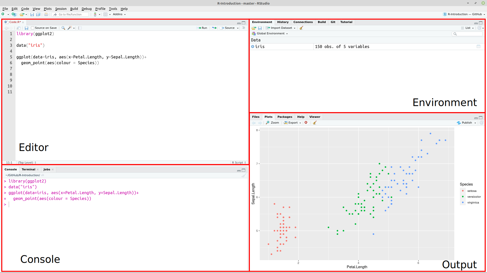
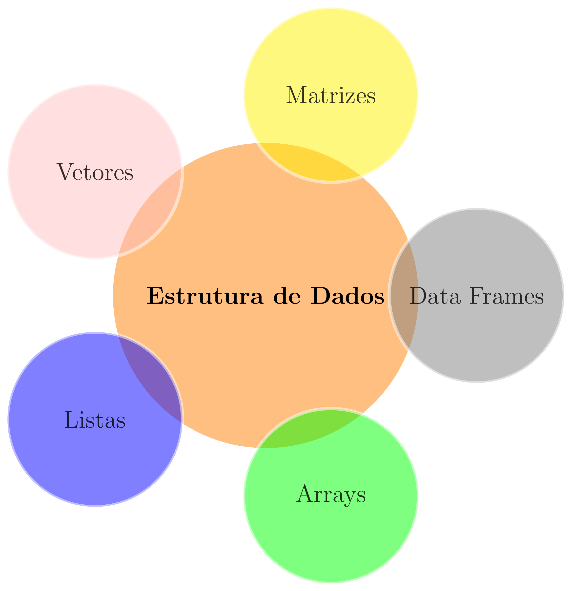

class: title-slide, center, middle
background-image: url(fig/slide-title/ufpa2.png), url(fig/slide-title/sciflor.png), url(fig/slide-title/ufes.png), url(fig/slide-title/img3.png)
background-position: 90% 90%, 50% 10%, 10% 90%
background-size: 250px, 300px, 100px, cover

```{r setup, include=FALSE}
knitr::opts_chunk$set(
  fig.showtext = TRUE,
  fig.align = "center", 
  cache = FALSE,
  error = FALSE,
  message = FALSE, 
  warning = FALSE, 
  collapse = TRUE ,
  dpi = 600)
```

```{css, echo=FALSE}
.with-logo::before {
	content: '';
	width: 120px;
	height: 120px;
	position: absolute;
	bottom: 1.3em;
	right: -0.3em;
	background-size: contain;
	background-repeat: no-repeat;
}

.logo-ufpa::before {
	background-image: url(fig/slide-title/ufpa.png);
}

.logo-dplyr::before {
	background-image: url(https://github.com/rstudio/hex-stickers/raw/master/PNG/dplyr.png);
}

.logo-purrr::before {
	background-image: url(https://github.com/rstudio/hex-stickers/raw/master/PNG/purrr.png);
}

.logo-plumber::before {
	background-image: url(https://github.com/rstudio/hex-stickers/raw/master/PNG/plumber.png);
}
```


```{r packages, include=FALSE}
# remotes::install_github("dill/emoGG")
library(ggplot2)
library(dplyr)
library(ggimage)
library(kableExtra)
```

```{r xaringan-logo, echo=FALSE}
library(xaringanExtra)
use_logo(
  image_url = "fig/slide-title/sciflor.png",
  position = css_position(top = "1.5em", right = "0.6em"),
  width = "210px",
  height = "210px"
)

use_scribble()

use_extra_styles(
  hover_code_line = TRUE,         #<<
  mute_unhighlighted_code = TRUE  #<<
)
xaringanExtra::use_editable(expires = 1)
#.can-edit[Você pode editar este título de slide]
#.can-edit.key-firstSlideTitle[Change this title and then reload the page]
use_clipboard()
```

```{r icon, echo=FALSE}
#remotes::install_github("mitchelloharawild/icons")
#remotes::install_github('emitanaka/anicon')
#library(icons)
#download_fontawesome()
#download_simple_icons()
```

<!-- title-slide -->
# Minicurso: Introdução ao R para Análise de Dados

## Parte 1 - Introdução à Linguagem <br> de Programação R `r anicon::faa("pagelines", animate="horizontal", colour="green")`

#### **Prof. Dr. Deivison Venicio Souza**
##### Universidade Federal do Pará (UFPA) 
##### Faculdade de Engenharia Florestal
##### E-mail: deivisonvs@ufpa.br
<br>
##### 1ª versão: 22/setembro/2021 <br> (Atualizado em: `r format(Sys.Date(),"%d/%B/%Y")`)

---

layout: true
class: with-logo logo-ufpa
<div class="my-header"></div>
<div class="my-footer"><span>Prof. Dr. Deivison Venicio Souza (E-mail: deivisonvs@ufpa.br)&emsp;&emsp;&emsp;&emsp;&emsp; <div3>Introdução ao R para Análise de Dados</div3>/ <div2>Parte 1 - Introdução à Linguagem de Programação R</div2> </div>

---


## Objetivos
<br><br>
Ao final desta primeira parte (Introdução à Linguagem de Programação R) espera-se que os participantes possam alcançar conhecimentos para...

* Entender a importância e reconhecer a praticidade de uso de Linguagem de Programação;
* Compreender e construir as principais estruturas de dados na Linguagem R;
* Realizar indexação de diferentes estruturas de dados no R; e
* Conhecer e aprender a usar operadores no R (aritméticos, relacionais, lógicos).
<!--* .red[Compreender e desenvolver suas próprias funções no R.]-->
<!-- * Compreender e aprender a usar estruturas de controle no R; -->
<!-- * Criar gráficos usando funções de pacotes do R-base; e -->
<!-- * Realizar uma análise exploratória de dados. -->
---

## Conteúdo

.pull-left-4[
**Parte 1 - Conhecendo o R e o IDE Rstudio**

[1- A linguagem R](#R)

[2 - Por que usar a linguagem R?](#pqR)

[3 - RGui - Download, instalação e interface](#RGui)

[4 - IDE RStudio - Download, instalação e interface](#Rstudio)

]

.pull-right-4[
.pull-down[
**Parte 2 - Estrutura de dados na linguagem R**

[1 - Vetores](#vet)

[2 - Matrizes](#mat)

[3 - Arrays](#arrays)

[4 - Data Frames](#df)

[5 - Listas](#list)

]
]

---

## Conteúdo

.pull-left-4[
**Parte 3 - Indexação no R**

[1 - Como fazer indexação no R?](#Ind)

[2 - Indexação de vetores](#IndV)

[3 - Indexação de matrizes](#IndM)

[4 - Indexação de arrays](#iae)

[5 - Indexação de data frames](#IndDF)

[6 - Indexação de listas](#IndL)
]


.pull-right-4[
.pull-down[
**Parte 4 - Funções no R**

[1 - Sintaxe](#yyy)

[2 - Criando funções no R](#xxx)

]
]

---

## Conteúdo

.pull-left-4[
**Parte 5 - Um pouco mais sobre o R**

[1 - Sintaxe da linguagem R](#Sint)

[2 - Operadores no R](#Oper)

&nbsp;&nbsp;&nbsp;&nbsp;[2.1 - Aritméticos](#arit)

&nbsp;&nbsp;&nbsp;&nbsp;[2.2 - Relacionais](#relac)

&nbsp;&nbsp;&nbsp;&nbsp;[2.3 - Lógicos](#log)

[3 - Funções matemáticas usuais](#FunsMat)

]

---

layout: false
name: conc
class: inverse, top, right
background-image: url(fig/part1/arara.jpg)
background-size: cover

.font200[**.yellow[Parte 1] <br> .white[Conhecendo o R e <br> o IDE Rstudio]**]

---

layout: true
class: with-logo logo-ufpa
<div class="my-header"></div>
<div class="my-footer"><span>Prof. Dr. Deivison Venicio Souza (E-mail: deivisonvs@ufpa.br)&emsp;&emsp;&emsp;&emsp;&emsp; <div3>Introdução ao R para Análise de Dados</div3>/ <div2>Parte 1 - Introdução à Linguagem de Programação R</div2> </div>

---
name: R
## Linguagem R

.pull-left-4[
.font90[
- É uma linguagem de programação de computadores de código aberto e gratuita;
- Criada em 1993: Ross Ihaka e por Robert Gentleman;
- Departamento de Estatística da Universidade de Auckland, Nova Zelândia;
- O R foi desenvolvido a partir da Linguagem S.
]
]

.pull-right-4[
.font90[
**Possui múltiplas facetas:**

- Pacotes para implementação de métodos estatisticos;
- Pacotes para visualização gráfica elegantes;
- Pacotes para criação de aplicações web, Dashboard;
- Pacote para geração de relatórios dinâmicos;
- Pacotes para criação de apresentações elegantes.
]
]

.pull-left-7[
```{r echo=FALSE, out.width='30%', fig.align='center', fig.cap='', dpi=600}
knitr::include_graphics("https://petsistemas.ufms.br/wp-content/uploads/2017/02/main-qimg-7012cde5b60209165cdc281d888b33ac.png")

```
]

.pull-left-7[
```{r echo=FALSE, out.width='30%', fig.align='center', fig.cap='', dpi=600}
knitr::include_graphics("https://blog.efpsa.org/wp-content/uploads/2019/04/pic1.png")

```

]

.pull-left-7[
```{r echo=FALSE, out.width='30%', fig.align='center', fig.cap='', dpi=600}
knitr::include_graphics("https://ggplot2.tidyverse.org/logo.png")
```
]

.pull-left-7[
```{r echo=FALSE, out.width='30%', fig.align='center', fig.cap='', dpi=600}
knitr::include_graphics("https://pkgs.rstudio.com/rmarkdown/reference/figures/logo.png")
```
]

.pull-left-7[
```{r echo=FALSE, out.width='30%', fig.align='center', fig.cap='', dpi=600}
knitr::include_graphics("https://tidyverse.tidyverse.org/articles/tidyverse-logo.png")
```
]

---
name: pqR
## Por que usar a linguagem R?

```{r, echo=FALSE, out.width='50%', fig.align='center', fig.cap='', dpi=600}
knitr::include_graphics('fig/part1/WhyR.png')
```

---
name: RGui
## RGui - Download e instalação
<br>

**1⁰ Passo**: Acessar a página do projeto R em: https://www.r-project.org/;

**2⁰ Passo**: Do lado esquerdo da página clique sobre o menu .green[CRAN];

**3⁰ Passo**: Será aberta uma página com diversos links de .green[CRAN Mirrors], isto é, espelhos CRAN. 
<br>
Veja na tabela a seguir os principais espelhos disponíveis no Brasil.
<br><br>

.center2[
```{r echo=FALSE}
df <- data.frame(Link = 
                   c("http://cran-r.c3sl.ufpr.br/",
                     "http://nbcgib.uesc.br/mirrors/cran/", 
                     "https://cran.fiocruz.br/",
                     "https://vps.fmvz.usp.br/CRAN/",
                     "http://brieger.esalq.usp.br/CRAN/"),
                 Instituição = 
                   c("Universidade Federal do Paraná - UFPR",
                     "Center for Comp Biol at Universidade Estadual de Santa Cruz",
                     "Oswaldo Cruz Foundation, Rio de Janeiro",
                     "University of São Paulo, São Paulo",
                     "University of São Paulo, Piracicaba")
                 )

df %>% 
   DT::datatable(editable = 'cell', rownames = FALSE, style = "default",
                 class = "display", width = '750px',
                 caption = '',
     options=list(pageLength = 10, dom = 'tip', autoWidth = F,
       initComplete = htmlwidgets::JS(
          "function(settings, json) {",
          paste0("$(this.api().table().container()).css({'font-size': '", "12pt", "'});"),
          "}")
       ) 
     )
```
]

---

## RGui - Download e instalação
<br>

**4⁰ Passo**: Na página http://cran-r.c3sl.ufpr.br/, na seção .green[Download and Install R], clicar em um dos três links, conforme o Sistema Operacional do usuário:

1. Download R for Windows;
2. Download R for Linux; ou
3. Download R for MacOS.
<br>

**5⁰ Passo**: Clicar no link do .green[subdiretório base] ou em o .green[install R for the first time] para instalar o R pela primeira vez;
<br>

**6⁰ Passo**: Clicar, por exemplo, em .green[Download R-4.1.0. for Windows] (.red[escolha seu SO]). Assim, será iniciado o download do R Development Core Team para o respectivo sistema; e
<br>

**7⁰ Passo**: Por fim, basta usar o setup baixado para instalar o programa.

---

## RGui - Interface
<br>

Ao inicializar o **R Development Core Team** pela primeira vez aparecerá a seguinte imagem:

```{r, echo=FALSE, out.width='50%', fig.align='center', fig.cap='R Console'}
knitr::include_graphics('fig/part1/Rgui.png')
```

---

## RGui - Interface

- No contato inicial do usuário com o RGui tem-se a visão do .green[R Console].
- O sinal .red[>] é o prompt de comando.
- Execute as funções .green[demo(), help(), help.start(), q()].

```{r, echo=FALSE, out.width='50%', fig.align='center', fig.cap='R Console'}
knitr::include_graphics('fig/part1/Rgui.png')
```

---

## RGui - R editor

O RGui possui um .green[R editor] $\rightarrow$ Abrir script.

```{r, echo=FALSE, out.width='50%', fig.align='center', fig.cap='R editor'}
knitr::include_graphics('fig/part1/Reditor.png')
```

---
name: Rstudio
## IDE RStudio - download e instalação
<br>

O .green[RStudio] é um ambiente de desenvolvimento integrado (*Integrated Development Environment - IDE*) de códigos em R mais comumente usado por usuários da linguagem.

**1⁰ Passo**: Acessar a página do projeto RStudio: https://www.rstudio.com;

**2⁰ Passo**: Products $\rightarrow$ RStudio;

**3⁰ Passo**: Selecionar a versão do RStudio para Desktop;

**4⁰ Passo**: Na edição Open source $\rightarrow$ Download Rstudio Desktop;

**5⁰ Passo**: Por fim, basta usar o setup baixado para instalar o programa.
<br><br>

```{r, echo=FALSE, out.width='30%', fig.align='center', fig.cap=''}
knitr::include_graphics('fig/part1/RStudio.png')
```

---

## IDE RStudio - Interface

```{r, echo=FALSE, out.width='80%', fig.align='center', fig.cap=''}

```
<!-- http://material.curso-r.com/rbase/ -->

---

## IDE RStudio - Interface (Painéis)
<br>

**Editor**: Painel de desenvolvimento dos códigos R.

**Environment**: Painel onde aparecerão todos os objetos criados no R.

**Console**: Painel para rodar os códigos R e receber outputs.

**Plots**: Painel de saída gráfica.

**History**: Painel que mostra um histórico dos comandos executados na sessão corrente.

**Help**: Painel que mostra a documentação de funções de pacotes, quando solicitada.

**Files**: Painel para identificar arquivos no diretório de trabalho.

**Packages**: Painel que mostra os pacotes instalados. É possível identificar os pacotes carregados na sessão corrente.

---
layout: false
name: conc
class: inverse, top, right
background-image: url(fig/part1/arara2.jpg)
background-size: cover

.font200[**.yellow[Parte 2] <br> .white[Estrutura de dados <br> na linguagem R]**]

---

layout: true
class: with-logo logo-ufpa
<div class="my-header"></div>
<div class="my-footer"><span>Prof. Dr. Deivison Venicio Souza (E-mail: deivisonvs@ufpa.br)&emsp;&emsp;&emsp;&emsp;&emsp; <div3>Introdução ao R para Análise de Dados</div3>/ <div2>Parte 1 - Introdução à Linguagem de Programação R</div2> </div>

---

## Estrutura de dados na linguagem R

- O R pode armazenar dados em diferentes estruturas.

```{r echo=FALSE, out.width='40%', fig.align='center', fig.cap='', dpi=600}

```


<!-- .pull-right-4[ -->
<!-- .font90[ -->
<!-- **Vetores - Características**  -->

<!-- a) Sequência de elementos; b) possui uma dimensão; c) admitem apenas elementos da mesma natureza. -->

<!-- **Matrizes - Características**  -->

<!-- a) Admite duas dimensões (linhas e colunas); b) formada por elementos de uma única classe. -->

<!-- **Data Frames - Características**  -->

<!-- a) Admite duas dimensões (linhas e colunas); b) Pode reunir vetores de diferentes classes, com a condição de possuírem igual -->
<!-- comprimento. -->

<!-- **Lista - Características** -->

<!-- a) Admite diferentes estruturas de dados (vetores, matrizes, data frames e inclusive outras listas). -->

<!-- ] -->
<!-- ] -->

---

## Estrutura de dados na linguagem R

- O R pode armazenar dados em diferentes estruturas

```{r echo=FALSE, out.width='80%', fig.align='center', fig.cap='', dpi=600}
knitr::include_graphics("http://venus.ifca.unican.es/Rintro/_images/dataStructuresNew.png")
```
.font70[
**Fonte**: http://venus.ifca.unican.es/Rintro/dataStruct.html]


---
name: vet
## Estrutura de dados na linguagem R
<br>

### Vetores

.pull-left-4[
- É a forma mais simples de armazenar dados no R;
- São caracterizados por possuírem somente uma dimensão;
- Todos os seus elementos constituintes devem ter, obrigatoriamente, a mesma natureza (classe).
]


.pull-right-4[
.center[**Principais classes de vetores**]
<br>

```{r echo=FALSE, out.width='75%', fig.align='center', fig.cap='', dpi=600}
knitr::include_graphics("fig/part1/Clv.png")
```
]

---

## Estrutura de dados na linguagem R
<br>

### Vetores - Principais funções do R-base para criar vetores...
<br>

.pull-left-4[
**1. Função .black[c() (concatenate)]**

Função genérica que permite concatenar (combinar) argumentos para formar um vetor.
<br><br>

**2. Função .black[seq() (sequence)]**

Função genérica usada para gerar sequências de números em intervalos pré-definidos.
]


.pull-right-4[
**3. Função .black[rep() (replicate)]**

Função genérica usada para replicar um elemento “x”.
<br><br>

**4. Função .black[scan()]**

Usada para criar vetores diretamente no R Console.
]

---

## Estrutura de dados na linguagem R
<br>

### Vetores - .black[Função c() (concatenate)]

.pull-top[
.pull-left-4[
**Classe "character"**
```{r, echo=T, eval=F}
# Cria um vetor
c("Acapu", "Araucaria", "Mogno", "Cedro")
```

```{r, echo=T, eval=F}
# Cria um vetor e faz atribuição
especie <- c("Acapu", "Mogno", "Cedro", "Ipe")
#class(especie)
```
]

.pull-right-4[
**Classe "numeric"**
```{r, echo=T, eval=F}
# Cria um vetor
c(23.0, 27.0, 33.6, 42.6, 52.1)
```

```{r, echo=T, eval=F}
# Cria um vetor e faz atribuição
diametro <- c(23.0, 27.0, 33.6, 42.6, 52.1)
#class(diametro)
```
]
]

---

## Estrutura de dados na linguagem R
<br>

### Vetores - .black[Função c() (concatenate)]

.pull-left-10[
**Classe "factor"**
.font90[
- Por padrão, ao concatenar **strings** cria-se um vetor de classe **character**.
- Se desejável, pode-se codificar um vetor de classe **character** para a classe **factor**.
- O R-base possui duas funções: .green[factor()] e .green[as.factor()].
- Motivos: modelos estatísticos e gráficos
]
]

.pull-right-10[
```{r, echo=T, eval=T}
# Cria um vetor - Fitofisionomia
(Fito <- c("FOM", "FOA", "FOM", "FOM", "FOM", "FOA"))
class(Fito)
```

```{r, echo=T, eval=T}
# Codifica para "factor"
Fito <- c("FOM", "FOA", "FOM", "FOM", "FOM", "FOA")
(Fito <- factor(Fito))
class(Fito)
```
]

---

## Estrutura de dados na linguagem R
<br>

### Vetores - .black[Função c() (concatenate)]

.pull-left-10[
**Classe "factor" - declarando hierarquia**
.font90[
- Por padrão, os níveis (levels) de um vetor de classe **factor** ficam dispostos em ordem alfabética.
- Em algumas situações, pode ser desejável estabelecer uma hierarquia entre esses níveis.
- Por exemplo, imagine a variável mês de coleta. É evidente que existe hierarquia entre os meses.
]
]

.pull-right-10[
.font90[
**Níveis do mês não ordenados**
```{r}
(mes <- factor(
  c("Janeiro", "Abril", "Julho", "Outubro")
  ))
```

**Níveis do mês ordenados**

```{r size=3}
(mes <- 
   factor(x = mes,
          levels = c("Janeiro", "Abril", 
                     "Julho", "Outubro"),
               ordered = TRUE))
```

]
]

---

## Estrutura de dados na linguagem R
<br>

### Vetores - .black[Função seq() (sequence)]
<br>

.blockquote[
.center[.blue[seq(]**from** = ?, **to** = ?, **by** = ?, **length.out** = ?, **along.with** = ?.blue[)]]
<br>

.font90[
**from** = define um valor inicial (start) para a sequência.

**to** = define um valor máximo para a sequência.

**by** = define um valor incremental para a sequência.

**length.out** = define o comprimento da sequência dentro de um intervalo.

**along.with** = define uma sequência de inteiros do tamanho do argumento repassado.
]
]

---

## Estrutura de dados na linguagem R
<br>

### Vetores - .black[Função seq() (sequence)]

.pull-top[
.pull-left-4[
```{r seq1, echo=T, eval=F}
# 1 a 10, com intervalo 1.
seq(10)

# Sequência de 1 a 10, com intervalo 1.
seq(1:10)

# Sequência de 1 a 10, com intervalo 1.
seq(from = 1, to = 10, by = 1)

# Sequência de -2 a 10, com intervalo 2.
seq(from = -2, to = 10, by = 2)

# Sequência de 11 números entre 0 e 1.
seq(from=0, to=1, length.out = 5)

# Sequência do tamanho do vetor-espécie.
especie <- c("Acapu", "Mogno", "Cedro", "Ipe")
seq(along.with = especie)
```
]

.pull-right-4[
```{r ref.label="seq1", echo=FALSE, eval=TRUE, collapse=TRUE}
```
]
]

---

## Estrutura de dados na linguagem R
<br>

### Vetores - .black[Função rep() (replicate)]
<br>

.blockquote[
.center[.blue[rep(]**x** = ?, **times** = ?, **each** = ?.blue[)]]
<br>

.font90[
**x** = escalar, vetor ou uma lista, entre outros.

**times** = um vetor de inteiro (não negativo) indicando quantas vezes repetir cada elemento.

**each** = cada elemento de x é repetido n vezes.
]
]

---

## Estrutura de dados na linguagem R
<br>

### Vetores - .black[Função rep() (replicate)]

.pull-top[
.pull-left-4[
.font90[
```{r rep1, echo=T, eval=F}
# Repete a sequência de 1 a 4 (2x).
rep(x = 1:4, 2)

# Repete a sequência de 1 a 4 (3x).
rep(x = 1:4, times = 3)

# Repete cada valor em "x" (2x).
rep(x = 1:4, each = 2)

# Repete cada valor em "x" (2x).
rep(x = 1:4, c(2,2,2,2))

# Repete cada valor em "x", com base em c().
rep(1:4, c(2,1,2,1))

# Repete cada valor em "x", até 4 números.
rep(1:4, each = 2, len = 4)

# Repete cada valor em "x" (2x), por 3x.
rep(1:2, each = 2, times = 3)
```
]
]

.pull-right-4[
```{r ref.label="rep1", echo=FALSE, eval=TRUE, collapse=TRUE}
```
]
]

---

## Estrutura de dados na linguagem R
<br>

### Vetores - .black[Função scan()]

.pull-left-4[
.font90[
**Procedimento**

**Passo 1⁰**: digitar no R console, por exemplo: y <- scan()

**Passo 2⁰**: Digitar o primeiro dado e apertar $<ENTER>$. Seguir esse passo até o último dado.

**Passo 3⁰**: Para encerrar a entrada de dados basta apertar $<ENTER>$ duas vezes.
]
]

.pull-right-4[
.font90[
**Atividade para** `r anicon::faa("home", animate="horizontal")`

Use a função .blue[scan()] para criar vetores para as variáveis da tabela a seguir diretamente no R console:
<br>

```{r echo=F, eval=T}
data.frame(especie = c("Acapu", "Araucaria", 
                       "Mogno", "Cedro", "Ipe"),
           diametro = c(23.0, 27.0, 33.6, 42.6, 52.1),
           altura = c(8.5, 9.2, 10.5, 13.4, 15.8))
```

**Obs.**: Para vetores da class **character** especifique o argumento **what = character()**. 

y <- scan(what = character())
]
]

---
name: mat
## Estrutura de dados na linguagem R
<br>

### Matrizes - .black[Propriedades]

.pull-left-4[
.font90[
- São caracterizadas por possuírem duas dimensões (linhas e colunas) - bidimensional.
- Todos os seus elementos possuem a mesma classe (numeric, character ou logical).
- O R-base possui 3 funções principais: .green[cbind()], .green[rbind()], .green[matrix()].
- A função .green[matrix()] é considerada mais eficiente.
]
]


.pull-right-4[

.blockquote[
.font90[
.center[.blue[matrix(]**data** = NA, **nrow** = 1, **ncol** = 1, **byrow** = FALSE, **dimnames** = NULL.blue[)]]
<br>

**data** = um vetor de dados (opcional).

**nrow** = número de linhas da matriz.

**ncol** = número de colunas da matriz.

**byrow** = argumento lógico. Se **FALSE** (padrão), a matriz é preenchida por colunas. Se **TRUE**, a matriz é preenchida por linhas.

**dimnames** = Insere os rótulos das linhas e colunas da matriz com a função .green[list()].
]
]
]

---

## Estrutura de dados na linguagem R
<br>

### Matrizes - .black[Função matrix()]

.pull-top[
.pull-left-4[
.font90[
```{r mat, echo=T, eval=F}
# Cria uma matriz de 1 a 6, com 2 linhas e 3 colunas
(mat1 <- matrix(data=1:6, nrow=2, ncol=3))
```

```{r mat2, echo=T, eval=F}
# Atribui nomes às linhas e colunas
rownames(mat1) <- c("L1","L2"); print(mat1)

colnames(mat1) <- c("C1","C2","C3"); print(mat1)
```
<br>

- Se desejável, pode-se usar as funções .green[rownames()] e .green[colnames()] para atribuir nomes às linhas e colunas da matriz.

]
]
]

.pull-right-4[
```{r ref.label="mat", echo=FALSE, eval=TRUE, collapse=TRUE}
```

```{r ref.label="mat2", echo=FALSE, eval=TRUE, collapse=F}
```

]

---

## Estrutura de dados na linguagem R
<br>

### Matrizes - .black[Função matrix()]

- Outra forma de atribuir nomes às linhas e colunas é usar o parâmetro **dimnames** da própria função .blue[matrix()].


.pull-left-4[
```{r mat3, echo=T, eval=F}
(mat2 <- 
   matrix(data=1:6, nrow=2, 
          ncol=3, byrow=TRUE,
          dimnames=list(c("L1", "L2"),
                        c("C1", "C2", "C3"))))
```
]

.pull-right-4[
```{r ref.label="mat3", echo=FALSE, eval=TRUE, collapse=F}
```
]


---

## Estrutura de dados na linguagem R
<br>

### Matrizes - .black[Situações especiais]
<br>

- Ao criar-se matrizes atentar-se para duas situações:
<br>

1 - **Descarte de elementos**: Quando a quantidade de elementos (n) for maior que a quantidade de linhas e colunas (ncol x nrow).

2 - **Regra da Reciclagem**: Quando a quantidade de linhas e colunas (ncol x nrow) for maior do que a quantidade de elementos (n).

---
name: arrays
## Estrutura de dados na linguagem R
<br>

### Arrays - .black[Propriedades]

.pull-left-4[
.font80[
- Os arrays generalizam a noção de matriz. Veja que:

**Matrizes**: Os elementos são organizados em duas dimensões (linhas e colunas).

**Array**: Os elementos podem ser armazenados em mais de duas dimensões.

- No R-base, um array pode ser criando com a função .green[array()].
- Os arrays podem armazenar apenas um tipo de dados.
]
]

--

.pull-right-4[

.blockquote[
.font80[
.center[.blue[array(]**data** = NA, **dim** = length(data), **dimnames** = NULL.blue[)]]
<br>

**data** = um vetor (incluindo uma lista) que fornecerá dados para preencher a matriz.

**dim** = um vetor de inteiros indicando as dimensões máximas do array.

**dimnames** = Insere rótulos para as dimensões do array. Deve ser uma lista com nomes para as dimensões. Padrão é NULL.
]
]
]

---

## Estrutura de dados na linguagem R
<br>

### Arrays - .black[Função array()]

.pull-top[
.pull-left-4[
.font90[
```{r array, echo=T, eval=F}
# Cria um array sem elementos
(ar1 <- array(dim = c(3, 2, 2)))

# 3: número de linhas
# 2: número de colunas
# 2: número de matrizes
```

]
]
]

.pull-right-4[
```{r ref.label="array", echo=FALSE, eval=TRUE, collapse=TRUE}
```
]


---

## Estrutura de dados na linguagem R
<br>

### Arrays - .black[Função array()]

.pull-top[
.pull-left-4[
.font90[
```{r array2, echo=T, eval=F}
# Cria um array com elementos
(ar2 <- array(data = 1:12, dim = c(3, 2, 2)))
```
<br>

- Veja que os valores do vetor .blue[1:12] foram distribuídos nas 2 matrizes na ordem dos elementos e por colunas das matrizes.


]
]
]

.pull-right-4[
```{r ref.label="array2", echo=FALSE, eval=TRUE, collapse=F}
```
]

---

## Estrutura de dados na linguagem R
<br>

### Arrays - .black[Função array()]

.pull-top[
.pull-left-4[
.font90[
```{r array3, echo=T, eval=F}
# Cria um array a partir de vetores de 
# tamanhos diferentes
vect1 <- c(3, 6, 1)
vect2 <- c(15, 18, 13, 11, 17, 16)

(ar3 <- array(c(vect1, vect2), dim = c(3, 3, 2)))
```
<br>

]
]
]

.pull-right-4[
```{r ref.label="array3", echo=FALSE, eval=TRUE, collapse=F}
```
]

---

## Estrutura de dados na linguagem R
<br>

### Arrays - .black[Função array()] - Nomeando dimensões

.pull-top[
.pull-left-4[
.font90[
```{r array4, echo=T, eval=F}
# Nomeando linhas, colunas e matrizes do array
array(c(vect1, vect2),
      dim = c(3, 3, 2),
      dimnames = list(c("L1", "L2", "L3"),
                      c("C1", "C2", "C3"),
                      c("M1", "M2")))
```
<br>

- Use o argumento **dimnames** para nomear as linhas, colunas e
matrizes do array.

]
]
]

.pull-right-4[
```{r ref.label="array4", echo=FALSE, eval=TRUE, collapse=F}
```
]


---
name: df
## Estrutura de dados na linguagem R
<br>

### Data Frames - .black[Propriedades]

.pull-left-4[
.font90[
- São caracterizados por possuírem duas dimensões (linhas e colunas) - bidimensional.
-  Pode-se reunir vetores de diferentes classes, com a condição de possuírem igual comprimento.
- O R-base possui a função .green[data.frame()].
- A edição de um data.frame pode ser feita usando a função .green[edit()].
- Em geral, dados importados (.csv e .txt) são armazenados como data.frame.
]
]

--

.pull-right-4[
**Atividade para** `r anicon::faa("home", animate="horizontal")`

Use o comando x <- edit(data.frame()) e crie a tabela a seguir:

```{r echo=F, eval=T}
data.frame(especie = c("Acapu", "Araucaria", 
                       "Mogno", "Cedro", "Ipe"),
           diametro = c(23.0, 27.0, 33.6, 42.6, 52.1),
           altura = c(8.5, 9.2, 10.5, 13.4, 15.8))
```

]

---

## Estrutura de dados na linguagem R
<br>

### Data Frames - .black[Função data.frame()]

.pull-left-4[
.font90[
**Cria um data frame a partir de vetores existentes**
```{r df1, echo=T, eval=F}
especie <- c("Acapu", "Araucaria", "Cedro", "Tauari")
diametro <- c(23.0, 27.0, 33.6, 52.6)
altura <- c(8.4, 8.7, 9.1, 18.2)
cortar <- c("Não", "Não", "Não", "Sim")

(invFlor1 <- 
  data.frame(especie, diametro, altura, cortar,
             stringsAsFactors = TRUE))
```

```{r ref.label="df1", echo=FALSE, eval=TRUE, collapse=F}
```
]
]

--

.pull-right-4[
.font90[
**Cria um data frame com apenas um comando**
```{r df2, echo=T, eval=F}
(invFlor2 <- 
  data.frame(
    especie=c("Acapu", "Araucaria", "Cedro", "Tauari"),
    diametro=c(23.0, 27.0, 33.6, 52.6),
    altura=c(8.4, 8.7, 9.1, 18.2),
    cortar=c("Não", "Não", "Não", "Sim"),
    stringsAsFactors=FALSE))
```

```{r ref.label="df2", echo=FALSE, eval=TRUE, collapse=F}
```
**Explore as funções dim() e str().**
]
]

---
name: list
## Estrutura de dados na linguagem R
<br>

### Listas - .black[Propriedades]


.font90[
- Pode reunir diferentes estruturas de dados (vetores, matrizes, data frames e inclusive outras listas).
- O R-base possui a função .green[list()].
- Se os objetos já existem pode-se simplesmente adicioná-los à
função list().
]

---

## Estrutura de dados na linguagem R
<br>

### Listas - .black[Função list()]

.pull-left-4[
**Uma lista a partir de objetos já existentes**
```{r list1, echo=T, eval=F}
especie <- c("Acapu", "Mogno", "Cedro", "Ipe")
diametro <- c(23.0, 27.0, 33.6, 52.6)
altura <- c(8.4, 8.7, 9.1, 18.2)

# Sem atribuir nomes aos objetos da lista
(list1 <- list(especie, diametro, altura))

# Atribuindo nomes aos objetos da lista
(list2 <- list(Esp = especie, 
               DAP = diametro, 
               H = altura))
```
**Nomear os componentes da lista facilita a identificação e a indexação.**

]

--

.pull-right-4[
```{r ref.label="list1", echo=FALSE, eval=TRUE, collapse=F}
```
]

---

## Estrutura de dados na linguagem R
<br>

### Listas - .black[Função list()]

.pull-left-4[
.font90[
**Uma lista com diferentes estruturas de dados**
```{r list3, echo=T, eval=F}
diametro <- c(23.0, 27.0, 33.6, 52.6)

mat <- 
   matrix(data=1:6, nrow=2, 
          ncol=3, byrow=TRUE,
          dimnames=list(c("L1", "L2"),
                        c("C1", "C2", "C3")))

invFlor <- 
  data.frame(
    especie=c("Acapu", "Mogno", "Cedro", "Ipe"),
    cortar=c("Não", "Não", "Não", "Sim"),
    stringsAsFactors=FALSE)

# Criando lista nomeada
(list3 <- list(Vetor = diametro, 
               Matriz = mat,
               DataFrame = invFlor))

```
]
]

--

.pull-right-4[
```{r ref.label="list3", echo=FALSE, eval=TRUE, collapse=F}
```
**Explore as funções length() e names()**.

]

---

## Estrutura de dados na linguagem R
<br>

### Listas - .black[Coagindo lista para data frame]

.pull-left-4[
.font90[
- Uma lista pode ser transformada em um data frame usando
a função .green[as.data.frame()]. 
- Mas, para isso a lista a ser transformada deve possuir vetores de igual comprimento.
]
]

--

.pull-right-4[
**Lista para Data Frame**
```{r listDF, echo=T, eval=F}
# Criando lista nomeada
list4 <- list(
  Esp = c("Acapu", "Mogno", "Cedro", "Ipe"),
  DAP = c(23.0, 27.0, 33.6, 52.6), 
  H = c(8.4, 8.7, 9.1, 18.2))

as.data.frame(list4)
```

```{r ref.label="listDF", echo=FALSE, eval=TRUE, collapse=F}
```
]

---
layout: false
name: conc
class: inverse, top, right
background-image: url(fig/part1/arara2.jpg)
background-size: cover

.font200[**.yellow[Parte 3] <br> .white[Indexação no R]**]

---

layout: true
class: with-logo logo-ufpa
<div class="my-header"></div>
<div class="my-footer"><span>Prof. Dr. Deivison Venicio Souza (E-mail: deivisonvs@ufpa.br)&emsp;&emsp;&emsp;&emsp;&emsp; <div3>Introdução ao R para Análise de Dados</div3>/ <div2>Parte 1 - Introdução à Linguagem de Programação R</div2> </div>

---
name: Ind
## Indexação no R
<br>

- Quando o interesse é **extrair**, **excluir** ou **substituir** elementos de objetos é possível fazê-lo por meio de algum mecanismo de indexação.
- Operadores de indexação: .red[[ ]], .red[[[ ]]] e .red[$].
- O operador .red[$]: permite extrair componentes nomeados de uma lista ou data frame.


---
name: IndV
## Indexação no R
<br>

### Indexação de vetores

.font90[
- Para extrair, excluir ou substituir elementos no objeto-vetor usa-se o comando [ $i$ ].
- O índice $i$ indica a posição do elemento no objeto, e inicia no valor 1.
- A função .blue[c()] pode ser usada para concatenar as posições dentro de colchetes.
]

---

## Indexação no R
<br>

### Indexação de vetores - Extração

.pull-left-4[
.font90[
**Extração por indexação positiva**
```{r Vext, echo=T, eval=F}
# cria os vetores
especie <- c("Acapu", "Mogno", "Cedro", "Ipe")
diametro <- c(23.0, 27.0, 33.6, 42.6)

# Um elemento.
especie[2]

# Múltiplos elementos (sequenciais).
diametro[1:3]

# Múltiplos elementos (alternados).
especie[c(1,3,4)]

# Múltiplos elementos usando seq().
diametro[seq(from = 1, to = 4, by = 1)]
```
]
]

--

.pull-right-4[
<br><br>
```{r ref.label="Vext", echo=FALSE, eval=TRUE, collapse=F}
```
]

---

## Indexação no R
<br>

### Indexação de vetores - Extração

.pull-left-4[
.font90[
**Extração por indexação negativa**
```{r VextN, echo=T, eval=F}
# cria os vetores
especie <- c("Acapu", "Mogno", "Cedro", "Ipe")
diametro <- c(23.0, 27.0, 33.6, 42.6)

# Um elemento.
especie[-2]

# Múltiplos elementos (sequenciais).
diametro[-(1:3)]

# Múltiplos elementos (alternados).
especie[-c(1,3,5)]
```
]
]

--

.pull-right-4[
<br><br>
```{r ref.label="VextN", echo=FALSE, eval=TRUE, collapse=F}
```
]

---

## Indexação no R
<br>

### Indexação de vetores - Extração

.pull-left-4[
.font90[
**Extração por indexação lógica**
```{r VextL, echo=T, eval=F}
Especie <- c("Mogno", "Cedro", "Ipe", "Tauari")
Diametro <- c(23.0, 27.0, 33.6, 42.6, 52.1)

# Extrai árvores que não sejam Tauari
Especie[Especie != "Tauari"]

# Diâmetros >= 50cm.
Diametro[Diametro >= 50]
```
]
]

--

.pull-right-4[
<br><br>
```{r ref.label="VextL", echo=FALSE, eval=TRUE, collapse=F}
```
]

---

## Indexação no R
<br>

### Indexação de vetores - Substituição

.pull-left-4[
.font90[

```{r Vsub, echo=T, eval=F}
Especie <- c("Mogno", "Cedro", "Ipe", NA, NA)
Diametro <- c(23.0, 27.0, 33.6, 42.6, 52.1)

# Substitui os NAs
Especie[is.na(Especie)] <- "NI"
print(Especie)

# Altera posição 3, e atribui 33.5.
Diametro[3] <- 33.5; print(Diametro)

# Altera posições 4 e 5, e atribui 55.3 e 63.4
Diametro[c(4, 5)] <- c(55.3, 63.4); print(Diametro)
```
]
]

--

.pull-right-4[
<br><br>
```{r ref.label="Vsub", echo=FALSE, eval=TRUE, collapse=F}
```
]


---
name: IndM
## Indexação no R
<br>

### Indexação de matrizes

- Para **extrair**, **excluir** ou **substituir** elementos de uma matriz usa-se o comando [ $i$, $j$ ]. 
- O índice $i$ indica as linhas e o índice $j$ indica as colunas da matriz.
- Se o argumento for do tipo [ $i$, ] ter-se-á acesso a todos os elementos da linha $i$ especificada.
- Se o argumento for do tipo [ , $j$ ] ter-se-á acesso a todos os elementos da coluna $j$ especificada.
- Se nem o número da linha e nem o número da coluna é informado [ , ]: a matriz é acessada por completa.

---

## Indexação no R
<br>

### Indexação de matrizes - Extração

.pull-left-4[
.font90[
**Extração por indexação positiva**
```{r Mext, echo=T, eval=F}
# Cria uma matriz
(mat <- 
  matrix(1:6, nrow=2, ncol=3, byrow = TRUE,
         dimnames = list(c("L1", "L2"),
                         c("C1", "C2", "C3"))))


# extrai o elemento da linha 2 e coluna 2.
mat[2, 2]

# extrai todos elementos da linha 2.
mat[2, ]

# extrai todos elementos da coluna 3.
mat[, 3]

# extrai os elementos de L1 e L2, C2 e C3.
mat[c(1, 2), c(2, 3)]
```
]
]

--

.pull-right-4[
.font90[
```{r ref.label="Mext", echo=FALSE, eval=TRUE, collapse=F}
```
]
]

---

## Indexação no R
<br>

### Indexação de matrizes - Extração

.pull-left-4[
.font90[
**Extração por indexação negativa**
```{r MextN, echo=T, eval=F}
# Cria uma matriz
(mat <- 
  matrix(1:6, nrow=2, ncol=3, byrow = TRUE,
         dimnames = list(c("L1", "L2"),
                         c("C1", "C2", "C3"))))

# exclui as colunas 1 e 3.
mat[, c(-1, -3)]

# exclui apenas a coluna 2
mat[, -2]
```
]
]

--

.pull-right-4[
<br>
.font90[
```{r ref.label="MextN", echo=FALSE, eval=TRUE, collapse=F}
```
]
]

---

## Indexação no R
<br>

### Indexação de matrizes - Substituição

.pull-left-4[
.font90[
**Substituição de elementos na matriz**
```{r Msub, echo=T, eval=F}
# Cria uma matriz
(mat <- 
  matrix(1:6, nrow=2, ncol=3, byrow = TRUE,
         dimnames = list(c("L1", "L2"),
                         c("C1", "C2", "C3"))))

# substitui o elemento da posição 1 por zero.
mat[1, 1] <- 0; print(mat)

# substitui os elementos das posições 1 e 5 por zero.
mat[c(1,5)] <- c(0,0); print(mat)
```
]
]

--

.pull-right-4[
<br>
.font90[
```{r ref.label="Msub", echo=FALSE, eval=TRUE, collapse=F}
```
]
]

---
name: iae
## Indexação no R
<br>

### Indexação de arrays

- A ideia de indexação de **arrays** é **similar** ao aprendido para **matrizes**.
- No caso de arrays, deve-se apenas considerar que existe mais dimensões.
- Portanto, a indexação pode ser realizada usando o comando [ $i$, $j$, $z$ ].
- Então: $i$ = linha, $j$ = coluna, $z$ = matriz.
- Se o número da linha, coluna e matriz não é informado [ , , ]: o array é acessado por completo.

---

## Indexação no R
<br>

### Indexação de arrays - Extração

.pull-left-4[
.font90[
**Extração por indexação positiva**
```{r arext, echo=T, eval=F}
# Cria um array
arr <- array(1:18,
      dim = c(3, 3, 2),
      dimnames = list(c("L1", "L2", "L3"),
                      c("C1", "C2", "C3"),
                      c("M1", "M2")))


# extrai a matriz "M1" do array
arr[ , , 1]

# extrai a matriz "M2" do array
arr[ , , 2] 
```
]
]

--

.pull-right-4[
.font90[
```{r ref.label="arext", echo=FALSE, eval=TRUE, collapse=F}
```
]
]

---

## Indexação no R
<br>

### Indexação de arrays - Extração

.pull-left-4[
.font90[
**Extração por indexação positiva**
```{r arext2, echo=T, eval=F}

# extrai 1ª linha da matriz "M1"
arr[1, , 1]

# extrai 2ª coluna da matriz "M2"
arr[ , 2, 2]

# extrai 1ª linha das duas matrizes
arr[1, , ]

# extrai elemento da 1ª linha e 2ª coluna de "M1"
arr[1, 2, 1]
```
]
]

--

.pull-right-4[
.font90[
```{r ref.label="arext2", echo=FALSE, eval=TRUE, collapse=F}
```
]
]

---

## Indexação no R
<br>

### Indexação de arrays - Extração

.pull-left-4[
.font90[
**Extração por indexação negativa**
```{r arext3, echo=T, eval=F}

# extrai matriz, exceto a 1ª
arr[ , , -1]   

# extrai 1ª linha, exceto da 1ª matriz
arr[1, , -1]

# extrai 1ª linha, exceto da 2ª e incluindo a 2ª matriz
arr[1, -2, -2] 
```
]
]

--

.pull-right-4[
.font90[
```{r ref.label="arext3", echo=FALSE, eval=TRUE, collapse=F}
```
]
]

---

## Indexação no R
<br>

### Indexação de arrays - Substituição

.pull-left-4[
.font90[
**Substituição de elementos**
```{r arext4, echo=T, eval=F}
# Substitui o elemento da 1ª linha e 1ª coluna 
# da matriz 1
arr[1, 1, 1] <- 0; print(arr)
```
]
]

--

.pull-right-4[
.font90[
```{r ref.label="arext4", echo=FALSE, eval=TRUE, collapse=F}
```
]
]

---


## Indexação no R
<br>

### Indexação de arrays - Substituição

.pull-left-4[
.font90[
**Substituição de elementos**
```{r arext5, echo=T, eval=F}
# Substitui todos os elementos da 1ª linha 
# da matriz 2
arr[1, , 2] <- c(50,60,70); print(arr)
```
]
]

--

.pull-right-4[
.font90[
```{r ref.label="arext5", echo=FALSE, eval=TRUE, collapse=F}
```
]
]

---
name: IndDF
## Indexação no R
<br>

### Indexação de data frames

- A **extração**, **inclusão** ou **substituição** de vetores em um data frame pode ser feita usando os comandos: .red[[ .black[*i*, *j*] ]] e .red[$].
- O comando .red[$] é usual para colunas nomeadas.
- O comando .red[[ .black[*i*, *j*] ]] segue a lógica de matrizes. Em que, *i* = linhas e *j* = colunas.
- Operadores **lógicos** (.red[&, |, !]) e de **comparação** (.red[<, >, >=, <=, !=, ==, %in%]) podem ser usados para extrair informações específicas do data frame.
- As funções .blue[attach()] (attachment) e .blue[with()] também podem ser usadas para facilitar o acesso à colunas de data frames.

---

## Indexação no R
<br>

### Indexação de data frames - .black[Comando] .red[[ .black[*i*, *j*] ]]

.pull-left-4[
.font90[
**Extração de elementos do data frame**
```{r DF, echo=T, eval=F}
(invFlor <- 
  data.frame(
    especie=c("Acapu", "Mogno", "Cedro", "Tauari"),
    diametro=c(39.5, 45.6, 49.5, 70.4),
    altura=c(10.5, 13.6, 14.5, 17.4),
    cortar=c("Não", "Não", "Não", "Sim"),
    stringsAsFactors=FALSE))

# Extrai elementos da linha 2 e coluna 1
invFlor[2, 1]

# Extrai todos os elementos da coluna 2
invFlor[, 2]

# Extrai todos os elementos da coluna 2
# Porém, conserve a saída como data frame
invFlor[, 2, drop=FALSE]
```
]
]

--

.pull-right-4[
.font90[
```{r ref.label="DF", echo=FALSE, eval=TRUE, collapse=F}
```
]
]

---

## Indexação no R
<br>

### Indexação de data frames - .black[Comando] .red[[ .black[*i*, *j*] ]]

.pull-left-4[
.font90[
**Extração de elementos do data frame**
```{r DF2, echo=T, eval=F}
(invFlor <- 
  data.frame(
    especie=c("Acapu", "Mogno", "Cedro", "Tauari"),
    diametro=c(39.5, 45.6, 49.5, 70.4),
    altura=c(10.5, 13.6, 14.5, 17.4),
    cortar=c("Não", "Não", "Não", "Sim"),
    stringsAsFactors=FALSE))

# Extrai colunas pelo nome
invFlor[, "especie"]

# Extrai grupos de colunas
# Observe a ordem de impressão das variáveis
invFlor[, c(4,3)]
invFlor[, c("cortar", "especie")]

```
]
]

--

.pull-right-4[
.font80[
```{r ref.label="DF2", echo=FALSE, eval=TRUE, collapse=F}
```
]
]

---

## Indexação no R
<br>

### Indexação de data frames - .black[Comando] .red[$]

.pull-left-4[
.font90[
**Extração de elementos do data frame**
```{r DF3, echo=T, eval=F}
(invFlor <- 
  data.frame(
    especie=c("Acapu", "Mogno", "Cedro", "Tauari"),
    diametro=c(39.5, 45.6, 49.5, 70.4),
    altura=c(10.5, 13.6, 14.5, 17.4),
    cortar=c("Não", "Não", "Não", "Sim"),
    stringsAsFactors=FALSE))

# extrai a coluna “diâmetro”
invFlor$diametro

# Acessa a coluna “altura” 
# e extrai os elementos da posição [4, 5]
invFlor$altura[c(3,4)]
```
]
]

--

.pull-right-4[
<br><br>
.font80[
```{r ref.label="DF3", echo=FALSE, eval=TRUE, collapse=F}
```
]
]

---

## Indexação no R
<br>

### Indexação de data frames - .red[$] .black[+] .black[Operadores de comparação]

.pull-left-4[
.font90[
**Extração de elementos do data frame**
```{r DF4, echo=T, eval=F}
(invFlor <- 
  data.frame(
    especie=c("Acapu", "Mogno", "Cedro", "Tauari"),
    diametro=c(39.5, 45.6, 49.5, 70.4),
    altura=c(10.5, 13.6, 14.5, 17.4),
    cortar=c("Não", "Não", "Não", "Sim"),
    stringsAsFactors=FALSE))

# Quais árvores têm mais de 14 m?
invFlor$altura > 14

# Quais árvores têm diâmetros >= 50cm?
invFlor$diametro >= 50

# Quais árvores estão previstas para corte?
invFlor$cortar == "Sim"
```
]
]

--

.pull-right-4[
<br>
.font80[
```{r ref.label="DF4", echo=FALSE, eval=TRUE, collapse=F}
```

**Observe que as saídas dos comandos são respostas booleanas (TRUE ou FALSE). No entanto, na maioria das vezes deseja-se extrair os elementos.**

]
]

---

## Indexação no R
<br>

### Indexação de data frames - .red[[ .black[*i*, *j*] ]] .black[+] .red[$] .black[+] .black[Operadores (lógicos e comparação)]

.pull-left-4[
.font80[
**Extração de elementos do data frame**
```{r DF5, echo=T, eval=F}
(invFlor <- 
  data.frame(
    especie=c("Acapu", "Mogno", "Cedro", "Tauari"),
    diametro=c(39.5, 45.6, 49.5, 70.4),
    altura=c(10.5, 13.6, 14.5, 17.4),
    cortar=c("Não", "Não", "Não", "Sim"),
    stringsAsFactors=FALSE))

# Quais árvores têm mais de 14 m?
invFlor[invFlor$altura > 14, ]

# Quais árvores têm diâmetros >= 50cm?
invFlor[invFlor$diametro >= 50, ]

# Quais árvores estão previstas para corte?
invFlor[invFlor$cortar == "Sim", ]

# Quais árvores têm diametro < 50
# e não estão previstas para corte?
invFlor[invFlor$diametro < 50 & invFlor$cortar == "Não", ]
```
]
]

--

.pull-right-4[
.font70[
```{r ref.label="DF5", echo=FALSE, eval=TRUE, collapse=F}
```
]
]

---

## Indexação no R
<br>

### Indexação de data frames - .black[Adição de linhas e colunas]

.pull-left-4[
.font80[
```{r DF6, echo=T, eval=F}
(invFlor <- 
  data.frame(
    especie=c("Acapu", "Mogno", "Cedro", "Tauari"),
    diametro=c(39.5, 45.6, 49.5, 70.4),
    altura=c(10.5, 13.6, 14.5, 17.4),
    cortar=c("Não", "Não", "Não", "Sim"),
    stringsAsFactors=FALSE))

# Cria um vetor sobre proteção
protegida <- c("Sim", "Sim", "Sim", "Não")

# Adiciona como nova coluna
invFlor$protegida <- protegida
print(invFlor)

# Substitui linha na posição 1
invFlor[1,] <- c("Acapu", 50.9, 15.6, "Não", "Sim")
print(invFlor)

```
]
]

--

.pull-right-4[
.font70[
```{r ref.label="DF6", echo=FALSE, eval=TRUE, collapse=F}
```
]
]

---
name: IndL
## Indexação no R
<br>

### Indexação de listas

- A indexação de lista pode ser feita com uso dos comandos .red[ [[ ]] ] e .red[ $ ].
- Para acessar subíndices dos componentes da lista pode-se fazer: .red[ [[ ]][ ] ].
- O comando .red[ $ ] poderá ser usado quando a lista tiver seus componentes nomeados.

---

## Indexação no R
<br>

### Indexação de listas - .black[Níveis superiores não nomeados]

.pull-left-4[
.font90[
**Lista com níveis superiores não nomeados**
```{r IndL, echo=T, eval=F}
diametro <- c(23.0, 27.0, 33.6, 52.6)

invFlor <- 
  data.frame(
    especie=c("Acapu", "Mogno", "Cedro", "Tauari"),
    cortar=c("Não", "Não", "Não", "Sim"),
    stringsAsFactors=FALSE)

# Criando lista não nomeada
(list <- list(diametro, invFlor))

# extrai o componente 1
list[[1]]

# extrai a posição 1 do componente 2
list[[2]][1]
#list[[2]]["especie"]
list[[2]]$especie
```
]
]

--

.pull-right-4[
<br>
.font70[
```{r ref.label="IndL", echo=FALSE, eval=TRUE, collapse=F}
```
]
]

---

## Indexação no R
<br>

### Indexação de listas - .black[Níveis superiores nomeados]

.pull-left-4[
.font90[
**Lista com níveis superiores nomeados**
```{r IndL1, echo=T, eval=F}
diametro <- c(23.0, 27.0, 33.6, 52.6)

invFlor <- 
  data.frame(
    especie=c("Acapu", "Mogno", "Cedro", "Tauari"),
    cortar=c("Não", "Não", "Não", "Sim"),
    stringsAsFactors=FALSE)

# Criando lista não nomeada
(list <- list(DAP = diametro, Inventario = invFlor))

# extrai o componente da posição 1
list$DAP

# extrai a coluna espécie do componente 2
list$Inventario$especie

# extrai as árvores para corte com DAP > 50
list$Inventario[diametro > 50 & cortar == "Sim", ]
```
]
]

--

.pull-right-4[
<br>
.font70[
```{r ref.label="IndL1", echo=FALSE, eval=TRUE, collapse=F}
```
]
]

---
name: func
## Funções no R
<br>

### Criando funções no R

.pull-left-4[
.font80[
- O R-base possui muitas funções **interativas** e **prontas**.
- Não obstante, em algumas situações pode-se desejar ou ser obrigado a criar a própria função.
- No R-base [@R-base], pode-se usar a função .green[function()\{\}] para criar funções.
- Dentro de .green[()] ficam os argumento(s) da função. O código fica dentro
das chaves .green[\{\}], e este irá trabalhar sobre os argumentos da função.
- Opcionalmente, no escopo da função pode-se usar a função .green[return()], e especificar entre os parênteses a(s) saída(s) desejada(s) ao se aplicar a função.

]
]

--

.pull-right-4[

.blockquote[
.font90[

.center[.blue[function(]arglist = **arg1**, **arg2**, ..., **argn**.blue[)].magenta[\{] <br>
**expr** <br>
.blue[return(]value.blue[)]<br>
.magenta[\}]]
<br>

**arglist** = um argumento ou lista de argumentos sobre o(s) qual(is) irá atuar o código **expr**;

**expr** = uma expressão ou código a ser usado sobre os argumentos da função;

**return** = função que específica o retorno da função; e

**value** = uma expressão que representa a saída desejada.

]
]
]

---

## Funções no R
<br>

### Criando funções no R

.pull-left-4[
.font80[
.blue[**1. Função para calcular a média aritmética de um vetor x**].

```{r "func", echo=T, eval=T}
# Criando uma função

Media <- function(x){
  n = length(x)
  Soma = sum(x)
  Media = Soma/n
  
  return(Media)                                
}

```
<br><br>

**Lembre-se**: O R-base já possui a função .green[mean()].
<br>

**É claro que esta função não está em um nível profissional! :)**

]
]

--

.pull-right-4[
<br>
.font90[

**Dado um vetor de diâmetros de árvores pode-se calcular a média usando a função:**

```{r, echo=T, eval=T, collapse=T}
diametro <- c(23.4, 54.3, 45.1, 67.1, 34.7)
Media(diametro)

mean(diametro) # R-base
```


]
]

---

## Funções no R
<br>

### Criando funções no R

.pull-left-4[
.font80[
.blue[**2. Função para calcular o coeficiente de variação de um vetor x**].

```{r echo=T, eval=T}
# Criando uma função para CV

CV <- function(x){
  Media = sum(x)/length(x)
  DP = sqrt(sum((x-mean(x))^2)/(length(x)-1))
  CV = (DP/Media)*100
  
  return(CV)                                                                            
}

```
<br>

**Nota**: O R-base **NÃO possui** uma função para o calcular coeficiente de variação. No entanto, possui as funções .green[sd()] e .green[mean()], para calcular o **desvio padrão** e a **média**, respectivamente.

]
]

--

.pull-right-4[
<br>
.font90[

**Dado um vetor de diâmetros de árvores pode-se calcular o CV usando a função:**

```{r, echo=T, eval=T, collapse=T}
diametro <- c(23.4, 54.3, 45.1, 67.1, 34.7)
CV(diametro)
```

]
]


---
layout: false
name: conc
class: inverse, top, right
background-image: url(fig/part1/arara.jpg)
background-size: cover

.font200[**.yellow[Parte 5] <br> .white[Um pouco mais <br> sobre o R]**]

---

layout: true
class: with-logo logo-ufpa
<div class="my-header"></div>
<div class="my-footer"><span>Prof. Dr. Deivison Venicio Souza (E-mail: deivisonvs@ufpa.br)&emsp;&emsp;&emsp;&emsp;&emsp; <div3>Introdução ao R para Análise de Dados</div3>/ <div2>Parte 1 - Introdução à Linguagem de Programação R</div2> </div>

---
name: Sint
## Um pouco mais sobre o R
<br>

### Sintaxe da linguagem R

.font90[
- **Linguagem de expressão**: Tecnicamente, R é uma linguagem de expressão com uma sintaxe muito simples.
- **Case sensitive**: A linguagem R é *case sensitive*. Isto é, diferencia .green[maiúscula] e .green[minúscula].
]

.pull-left[
```{r r1, echo=TRUE, eval=FALSE}
"a" == "A"
"mogno" == "Mogno"

# Cria um vetor de nomes
esp <- c("Cedro", "Ipe", "Ipe", "Ipe", "Cedro",
         "Ipe", "Ipe", "Cedro", "Ipe", "ipe")
table(esp) # tabela de frequências
```
]

.pull-right[
```{r ref.label="r1", echo=FALSE, eval=TRUE, collapse=TRUE}
```
]

<br>

Fonte: [An Introduction to R](https://cran.r-project.org/doc/manuals/r-release/R-intro.html#:~:text=Contents%5D%5BIndex%5D-,1.8%20R%20commands%2C%20case%20sensitivity%2C%20etc.,would%20refer%20to%20different%20variables.)

---

## Um pouco mais sobre o R
<br>

### Sintaxe da linguagem R
.font90[
- **Comandos elementares no R**: consistem em .green[expressões] ou .green[atribuições].
<br>

Se uma expressão é um comando, então o R: .blue[avalia], .blue[imprime] (a menos que seja especificado ao contrário) e o resultado é ".blue[perdido]".

Se uma atribuições é um comando, então o R: .blue[avalia], .blue[atribui] o resultado para uma variável e .blue[suprime] a impressão automática do resultado".
]

.pull-left[
```{r r2, echo=TRUE, eval=FALSE}
# Atribuição: Avalia, atribui e suprime
DAP <- c(49, 56, 44, 46, 56, 
         87, 45, 98, 100, 120)

# Expressão: Avalia, imprime e perde o resultado
mean(DAP)
```
]

.pull-right[
```{r ref.label="r2", echo=FALSE, eval=TRUE, collapse=TRUE}
```
]

.font70[
Fonte: [An Introduction to R](https://cran.r-project.org/doc/manuals/r-release/R-intro.html#:~:text=Contents%5D%5BIndex%5D-,1.8%20R%20commands%2C%20case%20sensitivity%2C%20etc.,would%20refer%20to%20different%20variables.)
]

---

## Um pouco mais sobre o R
<br>

### Sintaxe da linguagem R

- **Separação de comandos**: ponto e vírgula (.red[;]) ou por uma nova linha;
- **Comentários**: precedidos pelo símbolo .red[\#] (tudo após .red[\#] não é executado);
- **Comando incompleto**: se o comando R não estiver sintaticamente completo (em uma linha de código), o prompt aparecerá com o símbolo: .red[+]. Esse símbolo indica continuação do comando inicial.
<br><br><br><br><br><br>

Fonte: [An Introduction to R](https://cran.r-project.org/doc/manuals/r-release/R-intro.html#:~:text=Contents%5D%5BIndex%5D-,1.8%20R%20commands%2C%20case%20sensitivity%2C%20etc.,would%20refer%20to%20different%20variables.)

---
name: Oper
## Um pouco mais sobre o R
<br>

### Operadores no R

- Na linguagem R existe três tipos de operadores
- Os operadores lógicos e relacionais operam com duas respostas possíveis: `TRUE` (verdadeiro) ou `FALSE` (falso).

```{r echo=FALSE, out.width='60%', fig.align='center', fig.cap='', dpi=600}
knitr::include_graphics("fig/part1/OpR.png")
```

---

## Um pouco mais sobre o R
<br>

### Tipos de operadores
<br>

.font80[
.pull-left-8[
.center[**Operadores Aritméticos**]

| Símbolo | Descrição                |
|---------|--------------------------|
| +       | Adição                   |
| -       | Subtração                |
| *       | Multiplicação            |
| /       | Divisão                  |
| ^ ou ** | Potenciação              |
| %%      | Resto da divisão         |
| %/%     | Parte inteira da divisão |
]


.pull-left-8[
.center[**Operadores Lógicos**]

| Símbolo | Descrição                       |
|---------|---------------------------------|
| &       | E (and) - versão vetorizada     |
| &&      | E (and) - versão não-vetorizada |
| ⎮       | Ou (or) - versão vetorizada     |
| ⎮⎮      | Ou (or) - versão não-vetorizada |
| !       | Não...                          |
| xor     | Ou exclusivo...                 |

]

.pull-left-8[
.center[**Operadores Relacionais**]

| Símbolo | Descrição                |
|---------|--------------------------|
| <       | Menor do que...          |
| >       | Maior do que...          |
| <=      | Menor ou igual do que... |
| >=      | Maior ou igual do que... |
| ==      | Igual a...               |
| !=      | Diferente de...          |
| %in%    | Contém                   |

]
]

---
name: arit
## Um pouco mais sobre o R
<br>

### Operadores aritméticos - Expressões básicas

- Operadores usuais para realizar operações matemáticas.

.pull-left[
.font80[
```{r refname, echo=TRUE, eval=FALSE}
2+3             # adição
4*9             # multiplicação
20/5            # divisão
32-10           # subtração
5^3             # potenciação (exponenciação)
10%%3           # resto da divisão
10%/%3          # Parte inteira da divisão
```

```{r refname3, echo=TRUE, eval=FALSE}
(x <- c(2,4,6,8))
(y <- c(1,5,9,0))
```

```{r refname4, echo=TRUE, eval=FALSE}
x + y
y/x+2
```
]
]

.pull-right[
.font80[
```{r ref.label="refname", echo=FALSE, eval=TRUE, collapse=TRUE}
```

```{r ref.label="refname3", echo=FALSE, eval=TRUE, collapse=TRUE}
```

```{r ref.label="refname4", echo=FALSE, eval=TRUE, collapse=TRUE}
```
]
]

Acesse o script: [01-R-Operadores](https://deivisonsouza.github.io/FL03034-EF/Slides/R/01-R-Operadores.R)

---

## Um pouco mais sobre o R
<br>

### Operadores aritméticos - Expressões mais complexas

- Regra **PEMDAS** (**P**arênteses, **E**xponenciação, **M**ultiplicação, **D**ivisão, **A**dição e **S**ubtração).

.pull-left[
```{r refname2, echo=TRUE, eval=FALSE}
(2+3)*10
4*3**3
5+8-4*9/3
5+(8-4)*9/3
2^3*4+6/2
2^3*(4+6)/2
```
]

.pull-right[
```{r ref.label="refname2", echo=FALSE, eval=TRUE, collapse=TRUE}
```
]

---
name: relac
## Um pouco mais sobre o R
<br>

### Operadores relacionais (ou comparação)

- Operadores relacionais são usados para realizar comparações de valores.

.pull-left-9[
.font80[
```{r logVar, echo=TRUE, eval=FALSE}
# vetor com um elemento
(x <- 20)
(y <- 10)
(v <- 1)

# vetor com mais de um elemento
(z <- c(1:5))
(w <- c(5:1))
```

```{r logname, echo=TRUE, eval=FALSE}
x > y        # x é maior do que y?
x < y        # x é menor do que y?
x != y       # x é diferente de y?
y <= x       # y é menor ou igual a x?
y >= x       # y é maior ou igual a x?
z == w       # elementos de z são iguais aos de w?
z != w       # elementos de z são dif. aos de w?
x >= w       # x é >= aos elementos de w?
w %in% v     # w contém v?
```
]
]

.pull-right-9[
.font80[
```{r ref.label="logVar", echo=FALSE, eval=TRUE, collapse=T}
```
<br>

```{r ref.label="logname", echo=FALSE, eval=TRUE, collapse=T}
```
]
]

---

## Um pouco mais sobre o R
<br>

### Operadores relacionais (ou comparação) - .black[operador %in%]

.font80[
É um operador binário que retorna um vetor booleano (TRUE ou FALSE) de tamanho sempre igual ao vetor esquerdo.

Considere um vetor de nomes de espécies florestais...
]

.pull-left-9[
.font80[
```{r IN, echo=TRUE, eval=FALSE}
especie <- 
   c("Vouacapoua-americana", "Cedrela-odorata",
     "Bertholletia-excelsa", "Dinizia-excelsa Ducke",
     "Bertholletia-excelsa", "Manilkara-huberi",
     "Couratari-guianensis")

"Bertholletia-excelsa" %in% especie
"Swietenia-macrophylla" %in% especie
```
]
]

.pull-right-9[
.font80[
Agora, você deseja descobrir se esse vetor contém *Bertholletia excelsa* e *Swietenia macrophylla*?
<br><br>

Essas espécies estão classificadas na categoria Vulnerável (VU), conforme a [Portaria MMA 443, de 17 de dezembro de 2014](http://dados.gov.br/dataset/portaria_443). Portanto, sofrem as restrições estabelecidas no art. 2º, incluindo a proibição de manejo.
]
]

.pull-left[
.font80[
```{r ref.label="IN", echo=FALSE, eval=TRUE, collapse=T}
"Bertholletia-excelsa" %in% especie
"Swietenia-macrophylla" %in% especie
```
]
]

---

## Um pouco mais sobre o R
<br>

### Operadores relacionais (ou comparação)

.pull-left-9[
```{r IN2, echo=TRUE, eval=FALSE}
especie <- 
   c("Vouacapoua-americana", "Cedrela-odorata",
     "Bertholletia-excelsa", "Dinizia-excelsa Ducke",
     "Bertholletia-excelsa", "Manilkara-huberi",
     "Couratari-guianensis")

ameacadas <- 
  c("Vouacapoua-americana", "Bertholletia-excelsa",
    "Cedrela-odorata", "Swietenia-macrophylla")

especie %in% ameacadas
#unique(especie[which(especie %in% ameacadas)])
```
]

.pull-right-9[
**A pergunta feita é:**

.font90[
- As espécies do vetor "ameacadas" estão contidas no vetor "especie"?
- O comando .green[**%in%**] avalia cada elemento do vetor "especie" e retorna uma resposta booleana (TRUE ou FALSE) de comprimento igual ao vetor esquerdo ("especie").
]
]

.pull-down[
```{r ref.label="IN2", echo=FALSE, eval=TRUE, collapse=T}
```
]

---
name: log
## Um pouco mais sobre o R
<br>

### Operadores lógicos

.pull-left-5[
.font80[
- Em programação, estes operadores são usados para realizar **operações lógicas**, cuja saída é uma **resposta booleana**.
- Uma resposta booleana indica se algo é Verdadeiro (`TRUE`) ou Falso (`FALSE`).
<br><br>

**Mogno brasileiro** = *Swietenia macrophylla*

**Angelim pedra** = *Hymenolobium petraeum*
]
]

.pull-right-5[
```{r , echo=FALSE, eval=TRUE}

data <- data.frame(
  Especie = c("Swietenia macrophylla", "Swietenia macrophylla", "Swietenia macrophylla", "Hymenolobium petraeum","Hymenolobium petraeum", "Hymenolobium petraeum", "Hymenolobium petraeum","Hymenolobium petraeum", "Swietenia macrophylla", "Swietenia macrophylla"),
              DAP = c(33.6, 42.6, 52.1, 80.3, 90.8,
                      49.4, 70.5, 100.5, 60.7, 27.1),
              H = c(9.1, 13.2, 15.4, 18.6, 19.5,
                    16.8, 17.9, 22.4, 15.3, 8.7),
              Cipo = c("Sim", "Não", "Sim", "Não", "Sim",
                         "Não", "Sim", "Não", "Sim", "Sim"),
              QF = c(2, 1, 3, 1, 2, 1, 2, 3, 1, 3),
              Selecao = c("Protegida", "Protegida", "Protegida", "Explorar", "Explorar",
                          "Remanescente", "Explorar", "Remanescente","Protegida", "Protegida"),
  stringsAsFactors = T)

data %>% 
   DT::datatable(editable = 'cell', 
                 rownames = FALSE, style = "default",
                 class = "display", width = '800px',
                 caption = 'Dados fictícios para 10 árvores de duas espécies florestais.',
     options=list(pageLength = 10, dom = 'tip',
                  autoWidth = T,
       initComplete = htmlwidgets::JS(
          "function(settings, json) {",
          paste0("$(this.api().table().container()).css({'font-size': '", "12pt", "'});"),
          "}")
       ) 
     )
```

]

---

## Um pouco mais sobre o R
<br>

### Operadores lógicos

#### Operador `&` - versão vetorizada

Use o operador lógico `&` para responder as questões a seguir:

`r anicon::faa("hand-point-right", animate="horizontal")` Quais árvores possuem **DAP maior ou igual a 50cm** .red[e] **Qualidade de Fuste (QF) igual a 1**❓

--

```{r operE, echo=TRUE, eval=FALSE}
data$DAP >= 50 & data$QF == 1
#data[data$DAP >= 50 & data$QF == 1, ]
```

--

```{r ref.label="operE", echo=FALSE, eval=TRUE, collapse=T}
```

--
<br>
🌳**Legislação florestal!**🌳

.font80[
A [Resolução CONAMA nº 406 de 02/02/2009](http://www2.mma.gov.br/port/conama/legiabre.cfm?codlegi=597) (Publicada no DOU nº 26, de 06/02/2009, pág. 100) estabelece em seu art. 6º um <bdi style="font-weight:bold">Diâmetro Mínimo de Corte (DMC) de 50 cm</bdi> para todas as espécies, para as quais ainda não se estabeleceu o DMC específico.
]

---

## Um pouco mais sobre o R
<br>

### Operadores lógicos

#### Operador `&` - versão vetorizada (cont.)

`r anicon::faa("hand-point-right", animate="horizontal")` Quais árvores possuem **cipós ausentes**, **QF igual a 1** .red[e] **DAP maior ou igual a 50cm**❓

--

```{r operE2, echo=TRUE, eval=FALSE}
data$Cipo == "Não" & data$QF == 1 & data$DAP >= 50
#data[data$Cipo == "Não" & data$QF == 1 & data$DAP >= 50,]
```

--

```{r ref.label="operE2", echo=FALSE, eval=TRUE, collapse=T}
```

--
`r anicon::faa("hand-point-right", animate="horizontal")` Quais árvores estão selecionadas para **explorar** .red[e] **QF igual a 1**❓

--
```{r operE3, echo=TRUE, eval=FALSE}
data$Selecao == "Explorar" & data$QF == 1
#data[data$Selecao == "Explorar" & data$QF == 1, ]
```

--
```{r ref.label="operE3", echo=FALSE, eval=TRUE, collapse=T}
```

---
name: FunsMat
## Um pouco mais sobre o R
<br>

### Funções matemáticas usuais

A linguagem R dispõe de funções matemáticas usualmente encontradas em calculadoras científicas.
<br><br>


| Função                 | Descrição                        |
|------------------------|----------------------------------|
| sqrt()                 | Raiz quadrada                    |
| abs()                  | Valor absoluto                   |
| sin(); cos(); tan()    | Funções trigonométricas          |
| asin(); acos(); atan() | Funções trigonométricas inversas |
| exp()                  | Exponencial                      |
| log10()                | Logarítmo na base 10             |
| log()                  | Logarítmo natural                |
| factorial              | Fatorial                         |

---

## Um pouco mais sobre o R
<br>

### Alguns comandos básicos
<br>

.font80[
| **Comando**                             | **Ação**                                      |
| :-------------------------------------: | :-------------------------------------------: |
| q()                                     | Fechar o programa                             |
| rm(nome do objeto)                      | Remover um objeto qualquer                    |
| ls()                                    | Listar os objetos na janela de trabalho atual |
| help(nome da função) ou ?nome da função | Solicitar ajuda sobre o uso de uma função     |
| save.image()                            | Salvar                                        |
| Ctrl + L                                | Limpar a tela do R console                    |
| history(max.show, nrow = 3)             | Listar os últimos 3 comandos executados       |
| getwd()                                 | Mostrar o diretório de trabalho               |
| setwd("diretório desejado")             | Mudar o diretório de trabalho                 |
| install.packages("nome do pacote")      | Instalar um pacote específico                 |
]

---

## Um pouco mais sobre o R
<br>

### Alguns comandos básicos (cont.)
<br>

.font80[
| **Comando**               | **Ação**                                       |
| :-----------------------: | :--------------------------------------------: |
| library("nome do pacote") | Carregar um pacote específico                  |
| dir()                     | Lista os arquivos existentes no diretório      |
| getOption("OutDec")       | Verificar o separador decimal definido         |
| options("OutDec=")        | Mudar o separador decimal para vírgula         |
| round(5.9845, digits=2)  | Função para arredondamento de casas decimais   |
| data()                    | Lista de conjuntos de dados disponíveis no R             |
| ?nomedodataset            | Obter informações detalhadas sobre um conjunto de dado |
| class(nome do objeto)     | Verifica a classe de um objeto específico      |
| search()                  | Lista todos os pacotes carregados              |
]


<!--Slide XX -->
---
layout: false
class: inverse, top, right
background-image: url(fig/part1/arara2.jpg)
background-size: cover

.font300[
.yellow[Obrigado!]
]
<br><br>

.white[**Email**:] <a href="mailto:deivisonvs@ufpa.br">.white[deivisonvs@ufpa.br]</a>

.white[**Github**:] <a href="https://github.com/DeivisonSouza">.white[@DeivisonSouza]</a>

.left[.footnote[.white[Créditos: Imagem de ljwong por Pixabay].]]
