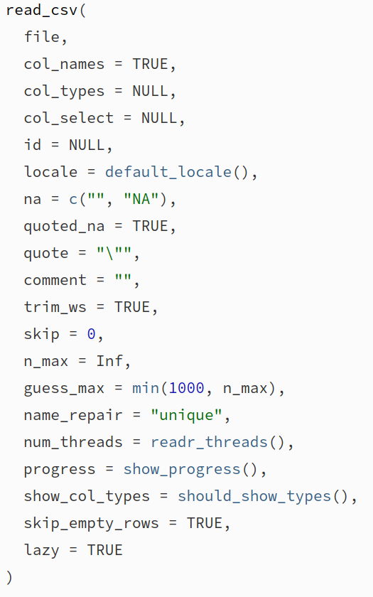
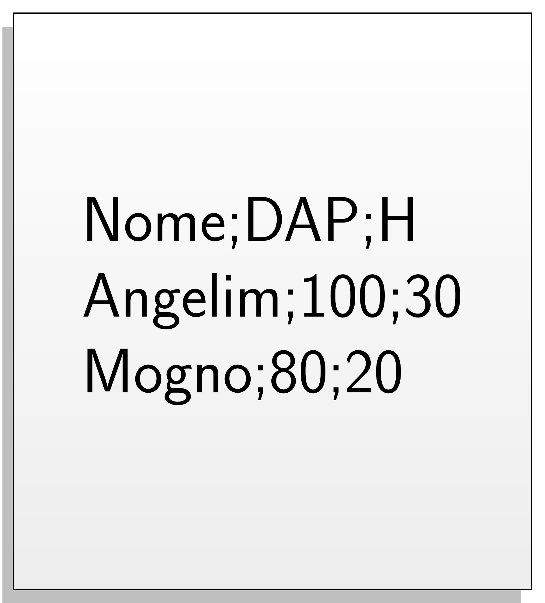
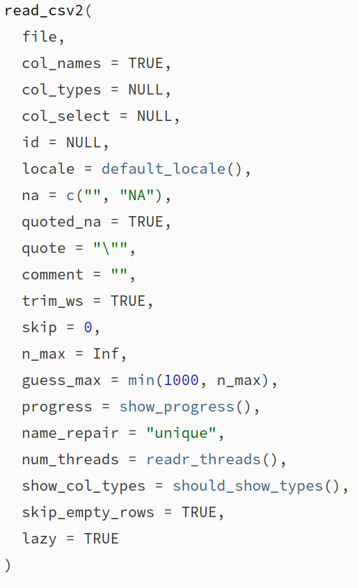
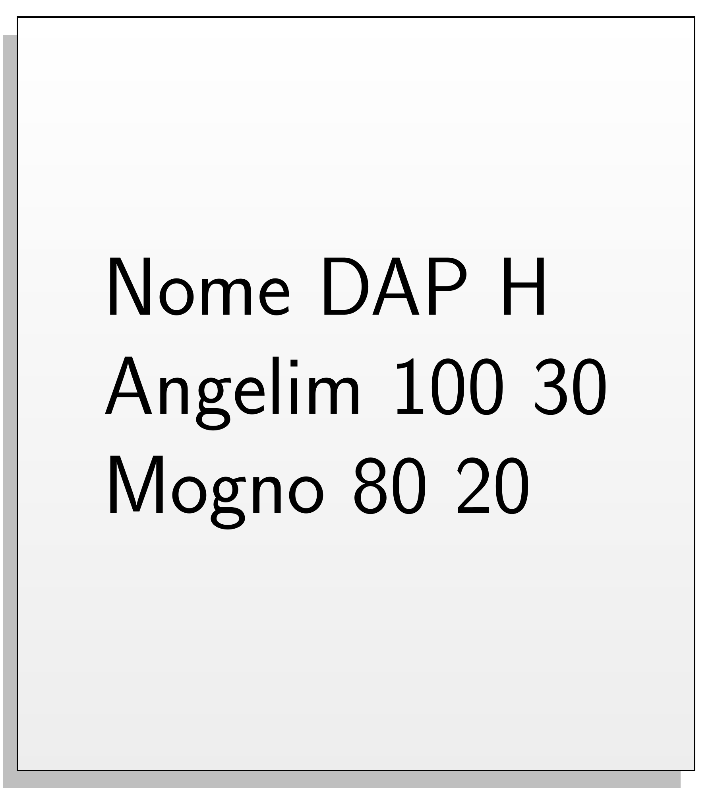
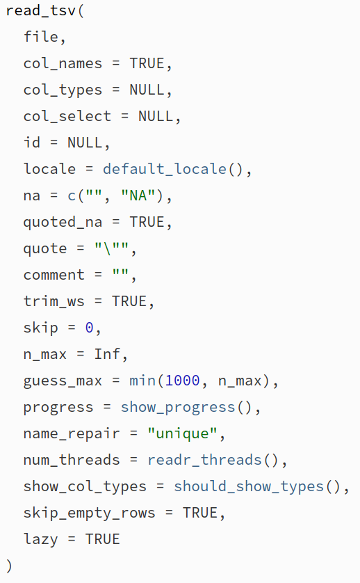
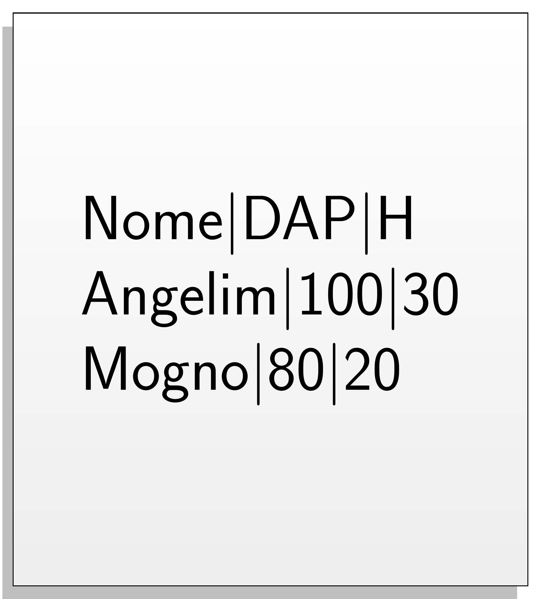
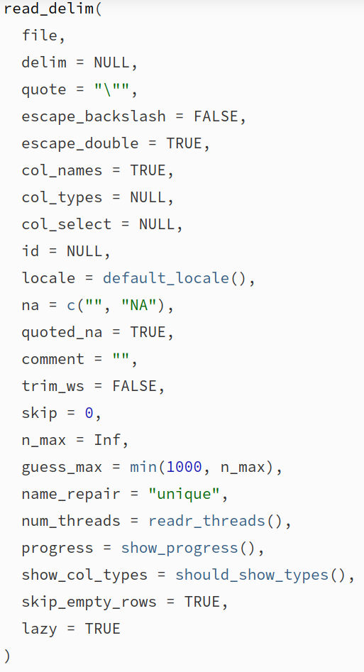

class: title-slide, center, middle
background-image: url(fig/slide-title/ufpa2.png), url(fig/slide-title/sciflor.png), url(fig/slide-title/ufes.png), url(fig/slide-title/img3.png)
background-position: 90% 90%, 50% 10%, 10% 90%
background-size: 250px, 300px, 100px, cover

```{r setup, include=FALSE}
knitr::opts_chunk$set(
	error = FALSE,
	fig.align = "center",
	fig.showtext = TRUE,
	message = FALSE,
	warning = FALSE,
	cache = FALSE,
	collapse = TRUE,
	dpi = 600
)
```

```{r packages, include=FALSE}
# remotes::install_github("dill/emoGG")
library(ggplot2)
library(dplyr)
library(ggimage)
library(kableExtra)
library(readr)
```

```{css, echo=FALSE}
.with-logo::before {
	content: '';
	width: 120px;
	height: 120px;
	position: absolute;
	bottom: 1.3em;
	right: -0.3em;
	background-size: contain;
	background-repeat: no-repeat;
}

.logo-ufpa::before {
	background-image: url(fig/slide-title/ufpa.png);
}
```

```{r xaringan-logo, echo=FALSE}
library(xaringanExtra)
use_logo(
  image_url = "fig/slide-title/sciflor.png",
  position = css_position(top = "1.5em", right = "0.6em"),
  width = "210px",
  height = "210px"
)

use_scribble()

use_extra_styles(
  hover_code_line = TRUE,         #<<
  mute_unhighlighted_code = TRUE  #<<
)

xaringanExtra::use_editable(expires = 1)
#.can-edit[Você pode editar este título de slide]
#.can-edit.key-firstSlideTitle[Change this title and then reload the page]
use_clipboard()

```

```{r icon, echo=FALSE}
#remotes::install_github("mitchelloharawild/icons")
#remotes::install_github('emitanaka/anicon')
#library(icons)
#download_fontawesome()
#download_simple_icons()
```

```{r customDT, echo=F}
CustomDT <- function(data){
  data %>% DT::datatable(editable = 'cell', rownames = FALSE,
                         style = "default",
                         class = "display", width = '180px',
                         caption = '',
     options=list(pageLength = 20, dom = 't', autoWidth = F,
       initComplete = htmlwidgets::JS(
          "function(settings, json) {",
          paste0("$(this.api().table().container()).css({'font-size': '", "9pt", "'});"),
          "}")
       ) 
     )
}
```


<!-- title-slide -->
# Minicurso: Introdução ao R para Análise de Dados

## .font90[Parte 2 - Importação e Manipulação <br> de Dados: readr e dplyr] `r anicon::faa("pagelines", animate="horizontal", colour="green")`

#### **Prof. Dr. Deivison Venicio Souza**
##### Universidade Federal do Pará (UFPA) 
##### Faculdade de Engenharia Florestal
##### E-mail: deivisonvs@ufpa.br
<br>
##### 1ª versão: 22/setembro/2021 <br> (Atualizado em: `r format(Sys.Date(),"%d/%B/%Y")`)

---

layout: true
class: with-logo logo-ufpa
<div class="my-header"></div>
<div class="my-footer"><span>Prof. Dr. Deivison Venicio Souza (E-mail: deivisonvs@ufpa.br)&emsp;&emsp;&emsp;&emsp;&emsp; <div3>Introdução ao R para Análise de Dados</div3>/ <div2>Parte 2 - Importação e Manipulação de Dados: readr e dplyr</div2> </div>

---

## Objetivos
<br><br>
Ao final desta segunda parte (.blue[Importação e Manipulação de Dados: readr e dplyr]) espera-se que os participantes possam alcançar conhecimentos para...
<br><br>

* Importar e exportar dados no R usando funções do pacote **readr**; e
* Manipular dados no R usando funções do pacote **dplyr**.
<br><br>

.pull-left-7[
```{r echo=FALSE, out.width='50%', fig.align='center', fig.cap='', dpi=600}
knitr::include_graphics("https://tidyverse.tidyverse.org/articles/tidyverse-logo.png")
```
]

.pull-left-7[
```{r echo=FALSE, out.width='50%', fig.align='center', fig.cap='', dpi=600}
knitr::include_graphics("https://readr.tidyverse.org/logo.png")
```
]

.pull-left-7[
```{r echo=FALSE, out.width='50%', fig.align='center', fig.cap='', dpi=600}
knitr::include_graphics("https://dplyr.tidyverse.org/logo.png")
```
]


---

## Conteúdo

.pull-left-10[
.font70[
**Parte 1 - Importação de dados com .orange[readr]**

[1 - Importação de dados no R](#import)

[2 - O pacote readr](#fie)

&nbsp;&nbsp;&nbsp;&nbsp;[2.1 - Funções de importação e exportação](#fie)

[3 - Importação de dados usando o readr](#idur)

&nbsp;&nbsp;&nbsp;&nbsp;[3.1 - Arquivo de valores separados por vírgula](#csv)

&nbsp;&nbsp;&nbsp;&nbsp;[3.2 - Arquivo de valores separados por ponto e vírgula](#csv2)

&nbsp;&nbsp;&nbsp;&nbsp;[3.3 - Arquivo de valores separados por tabulação](#tsv)

&nbsp;&nbsp;&nbsp;&nbsp;[3.4 - Arquivo de valores separados por um delimitador incomum](#delim)

[4 - Importação de dados usando a GUI do Rstudio](#importdata)

]
]

.pull-right-10[
.pull-down[
.font70[
**Parte 2 - Manipulação de dados com .orange[dplyr]**

[1 - Função select() e suas auxiliares](#select)

&nbsp;&nbsp;&nbsp;&nbsp;[1.1 - Função starts_with()](#startwith)

&nbsp;&nbsp;&nbsp;&nbsp;[1.2 - Função ends_with()](#endswith)

&nbsp;&nbsp;&nbsp;&nbsp;[1.3 - Função contains()](#contains)

&nbsp;&nbsp;&nbsp;&nbsp;[1.4 - Função matches()](#matches)

&nbsp;&nbsp;&nbsp;&nbsp;[1.5 - Função everything()](#everything)

&nbsp;&nbsp;&nbsp;&nbsp;[1.6 - Função where()](#where)

[2 - Função arrange()](#arrange)

[3 - Função filter()](#filter)

[4 - Função mutate() e suas auxiliares](#mutate)

&nbsp;&nbsp;&nbsp;&nbsp;[4.1 - Função if_else()](#ifelse)

&nbsp;&nbsp;&nbsp;&nbsp;[4.2 - Função case_when()](#casewhen)

&nbsp;&nbsp;&nbsp;&nbsp;[4.3 - Função across()](#acrossmut)

[5 - Função summarise()](#summarise)

&nbsp;&nbsp;&nbsp;&nbsp;[5.1 - Função across()](#across)

[6 - Função group_by()](#groupby)

]
]
]

---

layout: false
name: conc
class: inverse, top, right
background-image: url(fig/part1/arara.jpg)
background-size: cover

.font200[**.yellow[Parte 1] <br> .white[Importação de dados <br> com readr]**]

.left[.footnote[.white[Créditos: Imagem de IvaCastro por Pixabay].]]

---

layout: true
class: with-logo logo-ufpa
<div class="my-header"></div>
<div class="my-footer"><span>Prof. Dr. Deivison Venicio Souza (E-mail: deivisonvs@ufpa.br)&emsp;&emsp;&emsp;&emsp;&emsp; <div3>Introdução ao R para Análise de Dados</div3>/ <div2>Parte 2 - Importação e Manipulação de Dados: readr e dplyr</div2> </div>

---
name: import
## Importação de dados no R
<br>

.font90[
- A etapa de importação de dados para o R precede a análise de dados.
- Os dados podem ser exportados: i) diretamente para a memória (RAM); ou ii) acessados remotamente.
- O mecanismo de importação depende do formato dos dados.
- Por exemplo, é possível exportar dados nos formatos: .txt, .csv, .xlsx, .ods, SAS, SPSS, etc.
- O R-base possui funções para importação de dados: .green[**read.csv()**] e .green[**read.table()**] (Pacote .blue[**utils**]).
- O tidyverse incorpora o pacote .blue[**readr**], que possui várias funções para importação de dados.
]
<br><br>

.center[**O pacote .blue[readr] será o nosso objeto de estudo!**]

---
name: fie
## Pacote readr (tidyverse)
<br>

### Funções de importação e exportação

.font80[
- O pacote .blue[readr] está incorporado no tidyverse.
- Possui diversas funções para importação e exportação de dados.
]
<br>

.pull-left-4[
**Funções para importação de dados**
.font80[
```{r echo=T, eval=T}
ls("package:readr") %>% 
  stringr::str_subset("^read_")
```
]
]

.pull-right-4[
**Funções para exportação de dados**
.font80[
```{r echo=T, eval=T}
ls("package:readr") %>% 
  stringr::str_subset("^write_")
```
]
]

---
name: idur
## Pacote readr (tidyverse)
<br>

### Importação de dados usando o readr

- Vamos estudar apenas algumas das principais funções de importação...
<br><br>

.left[
.font80[
**read_csv()** - Importar um arquivo de valores separados por .blue[vírgula] (*Comma-Separated Values*)

**read_csv2()** - Importar um arquivo de valores separados por .blue[ponto e vírgula] (*Semicolon-Separated Values*)

**read_tsv()** - Importar um arquivo de valores separados por .blue[tabulação] (*Tab-Separated Values*)

**read_delim()** - Importar um arquivo de valores separados por um .blue[delimitador incomum]

]
]

---
name: csv
## Pacote readr (tidyverse)
<br>

### Arquivo de valores separados por vírgula .black[(].blue[,].black[)]

- **Função .black[read_csv()]** - Importar arquivos .csv

.pull-left-9[

```{r echo=FALSE, out.width='30%', fig.align='center', fig.cap='', dpi=600}

```

.font80[
```{r echo=T, eval=F}
# Cria o arquivo "file1.csv" e salva em "data"
readr::write_file(x = "Nome,DAP,H\nAngelim,100,30\nMogno,80,20",
                  path = "data/file1.csv")
```
]
]

--

.pull-right-9[
.font80[
**O único argumento obrigatório (file) é o caminho para o arquivo.**

```{r file1, echo=T, eval=F}
# Importa o arquivo "file1"
(file1 <- readr::read_csv(file="data/file1.csv"))
```

```{r ref.label="file1", echo=F, eval=T, collapse=T}
```
]

]

---

## Pacote readr (tidyverse)
<br>

.pull-left-4[
.font80[
### Arquivo de valores separados por vírgula .black[(].blue[,].black[)]

- **Função .black[read_csv()]** - Importar arquivos .csv

A função possui inúmeros argumentos que podem ser especificados.

Execute o comando: **args(**read_csv**)**
]
]


.pull-right-4[
```{r echo=FALSE, out.width='55%', fig.align='center', fig.cap='', dpi=600}

```
]

---

## Pacote readr (tidyverse)
<br>

### Arquivo de valores separados por vírgula .black[(].blue[,].black[)]

- **Função .black[read_csv()]** - Importar arquivos .csv
.font80[
Vamos explorar outros argumentos da função read_csv()...(.green[**col_types**])
]

.pull-left-4[
.font80[
```{r file5, echo=T, eval=F}
# Importa o arquivo "file1"
(file1 <- readr::read_csv(file="data/file1.csv"))
```

```{r ref.label="file5", echo=F, eval=T, collapse=T}
```

**col_types** = É possível usar strings compactas em que cada caractere representa uma coluna.

**c** = character; **i** = integer; **n** = number; **d** = double; **l** = logical; **f** = factor; **D** = date

]
]


--

.pull-right-4[
.font80[
```{r file6, echo=T, eval=F}
# Importa o arquivo "file1"
(file1.mod2 <- readr::read_csv(file="data/file1.csv", 
                          col_types = "fdi")
 )
```

```{r ref.label="file6", echo=F, eval=T, collapse=T}
```
]
]


---

## Pacote readr (tidyverse)
<br>

### Arquivo de valores separados por vírgula .black[(].blue[,].black[)]

- **Função .black[read_csv()]** - Importar arquivos .csv
.font80[
Vamos explorar outros argumentos da função read_csv()...(.green[**col_select**])
]

.pull-left-4[
.font80[
```{r file7, echo=T, eval=F}
# Importa o arquivo "file1"
(file1 <- readr::read_csv(file="data/file1.csv"))
```

```{r ref.label="file7", echo=F, eval=T, collapse=T}
```
]
]

--

.pull-right-4[
.font80[
```{r file8, echo=T, eval=F}
# Importa o arquivo "file1"
(file1.mod3 <- readr::read_csv(
  file = "data/file1.csv", 
  col_select = c(Nome, DAP)
  )
 )
```

```{r ref.label="file8", echo=F, eval=T, collapse=T}
```
]
]

---
name: csv2
## Pacote readr (tidyverse)
<br>

### Arquivo de valores separados por ponto e vírgula .black[(].blue[;].black[)]

- **Função .black[read_csv2()]**
.font80[
Os arquivo separados por ponto e vírgula também têm a extensão .blue[.csv].
]

.pull-left-9[

```{r echo=FALSE, out.width='30%', fig.align='center', fig.cap='', dpi=600}

```

.font80[
```{r echo=T, eval=F}
# Cria o arquivo "file2.csv" e salva em "data"
readr::write_file(x = "Nome;DAP;H\nAngelim;100;30\nMogno;80;20",
                  path = "data/file2.csv")
```
]
]

--

.pull-right-9[
.font80[
**O único argumento obrigatório (file) é o caminho para o arquivo.**

```{r filecsv2, echo=T, eval=F}
# Importa o arquivo "file2"
(file2 <- readr::read_csv2(file="data/file2.csv"))
```

```{r ref.label="filecsv2", echo=F, eval=T, collapse=T}
```
]

]

---

## Pacote readr (tidyverse)

.pull-left-4[
.font80[
### Arquivo de valores separados por ponto e vírgula .black[(].blue[;].black[)]
<br><br>

- **Função .black[read_csv2()]**

A função possui inúmeros argumentos que podem ser especificados.

Execute o comando: **args(**read_csv2**)**
<br><br>

`r anicon::faa("hand-point-right", animate="horizontal")` **Explore os demais argumentos!** `r anicon::faa("home", animate="horizontal")`

]
]

.pull-right-4[
```{r echo=FALSE, out.width='55%', fig.align='center', fig.cap='', dpi=600}

```
]


---
name: tsv
## Pacote readr (tidyverse)
<br>

### Arquivo de valores separados por tabulação .black[(].blue[\t].black[)]

- **Função .black[read_tsv()]** - Importar arquivos (.tsv, .txt)

.pull-left-9[

```{r echo=FALSE, out.width='30%', fig.align='center', fig.cap='', dpi=600}

```

.font80[
```{r echo=T, eval=F}
# Cria o arquivo "file3.tsv" e salva em "data"
readr::write_file(x = "Nome\tDAP\tH\nAngelim\t100\t30\nMogno\t80\t20",
                  path = "data/file3.txt")
```
]
]

--

.pull-right-9[
.font80[
**O único argumento obrigatório (file) é o caminho para o arquivo.**

```{r filetsv, echo=T, eval=F}
# Importa o arquivo "file3"
(file3 <- readr::read_tsv(file="data/file3.txt"))
```

```{r ref.label="filetsv", echo=F, eval=T, collapse=T}
```
]

]

---

## Pacote readr (tidyverse)

.pull-left-4[
.font80[
### Arquivo de valores separados por tabulação .black[(].blue[\t].black[)]
<br><br>

- **Função .black[read_tsv()]** - Importar arquivos (.tsv, .txt)

A função possui inúmeros argumentos que podem ser especificados.

Execute o comando: **args(**read_tsv**)**
<br><br>

`r anicon::faa("hand-point-right", animate="horizontal")` **Explore os demais argumentos!** `r anicon::faa("home", animate="horizontal")`

]
]

.pull-right-4[
```{r echo=FALSE, out.width='55%', fig.align='center', fig.cap='', dpi=600}

```
]


---
name: delim
## Pacote readr (tidyverse)
<br>

### Arquivo de valores separados por um delimitador incomum

- **Função .black[read_delim()]** - Importar arquivos com delimitator de valores específicos

.pull-left-9[

```{r echo=FALSE, out.width='30%', fig.align='center', fig.cap='', dpi=600}

```

.font80[
```{r echo=T, eval=F}
# Cria o arquivo "file4.txt" e salva em "data"
readr::write_file(x = "Nome|DAP|H\nAngelim|100|30\nMogno|80|20",
                  path = "data/file4.txt")
```
]
]

--

.pull-right-9[
.font80[
**O único argumento obrigatório (file) é o caminho para o arquivo.**

```{r filedelim, echo=T, eval=F}
# Importa o arquivo "file4"
(file4 <- readr::read_delim(
  file="data/file4.txt", 
  delim = "|")
 )
```

```{r ref.label="filedelim", echo=F, eval=T, collapse=T}
```
]

]

---

## Pacote readr (tidyverse)

.pull-left-4[
.font80[
### Arquivo de valores separados por um delimitador incomum
<br><br>

- **Função .black[read_delim()]** - Importar arquivos com delimitator de valores específicos

A função possui inúmeros argumentos que podem ser especificados.

Execute o comando: **args(**read_delim**)**
<br><br>

`r anicon::faa("hand-point-right", animate="horizontal")` **Explore os demais argumentos!** `r anicon::faa("home", animate="horizontal")`

]
]

.pull-right-4[
```{r echo=FALSE, out.width='55%', fig.align='center', fig.cap='', dpi=600}

```
]


---
name: importdata
## Pacote readr (tidyverse)
<br>

### Importação de dados usando a GUI do RStudio
<br><br>

.font90[
- Use a Interface Gráfica do Usuário (*Graphical User Interface* - GUI) para importar dados rapidamente.
- RStudio IDE $\rightarrow$ Environment $\rightarrow$ .blue[Import Dataset] $\rightarrow$ From Text (readr).
- É possível também usar funções do R-base e de outros pacotes, como **readxl** (para ler arquivos .blue[.xlsx]).

]


---

layout: false
name: conc
class: inverse, top, right
background-image: url(fig/part1/arara2.jpg)
background-size: cover

.font200[**.yellow[Parte 2] <br> .white[Manipulação de dados <br> com dplyr]**]

.left[.footnote[.white[Créditos: Imagem de ljwong por Pixabay].]]

---

layout: true
class: with-logo logo-ufpa
<div class="my-header"></div>
<div class="my-footer"><span>Prof. Dr. Deivison Venicio Souza (E-mail: deivisonvs@ufpa.br)&emsp;&emsp;&emsp;&emsp;&emsp; <div3>Introdução ao R para Análise de Dados</div3>/ <div2>Parte 2 - Importação e Manipulação de Dados: readr e dplyr</div2> </div>

---

## Manipulação de dados com dplyr
<br>

### Sobre o pacote **dplyr**...

.font90[
- Um dos principais pacotes do .green[tidyverse].
- O pacote dplyr é essencialmente um conjunto consistente de funções projetadas para resolver os desafios mais comuns de **manipulação de dados**.
- Foi projetado para ser simples, intuitivo, amigável e elegante.
- O encadeamento de comandos é facilitado pelo emprego do operador **%>%** (pipe).
- Códigos em R que fazem uso dos verbos dplyr são mais elegantes, compeeensíveis e intuitivos.
- **Cheatsheet do RStudio** (folhas de resumo): Help $\rightarrow$ Cheatsheets $\rightarrow$ Data Transformation with dplyr
- No site da RStudio pode-se encontrar algumas Cheatsheet traduzidas: [cheatsheets-translations](https://www.rstudio.com/resources/cheatsheets/#translations)
]

```{r echo=FALSE, out.width='10%', fig.align='center', fig.cap='', dpi=600}
knitr::include_graphics("https://dplyr.tidyverse.org/logo.png")
```

---

## Manipulação de dados com dplyr
<br>

### Verbos **dplyr**

.pull-left-4[
- O **dplyr** possui diversos verbos (funções). A seguir são listadas algumas das mais usuais:

.center[
mutate()

select()

filter()

arrange()

summarise()

group_by()

]
]

.pull-right-4[
Lista de funções do pacote **dplyr**:

```{r, echo=T, eval=F}
ls("package:dplyr")
#length(ls("package:dplyr"))
#lsf.str("package:dplyr")
```

Ou simplesmente digite .green[`dplyr::`].

Atualmente são `r length(ls("package:dplyr"))` funções projetadas para manipulação de dados.

]

---

## Manipulação de dados com dplyr
<br>

### Uma pequena amostra para praticar...

.font90[
.pull-left-9[

```{r tibble, echo=T, eval=F}
data <- readr::read_csv("data/data.csv")

data %>% CustomDT # Apenas para customizar a tabela
```

.font90[
Para aprender a intuição de algumas funções **dplyr** usaremos uma pequena amostra de dados de IF100%.
<br><br>

**A base completa pode ser acessada em**: [IF100%](https://deivisonsouza.github.io/FL03034-EF/Slides/data/UPA07DVS.csv)
]
]
]

.pull-right-9[
```{r ref.label="tibble", echo=FALSE, eval=TRUE, collapse=T}
```
]

---

layout: false
name: select
class: inverse, bottom, right
background-image: url(fig/part1/arara.jpg)
background-size: cover


.font200[**.white[Manipulação de dados <br> com dplyr]**]
<br><br>

.font150[**.yellow[Função select()]**]

---

layout: true
class: with-logo logo-ufpa
<div class="my-header"></div>
<div class="my-footer"><span>Prof. Dr. Deivison Venicio Souza (E-mail: deivisonvs@ufpa.br)&emsp;&emsp;&emsp;&emsp;&emsp; <div3>Introdução ao R para Análise de Dados</div3>/ <div2>Parte 2 - Importação e Manipulação de Dados: readr e dplyr</div2> </div>

---

## Manipulação de dados com dplyr
<br>

### .font90[Função **select()** - .black[selecionar colunas]]

.pull-left-10[
```{r echo=F, eval=T}
data %>% CustomDT
```
]

--

.pull-right-10[
.pull-left-11[
.blue[**Seleção de uma coluna...**]
<br><br>
.font80[
**Alternativa 1**:
```{r echo=TRUE, eval=FALSE}
select(data, Nome_Especie)
```

**Alternativa 2**
```{r echo=TRUE, eval=FALSE}
data %>%
  select(Nome_Especie)
```
]

```{r sel, echo=F, eval=F}
select(data, Nome_Especie) %>% CustomDT
```
]

.pull-right-11[
```{r ref.label="sel", echo=FALSE, eval=TRUE, collapse=T}
```
]
]

---

## Manipulação de dados com dplyr
<br>

### .font90[Função **select()** - .black[selecionar colunas]]

.pull-left-10[
```{r echo=F, eval=T}
data %>% CustomDT
```
]

--

.pull-right-10[
.pull-left-11[
.font80[
.blue[**Seleção de várias coluna...**]
<br><br>

**Alternativa 1** (sem %>%)
```{r echo=TRUE, eval=FALSE}
select(
  data, CAP, HC, QF
  )
```

**Alternativa 2** (com %>%)
```{r echo=TRUE, eval=FALSE}
data %>%
  select(CAP, HC, QF)
```

**Alternativa 3** (%>% + :)
```{r echo=TRUE, eval=FALSE}
data %>%
  select(CAP:QF)
```

]

```{r sel2, echo=F, eval=F}
select(data, CAP, HC, QF) %>% CustomDT
```
]

.pull-right-11[
```{r ref.label="sel2", echo=FALSE, eval=TRUE, collapse=T}
```
]
]

---
name: startwith
## Manipulação de dados com dplyr
<br>

### .font90[Função **select()** - .black[selecionar colunas]]

.pull-left-10[
```{r echo=F, eval=T}
data %>% CustomDT
```
]

--

.pull-right-10[
.pull-left-11[
.font80[
.blue[**Usando funções auxiliares...**]
<br><br>

.green[**starts_with()**]
<br>

.font80[
Função usada para selecionar colunas cujos nomes .green[iniciam] com um texto padrão.
]

```{r echo=TRUE, eval=FALSE}
select(
  data, starts_with("N")
  )
```

]

```{r sel3, echo=F, eval=F}
select(data, starts_with("N")) %>% CustomDT
```
]

.pull-right-11[
```{r ref.label="sel3", echo=FALSE, eval=TRUE, collapse=T}
```
]
]


---
name: endswith
## Manipulação de dados com dplyr
<br>

### .font90[Função **select()** - .black[selecionar colunas]]

.pull-left-10[
```{r echo=F, eval=T}
data %>% CustomDT
```
]

--

.pull-right-10[
.pull-left-11[
.font80[
.blue[**Usando funções auxiliares...**]
<br><br>

.green[**ends_with()**]
<br>

.font80[
Função usada para selecionar colunas cujos nomes .green[terminam] com um texto padrão.
]

```{r echo=TRUE, eval=FALSE}
select(
  data, ends_with("e")
  )
```

]

```{r sel4, echo=F, eval=F}
select(data, ends_with("e")) %>% CustomDT
```
]

.pull-right-11[
```{r ref.label="sel4", echo=FALSE, eval=TRUE, collapse=T}
```
]
]

---
name: contains
## Manipulação de dados com dplyr
<br>

### .font90[Função **select()** - .black[selecionar colunas]]

.pull-left-10[
```{r echo=F, eval=T}
data %>% CustomDT
```
]

--

.pull-right-10[
.pull-left-11[
.font80[
.blue[**Usando funções auxiliares...**]
<br><br>

.green[**contains()**]
<br>

.font80[
Função usada para selecionar colunas cujos nomes tenham algum texto padrão.
]

```{r echo=TRUE, eval=FALSE}
select(
  data, contains("e")
  )
```

]

```{r sel5, echo=F, eval=F}
select(data, contains("e")) %>% CustomDT
```
]

.pull-right-11[
```{r ref.label="sel5", echo=FALSE, eval=TRUE, collapse=T}
```
]
]

---
name: matches
## Manipulação de dados com dplyr
<br>

### .font90[Função **select()** - .black[selecionar colunas]]

.pull-left-10[
```{r echo=F, eval=T}
data %>% CustomDT
```
]

--

.pull-right-10[
.pull-left-11[
.font80[
.blue[**Usando funções auxiliares...**]
<br><br>

.green[**matches()**]
<br>

.font80[
Função usada para selecionar colunas que contenham nomes correspondentes à alguma expressão regular.
]

```{r echo=TRUE, eval=FALSE}
select(
  data, matches('No|cao|F')
  )
```

]

```{r sel6, echo=F, eval=F}
select(data, matches('No|cao|F')) %>% CustomDT
```
]

.pull-right-11[
```{r ref.label="sel6", echo=FALSE, eval=TRUE, collapse=T}
```
]
]

---
name: everything
## Manipulação de dados com dplyr
<br>

### .font90[Função **select()** - .black[selecionar colunas]]

.pull-left-10[
```{r echo=F, eval=T}
data %>% CustomDT
```
]

--

.pull-right-10[
.pull-left-5[
.font80[
.blue[**Usando funções auxiliares...**]
<br><br>

.green[**everything()**]
<br>

.font80[
Seleciona todas as variáveis. É útil para reordenar algumas colunas, sem se importar com a ordem das demais.
]

```{r echo=TRUE, eval=FALSE}
data %>%
  select(
    Nome_Especie,
    Selecao,
    everything())
```

]

```{r sel11, echo=F, eval=F}
data %>%
  select(Nome_Especie,
         Selecao,
         everything()) %>%
  CustomDT
```
]

.pull-right-5[
```{r ref.label="sel11", echo=FALSE, eval=TRUE, collapse=T}
```
]
]

---
name: where
## Manipulação de dados com dplyr
<br>

### .font90[Função **select()** - .black[selecionar colunas]]

.pull-left-10[
```{r echo=F, eval=T}
data %>% CustomDT
```
]

--

.pull-right-10[
.pull-left-10[
.font80[
.blue[**Usando funções auxiliares...**]
<br><br>

.green[**where()**]
<br>

.font80[
Aplica uma função à todas as variáveis e seleciona aquelas para as quais a resposta é TRUE.
]

```{r echo=TRUE, eval=FALSE}
data %>%
  select(where(is.character))
```

]

```{r sel12, echo=F, eval=F}
data %>%
  select(where(is.character)) %>%
  CustomDT
```
]

.pull-right-10[
```{r ref.label="sel12", echo=FALSE, eval=TRUE, collapse=T}
```
]
]

---

## Manipulação de dados com dplyr
<br>

### .font90[Função **select()** - .black[selecionar colunas]]

.pull-left-10[
```{r echo=F, eval=T}
data %>% CustomDT
```
]

--

.pull-right-10[
.pull-left-11[
.font80[
.blue[**Combinando funções auxiliares e operadores lógicos...**]
<br><br>

```{r echo=TRUE, eval=FALSE}
data %>%
  select(
    starts_with("N") &
      !ends_with("Arvore"))
```


`r anicon::faa("hand-point-down", animate="vertical")` **Experimente o comando**
<br>

```{r echo=TRUE, eval=FALSE}
data %>%
  select(
    starts_with("N") |
      ends_with("Arvore"))
```

]

```{r sel8, echo=F, eval=F}
data %>%
  select(
    starts_with("N") &
      !ends_with("Arvore")) %>%
  CustomDT
```
]

.pull-right-11[
```{r ref.label="sel8", echo=FALSE, eval=TRUE, collapse=T}
```
]
]

---

## Manipulação de dados com dplyr
<br>

### .font90[Função **select()** - .black[selecionar colunas]]

.pull-left-10[
```{r echo=F, eval=T}
data %>% CustomDT
```
]

--

.pull-right-10[
.pull-left-11[
.font80[
.blue[**Função concatenate**]
<br><br>

```{r echo=TRUE, eval=FALSE}
data %>%
  select(-c(CAP:Selecao))
```


`r anicon::faa("hand-point-down", animate="vertical")` **Experimente o comando**
<br>

```{r echo=TRUE, eval=FALSE}
data %>%
  select(!(CAP:Selecao))
```

]

```{r sel9, echo=F, eval=F}
data %>%
  select(-c(CAP:Selecao)) %>%
  CustomDT
```
]

.pull-right-11[
```{r ref.label="sel9", echo=FALSE, eval=TRUE, collapse=T}
```
]
]

---

## Manipulação de dados com dplyr
<br>

### .font90[Função **select()** - .black[selecionar colunas]]

.pull-left-10[
```{r echo=F, eval=T}
data %>% CustomDT
```
]

--

.pull-right-10[
.pull-left-1[
.font80[
.blue[**Reordenar colunas**]
<br><br>

```{r echo=TRUE, eval=FALSE}
data %>%
  select(Nome_Especie,
         Selecao, CAP,
         QF, HC)
```

]

```{r sel10, echo=F, eval=F}
data %>%
  select(Nome_Especie, Selecao, CAP, QF, HC) %>%
  CustomDT
```
]

.pull-right-2[
```{r ref.label="sel10", echo=FALSE, eval=TRUE, collapse=T}
```
]
]

---

layout: false
name: arrange
class: inverse, bottom, right
background-image: url(fig/part1/arara.jpg)
background-size: cover


.font200[**.white[Manipulação de dados <br> com dplyr]**]
<br><br>

.font150[**.yellow[Função arrange()]**]

---

layout: true
class: with-logo logo-ufpa
<div class="my-header"></div>
<div class="my-footer"><span>Prof. Dr. Deivison Venicio Souza (E-mail: deivisonvs@ufpa.br)&emsp;&emsp;&emsp;&emsp;&emsp; <div3>Introdução ao R para Análise de Dados</div3>/ <div2>Parte 2 - Importação e Manipulação de Dados: readr e dplyr</div2> </div>

---

## Manipulação de dados com dplyr
<br>

### .font90[Função **arrange()** - .black[Ordenar linhas]]

.pull-left-10[
```{r echo=F, eval=T}
data %>% CustomDT
```
]

--

.pull-right-10[
.pull-left-12[
.font80[
**Ordem crescente de uma variável**

```{r echo=TRUE, eval=FALSE}
data %>%
  arrange(HC)
```

]

```{r arr1, echo=F, eval=F}
data %>%
  arrange(HC) %>%
  CustomDT
```
]

.pull-right-12[
```{r ref.label="arr1", echo=FALSE, eval=TRUE, collapse=T}
```
]
]

---

## Manipulação de dados com dplyr
<br>

### .font90[Função **arrange()** - .black[Ordenar linhas]]

.pull-left-10[
```{r echo=F, eval=T}
data %>% CustomDT
```
]

--

.pull-right-10[
.pull-left-12[
.font80[
**Ordem decrescente de uma variável**

```{r echo=TRUE, eval=FALSE}
data %>%
  arrange(
    desc(HC)
    )
```

]

```{r arr2, echo=F, eval=F}
data %>%
  arrange(desc(HC)) %>%
  CustomDT
```
]

.pull-right-12[
```{r ref.label="arr2", echo=FALSE, eval=TRUE, collapse=T}
```
]
]

---

## Manipulação de dados com dplyr
<br>

### .font90[Função **arrange()** - .black[Ordenar linhas]]

.pull-left-10[
```{r echo=F, eval=T}
data %>% CustomDT
```
]

--

.pull-right-10[
.pull-left-12[
.font80[
**Ordenar em função de duas ou mais variáveis**

```{r echo=TRUE, eval=FALSE}
data %>%
  arrange(
    CAP, HC
    )
```

]

```{r arr3, echo=F, eval=F}
data %>%
  arrange(CAP, HC) %>%
  CustomDT
```
]

.pull-right-12[
```{r ref.label="arr3", echo=FALSE, eval=TRUE, collapse=T}
```
]
]

---

layout: false
name: filter
class: inverse, top, right
background-image: url(fig/part1/arara2.jpg)
background-size: cover


.font200[**.white[Manipulação de dados <br> com dplyr]**]
<br><br>

.font150[**.yellow[Função filter()]**]

---

layout: true
class: with-logo logo-ufpa
<div class="my-header"></div>
<div class="my-footer"><span>Prof. Dr. Deivison Venicio Souza (E-mail: deivisonvs@ufpa.br)&emsp;&emsp;&emsp;&emsp;&emsp; <div3>Introdução ao R para Análise de Dados</div3>/ <div2>Parte 2 - Importação e Manipulação de Dados: readr e dplyr</div2> </div>

---

## Manipulação de dados com dplyr
<br>

### .font90[Função **filter()** - .black[Filtrar linhas]]

.pull-left-10[
```{r echo=F, eval=T}
data %>% CustomDT
```
]

--

.pull-right-10[
.pull-top[
.font80[
**Filtrar linhas em função de alguma variável**

```{r echo=TRUE, eval=FALSE}
data %>%
  filter(HC > 15)
```

]

```{r fil1, echo=F, eval=F}
data %>%
  filter(HC > 15) %>%
  CustomDT
```
]

.pull-bottom[
```{r ref.label="fil1", echo=FALSE, eval=TRUE, collapse=T}
```

]
]

---

## Manipulação de dados com dplyr
<br>

### .font90[Função **filter()** - .black[Filtrar linhas]]

.pull-left-10[
```{r echo=F, eval=T}
data %>% CustomDT
```
]

--

.pull-right-10[
.pull-top[
.font80[
**Filtrar linhas para algum intervalo da variável**

```{r echo=TRUE, eval=FALSE}
data %>%
  filter(HC > 10 & HC <= 15)
```

]

```{r fil2, echo=F, eval=F}
data %>%
  filter(HC > 10 & HC <= 15) %>%
  CustomDT
```
]

.pull-bottom[
```{r ref.label="fil2", echo=FALSE, eval=TRUE, collapse=T}
```

]
]

---

## Manipulação de dados com dplyr
<br>

### .font90[Função **filter()** - .black[Filtrar linhas]]

.pull-left-10[
```{r echo=F, eval=T}
data %>% CustomDT
```
]

--

.pull-right-10[
.pull-top[
.font80[
**Filtrar linhas em função de duas ou mais variáveis**

```{r echo=TRUE, eval=FALSE}
data %>%
  filter(HC > 10, Selecao == "Explorar")
```

]

```{r fil3, echo=F, eval=F}
data %>%
  filter(HC > 10, Selecao == "Explorar") %>%
  CustomDT
```
]

.pull-bottom[
```{r ref.label="fil3", echo=FALSE, eval=TRUE, collapse=T}
```

]
]

---

## Manipulação de dados com dplyr
<br>

### .font90[Função **filter()** - .black[Filtrar linhas]]

.pull-left-10[
```{r echo=F, eval=T}
data %>% CustomDT
```
]

--

.pull-right-10[
.pull-top[
.font80[
**Filtrar linhas usando operador .green[%in%]** - Variáveis categóricas


```{r echo=TRUE, eval=FALSE}
data %>%
  filter(Nome_Especie %in% c('Acapu', 'Tauari'))
```

]

```{r fil4, echo=F, eval=F}
data %>%
  filter(Nome_Especie %in% c('Acapu', 'Tauari')) %>%
  CustomDT
```
]

.pull-bottom[
```{r ref.label="fil4", echo=FALSE, eval=TRUE, collapse=T}
```

]
]

---

## Manipulação de dados com dplyr
<br>

### .font90[Função **filter()** - .black[Filtrar linhas]]

.pull-left-10[
```{r echo=F, eval=T}
data %>% CustomDT
```
]

--

.pull-right-10[
.pull-top[
.font80[
**Filtrar linhas com várias condições**


```{r echo=TRUE, eval=FALSE}
data %>%
  filter(Nome_Especie %in% c('Acapu', 'Tauari'),
         HC >= 12, QF == 1)
```

]

```{r fil5, echo=F, eval=F}
data %>%
  filter(Nome_Especie %in% c('Acapu', 'Tauari'),
         HC >= 12, QF == 1) %>%
  CustomDT
```
]

.pull-bottom[
```{r ref.label="fil5", echo=FALSE, eval=TRUE, collapse=T}
```

]
]

---

layout: false
name: mutate
class: inverse, bottom, right
background-image: url(fig/part1/arara.jpg)
background-size: cover


.font200[**.white[Manipulação de dados <br> com dplyr]**]
<br><br>

.font150[**.yellow[Função mutate()]**]

.white[Criar (ou modificar) variáveis e manter as existentes.]

---

layout: true
class: with-logo logo-ufpa
<div class="my-header"></div>
<div class="my-footer"><span>Prof. Dr. Deivison Venicio Souza (E-mail: deivisonvs@ufpa.br)&emsp;&emsp;&emsp;&emsp;&emsp; <div3>Introdução ao R para Análise de Dados</div3>/ <div2>Parte 2 - Importação e Manipulação de Dados: readr e dplyr</div2> </div>

---

## Manipulação de dados com dplyr
<br>

### .font90[Função **mutate()** - .black[Modificar e criar variáveis]]

.pull-left-12[
```{r echo=F, eval=T}
data %>%
  select(-c(N_Arvore, QF, Selecao)) %>%
  CustomDT
```
]

--

.pull-right-12[
.pull-left-1[
.font80[
**Criar uma nova variável e adicioná-la à tabela**

```{r echo=TRUE, eval=FALSE}
data %>%
  mutate(DAP = CAP/pi)
```
<br><br>

`r anicon::faa("hand-point-down", animate="vertical")` **Experimente o comando**
```{r echo=TRUE, eval=FALSE}
data %>%
  mutate(DAP = round(CAP/pi, 2))
```

]

```{r mut1, echo=F, eval=F}
data %>%
  select(-c(N_Arvore, QF, Selecao)) %>%
  mutate(DAP = CAP/pi) %>%
  CustomDT
```
]

.pull-right-2[
```{r ref.label="mut1", echo=FALSE, eval=TRUE, collapse=T}
```
]
]

---

## Manipulação de dados com dplyr
<br>

### .font90[Função **mutate()** - .black[Modificar e criar variáveis]]

.pull-left-12[
```{r echo=F, eval=T}
data %>%
  select(-c(N_Arvore, QF, Selecao)) %>%
  CustomDT
```
]

--

.pull-right-12[
.pull-left-1[
.font80[
**Modificar uma variável na tabela**

```{r echo=TRUE, eval=FALSE}
data %>%
  mutate(CAP = CAP/100)
```
<br><br>

`r anicon::faa("hand-point-down", animate="vertical")` **Experimente o comando**
```{r echo=TRUE, eval=FALSE}
data %>%
  mutate(CAP = round(CAP/100, 2))
```

]

```{r mut2, echo=F, eval=F}
data %>%
  select(-c(N_Arvore, QF, Selecao)) %>%
  mutate(CAP = CAP/100) %>%
  CustomDT
```
]

.pull-right-2[
```{r ref.label="mut2", echo=FALSE, eval=TRUE, collapse=T}
```
]
]

---

## Manipulação de dados com dplyr
<br>

### .font90[Função **mutate()** - .black[Modificar e criar variáveis]]

.pull-left-12[
```{r echo=F, eval=T}
data %>%
  select(-c(N_Arvore, QF, Selecao)) %>%
  CustomDT
```
]

--

.pull-right-12[
.pull-left-1[
.font80[
**Modificar/criar múltiplas variáveis no mesmo mutate()**

```{r echo=TRUE, eval=FALSE}
data %>%
  mutate(DAP = CAP/pi,
         CAP = CAP/100,
         gi = (DAP^2*pi)/40000))
```
<br><br>

`r anicon::faa("hand-point-down", animate="vertical")` **Experimente o comando**
```{r echo=TRUE, eval=FALSE}
data %>%
  mutate(DAP = CAP/pi,
         CAP = CAP/100,
         gi = (DAP^2*pi)/40000,
         vi = gi*HC*0.7)
```

]

```{r mut3, echo=F, eval=F}
data %>%
  select(-c(N_Arvore, QF, Selecao)) %>%
  mutate(DAP = CAP/pi,
         CAP = CAP/100,
         gi = (DAP^2*pi)/40000) %>%
  CustomDT
```
]

.pull-right-2[
```{r ref.label="mut3", echo=FALSE, eval=TRUE, collapse=T}
```
]
]

---
name: ifelse
## Manipulação de dados com dplyr
<br>

### .font90[Função **mutate()** - .black[Modificar e criar variáveis]]

.pull-left-12[
```{r echo=F, eval=T}
data %>%
  select(-c(N_Arvore, QF, Selecao)) %>%
  CustomDT
```
]

--

.pull-right-12[
.pull-left-11[
.font80[
**.blue[Usando funções auxiliares...]**
<br><br>

**.green[if_else()]**
<br>

```{r echo=TRUE, eval=FALSE}
data %>%
  mutate(Selecao = if_else(
    CAP >= 600, "Matriz", "Não Matriz"
    ))
```

]

```{r mut4, echo=F, eval=F}
data %>%
  select(-c(N_Arvore, QF, Selecao)) %>%
  mutate(Selecao = if_else(
    CAP >= 600, "Matriz", "Não Matriz")) %>%
  CustomDT
```
]

.pull-right-11[
```{r ref.label="mut4", echo=FALSE, eval=TRUE, collapse=T}
```
]
]


---
name: casewhen
## Manipulação de dados com dplyr
<br>

### .font90[Função **mutate()** - .black[Modificar e criar variáveis]]

.pull-left-12[
```{r echo=F, eval=T}
data %>%
  select(-c(N_Arvore, QF, Selecao)) %>%
  CustomDT
```
]

--

.pull-right-12[
.pull-left-2[
.font80[
**.blue[Usando funções auxiliares...]**
<br><br>

**.green[case_when()]**
<br>

Permite vetorizar várias instruções .green[if_else()]. É um equivalente R da instrução SQL CASE WHEN.

Criar uma nova coluna por múltiplas condições mutuamente exclusivas.

```{r echo=TRUE, eval=FALSE}
data %>%
  mutate(
    Selecao =
      case_when(
        (CAP >= 600) ~ "Matriz",
        (Nome_Especie == "Acapu") ~ "Protegida",
        (CAP >= 158 & Nome_Especie != "Acapu") ~ "Explorar",
    ))
```

]

```{r mut5, echo=F, eval=F}
data %>%
  select(-c(N_Arvore, QF, Selecao)) %>%
  mutate(Selecao =
           case_when(
             (CAP >= 600) ~ "Matriz",
             (Nome_Especie == "Acapu") ~ "Protegida",
             (CAP >= 158 & Nome_Especie != "Acapu") ~ "Explorar",
    )) %>%
  CustomDT
```
]

.pull-right-1[
```{r ref.label="mut5", echo=FALSE, eval=TRUE, collapse=T}
```
]
]

---
name: acrossmut
## Manipulação de dados com dplyr
<br>

### .font90[Função **mutate()** - .black[Modificar e criar variáveis]]

.pull-left-12[
```{r echo=F, eval=T}
data %>%
  select(-c(N_Arvore, QF, Selecao)) %>%
  CustomDT
```
]

--

.pull-right-12[
.pull-left-2[
.font80[
**.blue[Usando funções auxiliares...]**
<br><br>

**.green[across()]**
<br>

Auxiliar a aplicar uma operação (função) em várias colunas.

```{r echo=TRUE, eval=FALSE}
data %>%
  mutate(across(.cols = where(is.numeric),
                .fns = format,
                scientific = T
                )
         )
```

]

```{r mut6, echo=F, eval=F}
data %>%
  select(-c(N_Arvore, QF, Selecao)) %>%
  mutate(across(.cols = where(is.numeric),
                .fns = format,
                scientific = T
                )
         ) %>%
  CustomDT
```
]

.pull-right-1[
```{r ref.label="mut6", echo=FALSE, eval=TRUE, collapse=T}
```
]
]


---

layout: false
name: groupby
class: inverse, top, right
background-image: url(fig/part1/arara2.jpg)
background-size: cover


.font200[**.white[Manipulação de dados <br> com dplyr]**]
<br><br>

.font150[**.yellow[Função summarise()]**]

.white[Criar um novo quadro de dados<br> com estatísticas de resumo <br> de variáveis selecionadas]

---

layout: true
class: with-logo logo-ufpa
<div class="my-header"></div>
<div class="my-footer"><span>Prof. Dr. Deivison Venicio Souza (E-mail: deivisonvs@ufpa.br)&emsp;&emsp;&emsp;&emsp;&emsp; <div3>Introdução ao R para Análise de Dados</div3>/ <div2>Parte 2 - Importação e Manipulação de Dados: readr e dplyr</div2> </div>

---

name: summarise
## Manipulação de dados com dplyr
<br>

### .font90[Função **summarise()** - .black[Sumarizar dados]]

.pull-left-10[
```{r echo=F, eval=T}
data %>%
  CustomDT
```
]

--

.pull-right-10[
.pull-top[
.font80[
**.blue[Uma única estatística de sumarização...]**

```{r echo=TRUE, eval=FALSE}
data %>%
  summarise(media_HC = mean(HC, na.rm = TRUE))
```

```{r sumr1, echo=F, eval=F}
data %>%
  summarise(media_HC = mean(HC, na.rm = TRUE)) %>%
  CustomDT
```

```{r ref.label="sumr1", echo=FALSE, eval=TRUE, collapse=T}
```

]
]

.pull-bottom[
.font80[
**.blue[Várias estatísticas na mesma summarise()...]**
```{r echo=TRUE, eval=FALSE}
data %>%
  summarise(media_HC = mean(HC, na.rm = TRUE),
            sd_HC = mean(HC, na.rm = TRUE),
            min_HC = min(HC, na.rm = TRUE),
            max_HC = max(HC, na.rm = TRUE))
```

```{r sumr2, echo=F, eval=F}
data %>%
  summarise(media_HC = mean(HC, na.rm = TRUE),
            sd_HC = mean(HC, na.rm = TRUE),
            min_HC = min(HC, na.rm = TRUE),
            max_HC = max(HC, na.rm = TRUE)) %>%
  CustomDT
```

```{r ref.label="sumr2", echo=FALSE, eval=TRUE, collapse=T}
```

]
]
]

---

## Manipulação de dados com dplyr
<br>

### .font90[Função **summarise()** - .black[Sumarizar dados]]

.pull-left-10[
```{r echo=F, eval=T}
data %>%
  CustomDT
```
]

--

.pull-right-10[
.pull-top[
.font80[
**.blue[Sumarizando diversas variáveis...]**

```{r echo=TRUE, eval=FALSE}
data %>%
  summarise(media_HC = mean(HC, na.rm = TRUE),
            sd_HC = sd(HC, na.rm = TRUE),
            media_CAP = mean(CAP, na.rm = TRUE),
            sd_CAP = sd(CAP, na.rm = TRUE))
```

```{r sumr3, echo=F, eval=F}
data %>%
  summarise(media_HC = mean(HC, na.rm = TRUE),
          sd_HC = sd(HC, na.rm = TRUE),
          media_CAP = mean(CAP, na.rm = TRUE),
          sd_CAP = sd(CAP, na.rm = TRUE)) %>%
CustomDT
```

```{r ref.label="sumr3", echo=FALSE, eval=TRUE, collapse=T}
```

]
]
]

---
name: across
## Manipulação de dados com dplyr
<br>

### .font90[Função **summarise()** - .black[Sumarizar dados]]

.pull-left-10[
```{r echo=F, eval=T}
data %>%
  CustomDT
```
]

--

.pull-right-10[
.pull-top[
.font80[
**.blue[Sumarizando diversas variáveis...]**
<br><br>

.green[**across()**] - Múltiplas colunas e uma função
<br>

.font70[
Aplicar uma função (ou funções) em várias colunas.

A função .green[across()] substitui a família de verbos **summarise** com sufixos:.green[_if, _at, _all].
]

```{r echo=TRUE, eval=FALSE}
data %>%
  summarise(across(
    .cols = c(HC, CAP),
    .fns = mean,
    na.rm = TRUE,
    .names = "mean_{.col}"
  ))
```

```{r sumr4, echo=F, eval=F}
data %>%
  summarise(across(
    .cols = c(HC, CAP),
    .fns = mean,
    na.rm = TRUE,
    .names = "mean_{.col}"
  )) %>%
  CustomDT
```

```{r ref.label="sumr4", echo=FALSE, eval=TRUE, collapse=T}
```

]
]
]

---

## Manipulação de dados com dplyr
<br>

### .font90[Função **summarise()** - .black[Sumarizar dados]]

.pull-left-10[
```{r echo=F, eval=T}
data %>%
  CustomDT
```
]

--

.pull-right-10[
.pull-top[
.font80[
**.blue[Sumarizando diversas variáveis...]**
<br><br>

.green[**across()**] - Múltiplas colunas e funções
<br>

```{r echo=TRUE, eval=FALSE}
data %>%
  summarise(across(.cols = c(HC, CAP),
                   .fns = list(media=mean, desv=sd),
                   na.rm = TRUE,
                   .names = "{.col}.{.fn}"
                   )
            )
```

```{r sumr5, echo=F, eval=F}
data %>%
  summarise(across(.cols = c(HC, CAP),
                   .fns = list(media=mean, desv=sd),
                   na.rm = TRUE,
                   .names = "{.col}.{.fn}"
                   )
            ) %>%
  CustomDT
```

```{r ref.label="sumr5", echo=FALSE, eval=TRUE, collapse=T}
```

]
]
]

---

layout: false
name: groupby
class: inverse, top, right
background-image: url(fig/part1/arara2.jpg)
background-size: cover


.font200[**.white[Manipulação de dados <br> com dplyr]**]
<br><br>

.font150[**.yellow[Função group_by()]**]

.white[Agrupar uma (ou mais) variáveis <br> para aplicar operações (funções) <br> a cada grupo/categoria]

---

layout: true
class: with-logo logo-ufpa
<div class="my-header"></div>
<div class="my-footer"><span>Prof. Dr. Deivison Venicio Souza (E-mail: deivisonvs@ufpa.br)&emsp;&emsp;&emsp;&emsp;&emsp; <div3>Introdução ao R para Análise de Dados</div3>/ <div2>Parte 2 - Importação e Manipulação de Dados: readr e dplyr</div2> </div>

---

## Manipulação de dados com dplyr
<br>

### .font90[Função **group_by()** - .black[Agrupar]]

.pull-left-10[
```{r echo=F, eval=T}
data %>%
  CustomDT
```
]

--

.pull-right-10[
.pull-top[
.font80[
**.blue[Agrupando e aplicando uma função...]**
<br><br>

.green[**Contagem por grupo**] - Uma variável

```{r echo=TRUE, eval=FALSE}
data %>%
  group_by(Nome_Especie) %>%
  summarise(n = n())
```

```{r gby, echo=F, eval=F}
data %>%
  group_by(Nome_Especie) %>%
  summarise(n = n()) %>%
  CustomDT
```

```{r ref.label="gby", echo=FALSE, eval=TRUE, collapse=T}
```

]
]
]

---

## Manipulação de dados com dplyr
<br>

### .font90[Função **group_by()** - .black[Agrupar]]

.pull-left-10[
```{r echo=F, eval=T}
data %>%
  CustomDT
```
]

--

.pull-right-10[
.pull-top[
.font80[
**.blue[Agrupando e aplicando uma função...]**
<br><br>

.green[**Contagem por grupo**] - Múltiplas variáveis

```{r echo=TRUE, eval=FALSE}
data %>%
  group_by(Nome_Especie, Selecao) %>%
  summarise(n = n())
```

```{r gby2, echo=F, eval=F}
data %>%
  group_by(Nome_Especie, Selecao) %>%
  summarise(n = n()) %>%
  CustomDT
```

```{r ref.label="gby2", echo=FALSE, eval=TRUE, collapse=T}
```
]
]
]

---

## Manipulação de dados com dplyr
<br>

### .font90[Função **group_by()** - .black[Agrupar]]

.pull-left-10[
```{r echo=F, eval=T}
data %>%
  CustomDT
```
]

--

.pull-right-10[
.pull-top[
.font80[
**.blue[Agrupando e aplicando múltiplas funções...]**
<br>

.green[**Média e desvio padrão por grupo**] - Múltiplas variáveis 

```{r echo=TRUE, eval=FALSE}
data %>%
  group_by(Nome_Especie) %>%
  summarise(across(.cols = c(HC, CAP),
                   .fns = list(media=mean, desv=sd),
                   na.rm = TRUE,
                   .names = "{.col}.{.fn}"
                   ),
            n = n()
            )
```

```{r gby3, echo=F, eval=F}
data %>%
  group_by(Nome_Especie) %>%
  summarise(across(.cols = c(HC, CAP),
                   .fns = list(media=mean, desv=sd),
                   na.rm = TRUE,
                   .names = "{.col}.{.fn}"
                   ),
            n = n()
            ) %>%
  CustomDT
```

```{r ref.label="gby3", echo=FALSE, eval=TRUE, collapse=T}
```
]
]
]

<!--Slide XX -->
---
layout: false
class: inverse, top, right
background-image: url(fig/part1/arara2.jpg)
background-size: cover

.font300[
.yellow[Obrigado!]
]
<br><br>

.white[**Email**:] <a href="mailto:deivisonvs@ufpa.br">.white[deivisonvs@ufpa.br]</a>

.white[**Github**:] <a href="https://github.com/DeivisonSouza">.white[@DeivisonSouza]</a>

.left[.footnote[.white[Créditos: Imagem de ljwong por Pixabay].]]
