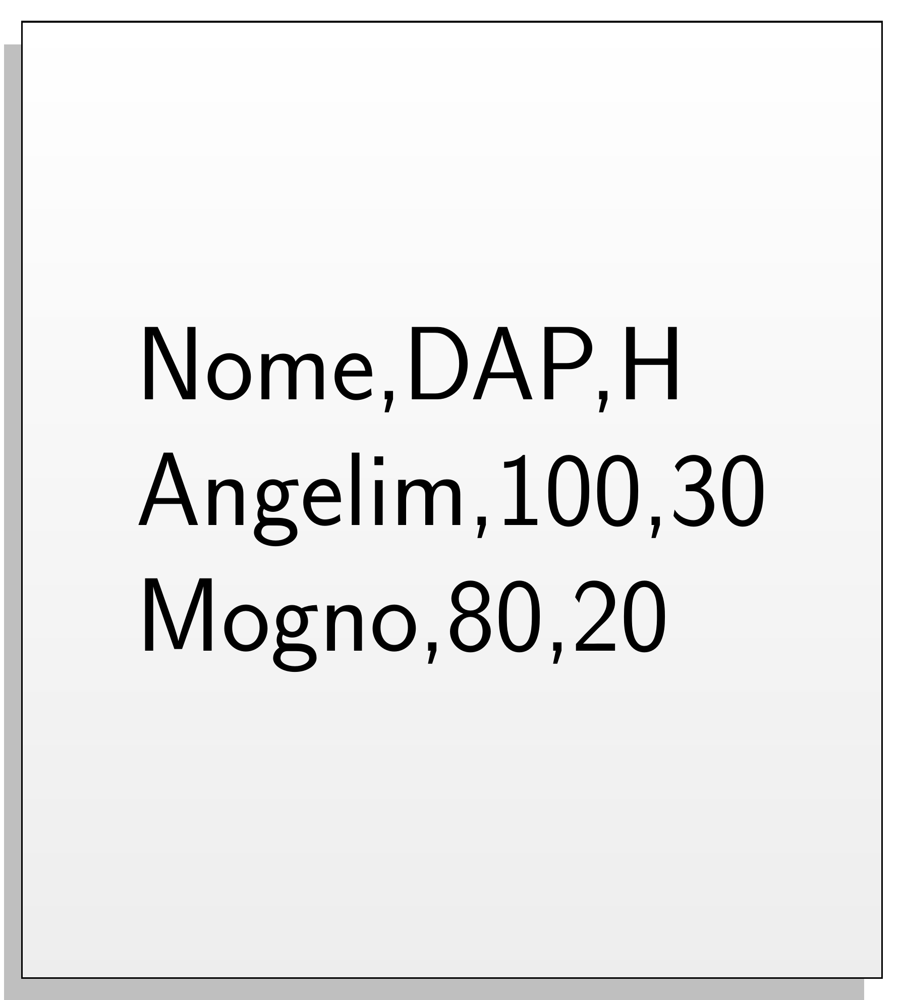
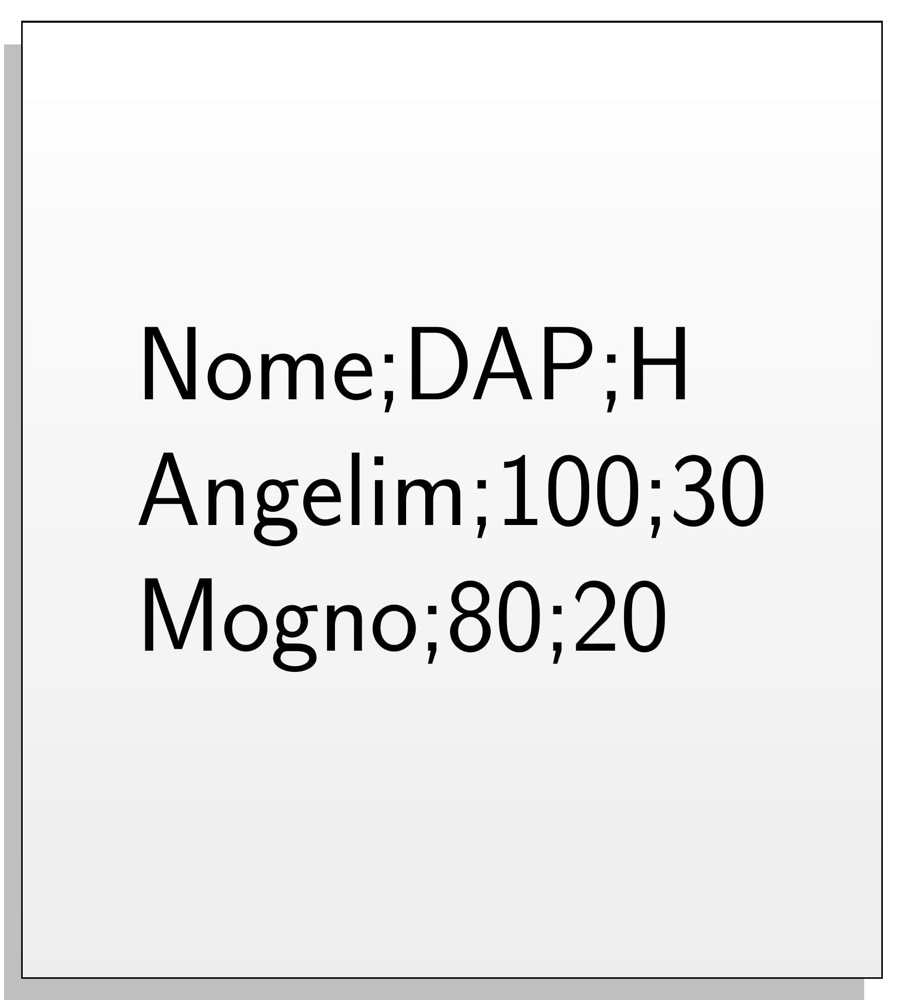
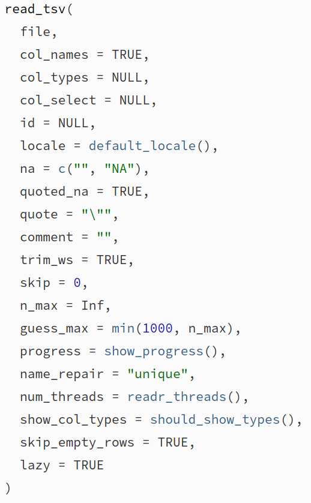

class: title-slide, center, middle
background-image: url(fig/slide-title/ufpa2.png), url(fig/slide-title/sciflor.png), url(fig/slide-title/ufes.png), url(fig/slide-title/img3.png)
background-position: 90% 90%, 50% 10%, 10% 90%
background-size: 250px, 300px, 100px, cover

```{r setup, include=FALSE}
knitr::opts_chunk$set(
	error = FALSE,
	fig.align = "center",
	fig.showtext = TRUE,
	message = FALSE,
	warning = FALSE,
	cache = FALSE,
	collapse = TRUE,
	dpi = 600
)
```

```{r packages, include=FALSE}
# remotes::install_github("dill/emoGG")
# remotes::install_github("hadley/emo")
library(ggplot2)
library(dplyr)
library(ggimage)
library(kableExtra)
library(readr)
library(emo)
```

```{css, echo=FALSE}
.with-logo::before {
	content: '';
	width: 120px;
	height: 120px;
	position: absolute;
	bottom: 1.3em;
	right: -0.3em;
	background-size: contain;
	background-repeat: no-repeat;
}

.logo-ufpa::before {
	background-image: url(fig/slide-title/ufpa.png);
}
```

```{r xaringan-logo, echo=FALSE}
library(xaringanExtra)
use_logo(
  image_url = "fig/slide-title/sciflor.png",
  position = css_position(top = "1.5em", right = "0.6em"),
  width = "210px",
  height = "210px"
)

use_extra_styles(
  hover_code_line = TRUE,         #<<
  mute_unhighlighted_code = TRUE  #<<
)
xaringanExtra::use_editable(expires = 1)
#.can-edit[Você pode editar este título de slide]
#.can-edit.key-firstSlideTitle[Change this title and then reload the page]
use_clipboard()
```

```{r icon, echo=FALSE}
#remotes::install_github("mitchelloharawild/icons")
#remotes::install_github('emitanaka/anicon')
#library(icons)
#download_fontawesome()
#download_simple_icons()
```

```{r customDT, echo=F}
CustomDT <- function(data){
  data %>% DT::datatable(editable = 'cell', rownames = FALSE,
                         style = "default",
                         class = "display", width = '180px',
                         caption = '',
     options=list(pageLength = 10, dom = 'tip', autoWidth = F,
       initComplete = htmlwidgets::JS(
          "function(settings, json) {",
          paste0("$(this.api().table().container()).css({'font-size': '", "9pt", "'});"),
          "}")
       ) 
     )
}
```


<!-- title-slide -->
# Minicurso: Introdução ao R para Análise de Dados

## .font90[Parte 3 - Visualização de Dados <br> com ggplot2] `r anicon::faa("pagelines", animate="horizontal", colour="green")`

#### **Prof. Dr. Deivison Venicio Souza**
##### Universidade Federal do Pará (UFPA) 
##### Faculdade de Engenharia Florestal
##### E-mail: deivisonvs@ufpa.br
<br>
##### `r format(Sys.Date(),"%d/%B/%Y")`

---

layout: true
class: with-logo logo-ufpa
<div class="my-header"></div>
<div class="my-footer"><span>Prof. Dr. Deivison Venicio Souza (E-mail: deivisonvs@ufpa.br)&emsp;&emsp;&emsp;&emsp;&emsp; <div3>Introdução ao R para Análise de Dados</div3>/ <div2>Parte 3 - Visualização de Dados com ggplot2</div2> </div>

---

<br>
## Objetivos
<br><br>
Ao final desta terceira parte (.blue[Visualização de Dados com ggplot2]) espera-se que os participantes possam alcançar conhecimentos para...
<br><br>

* Construir gráficos no R usando funções do pacote **ggplot2**; e
* Combinar gráficos usando o pacote **XXXXX**.
<br><br>

.pull-left-7[
```{r echo=FALSE, out.width='50%', fig.align='center', fig.cap='', dpi=600}
knitr::include_graphics("https://tidyverse.tidyverse.org/articles/tidyverse-logo.png")
```
]

.pull-left-7[
```{r echo=FALSE, out.width='50%', fig.align='center', fig.cap='', dpi=600}
knitr::include_graphics("https://ggplot2.tidyverse.org/logo.png")
```
]

---

<br>
## Conteúdo

.pull-left-10[
.font80[
**Parte 1 - Visualização de dados com .orange[ggplot2]**

[1 - Motivação](#mot)

[2 - O pacote ggplot2](#ggplot2)

[3 - Conjunto de dados - IF100%](#data)

[4 - Função ggplot()](#ggplot)

&nbsp;&nbsp;&nbsp;&nbsp;[4.1 - Camada base](#cb)

&nbsp;&nbsp;&nbsp;&nbsp;[4.2 - Especificando x e y](#xy)

[5 - Gráfico de pontos (dispersão)](#point)

&nbsp;&nbsp;&nbsp;&nbsp;[5.1 - Adicionando linha de regressão](#alr)

&nbsp;&nbsp;&nbsp;&nbsp;[5.2 - Modificando a cor dos pontos](#mcp)

&nbsp;&nbsp;&nbsp;&nbsp;[5.3 - Modificando a forma dos pontos](#mfp)

&nbsp;&nbsp;&nbsp;&nbsp;[5.4 - Modificando a tamanho dos pontos](#mtp)

&nbsp;&nbsp;&nbsp;&nbsp;[5.5 - Personalisando a forma e a cor dos pontos](#pfcp)

]
]

.pull-right-10[
.pull-down[
.font80[
&nbsp;&nbsp;&nbsp;&nbsp;[5.6 - Modificando legendas](#ml)

&nbsp;&nbsp;&nbsp;&nbsp;[5.7 - Modificando títulos e escalas](#mte)

[6 - Gráficos de barras](#gb)

&nbsp;&nbsp;&nbsp;&nbsp;[6.1 - Modificando cores das barras](#mcb)

&nbsp;&nbsp;&nbsp;&nbsp;[6.2 - Reordenando as barras](#rb)

]
]
]

---


.pull-right-10[
.pull-down[
.font80[
**Parte 2 - Combinação de gráficos com .orange[XXXXXX]**

[1 - Função select() e suas auxiliares](#select)

]
]
]

---

layout: false
name: conc
class: inverse, top, right
background-image: url(fig/part1/arara.jpg)
background-size: cover

.font200[**.yellow[Parte 1] <br> .white[Visualização de dados <br> com ggplot2]**]

.left[.footnote[.white[Créditos: Imagem de IvaCastro por Pixabay].]]

---

layout: true
class: with-logo logo-ufpa
<div class="my-header"></div>
<div class="my-footer"><span>Prof. Dr. Deivison Venicio Souza (E-mail: deivisonvs@ufpa.br)&emsp;&emsp;&emsp;&emsp;&emsp; <div3>Introdução ao R para Análise de Dados</div3>/ <div2>Parte 3 - Visualização de Dados com ggplot2</div2> </div>

---
name: mot
<br>
## Motivação

.font90[
- .blue[Dados] constituem uma representação usada para .blue[gerar informações sobre um fenômeno].
- Os .blue[gráficos são representações visuais] úteis para exibir .blue[informações ocultas nos dados].
- Representações visuais são .blue[melhor interpretadas] pelo cerébro humano.
- A natureza da variável e o objetivo da análise, em geral, orientam a melhor representação visual.
- O R-base possui diversas funções para visualização de dados. Por exemplo, .green[**plot()**], .green[**hist()**], .green[**barplot()**], .green[**boxplot()**], entre outras.
- O tidyverse incorpora o pacote .blue[**ggplot2**], um framework sensacional para construção de gráficos elegantes.
]
<br><br>

.center[**O pacote .blue[ggplot2] será o nosso objeto de estudo!**]

---
name: ggplot2
<br>
## O pacote ggplot2 (tidyverse)
<br>

.font90[
- O ggplot2 é um pacote para .blue[visualização de dados] disponível no R.
- O pacote foi desenvolvido por .blue[Hadley Wickham], inspirado pelo livro .blue[**The Grammar of graphics**] (A gramática dos gráficos) de .blue[Leland Wilkinson].
- A essência do ggplot2 é a construção de gráficos ".blue[camada por camada]".
- O ggplot2 possui .blue[vantagens] frente ao R-base:
  + É altamente customizável;
  + É mais elegante (bonito);
  + É muito intuitivo, devido a filosofia de camadas.
]

.pull-left-7[
```{r echo=FALSE, out.width='45%', fig.align='center', fig.cap='', dpi=600}
knitr::include_graphics("https://ggplot2.tidyverse.org/logo.png")
```
]


---
name: data
## Pacote ggplot2 (tidyverse)

.font80[
### Conjunto de dados - Amostra de Inventário Florestal 100%...
]
<br>

.font80[
.pull-left-4[
```{r data, echo=T, eval=F}
data <- readr::read_csv(file="data/UPA07DVS.csv")

set.seed(1000)

data_sample <- data %>% 
  select(Nome_Especie, CAP, HC, QF, Selecao) %>% 
  filter(Nome_Especie %in% c('Acapu', 'Andiroba', 
                             'Maçaranduba', 'Goiabão')) %>% 
  group_by(Nome_Especie) %>% 
  sample_n(50, replace = F) %>%
  mutate(DAP = round(CAP/pi, 2), 
         V = round(((DAP^2*pi)/40000)*HC*0.7, 4))

data_sample %>% CustomDT # apenas p/ uma saída elegante da tabela
```
<br>

**Vamos usar uma amostra de 4 espécies florestais de um IF100% para construir 
os gráficos...**

**A base completa pode ser acessada em**: [IF100%](https://deivisonsouza.github.io/FL03034-EF/Slides/data/UPA07DVS.csv)

]
]

.font80[
.pull-right-4[
```{r ref.label="data", echo=FALSE, eval=TRUE, collapse=T}
```
]
]

---
name: ggplot
## Pacote ggplot2 (tidyverse)
<br>
### Sintaxe Básica

.pull-left-2[
.font80[
- A estrutura de dados deve ser um .blue[data.frame]. Não admite matrizes, vetores, e outros!
- A função principal é .green[ggplot()].
- Nesta função os argumentos básicos são: 
  + .blue[data]: argumento que recebe os dados no formato de **data.frame**.
  + .blue[mapping]: argumento que recebe informações das variáveis (x e y) a serem usadas na plotagem. Esses argumentos são passados dentro da função .blue[aes()].
<br><br>

Obs.: Se .blue[mapping] não for especificado na função .green[ggplot()], deve ser fornecido em cada camada adicionada ao gráfico.
]
]

---

## Pacote ggplot2 (tidyverse)
<br>
### Sintaxe Básica

- Existem 3 formas de invocar a função .green[ggplot()]:

.pull-left-8[
.font80[

.green[ggplot(.brown[df], aes(.blue[x], .blue[y], .blue[outras estéticas]))]
<br><br>

- Método é recomendado quando dados de **um único data.frame** e também as **mesmas estéticas** são usadas nas camadas adicionadas.
]
]

--

.pull-left-8[
.font80[
.center[.green[ggplot(.brown[df])]]
<br>

- Método é recomendado quando dados de **um único data.frame** é usado pelas camadas adicionadas, mas as **estéticas variam de uma camada para outra**.

]
]

--

.pull-left-8[
.font80[
.center[.green[ggplot()]]
<br>

- Método é recomendado quando **vários data.frames precisam ser usados para produzir diferentes camadas** no gráfico. É usual para gráficos complexos.
]
]

---
name: cb
## Pacote ggplot2 (tidyverse)
<br>
### Camada base

.pull-left-4[
.font80[

```{r gg, echo=T, eval=F}
ggplot(data = data_sample)
```

- A execução da função .green[ggplot()] (sem argumentos) ou com apenas o argumento .blue[data] especificado .green[ggplot(.blue[data] = .brown[data_sample])] gera simplesmente a base do gráfico (sem elementos estéticos e geométricos).
<br><br>

```{r echo=T, eval=F}
data_sample %>% ggplot()
```

- É comum usar o operador .blue[%>%] para enviar o conjunto de dados para a função .green[ggplot()].

]
]

.pull-right-4[
.font80[
```{r ref.label="gg", fig.width=6, fig.height=5, echo=F, eval=T}
```
]
]

---
name: xy
## Pacote ggplot2 (tidyverse)

.font80[
### Camada base - .black[Especificando x e y]
]
<br>

.pull-left-4[
.font80[

```{r gg2, echo=T, eval=F}
ggplot(data = data_sample, 
       mapping = aes(x = DAP, y = HC)) # 1ª camada
```
<br>

- Adicionamos ".blue[x]" = DAP e ".blue[y]" = HC dentro da função .green[aes()] do argumento .blue[mapping].
- Isso informar que as variáveis DAP e HC devem ser usadas nos eixos x e y, respectivamente, do gráfico.
- Apesar disso, ainda não é possível visualizar um gráfico com elementos geométricos representativos dos dados.
- Então, é necessário definir o **tipo de gráfico** que deseja-se construir.

]
]

.pull-right-4[
.font80[
```{r ref.label="gg2", fig.width=6, fig.height=5, echo=F, eval=T}
```
]
]

---
name: point
## Pacote ggplot2 (tidyverse)
<br>
### Gráfico de pontos (dispersão)

.pull-left-4[
.font80[
**Útil para exibir a relação entre duas variáveis contínuas...**
```{r point1, echo=T, eval=F}
ggplot(data = data_sample, 
       mapping = aes(x = DAP, y = V)) + # 1ª camada
  geom_point()                          # 2ª camada
```
<br>

`r emo::ji("point_right")` **2ª camada**:

- A função .green[geom_point()] foi usada para adicionar uma camada de pontos no gráfico. Tem-se um gráfico de dispersão.
- **Importante**: Para adicionar camadas usa-se o operador .red[**+**].

]
]

.pull-right-4[
.font80[
```{r ref.label="point1", fig.width=6, fig.height=5, echo=F, eval=T}
```
]
]

---
name: alr
## Pacote ggplot2 (tidyverse)

.font70[
### Gráfico de pontos (dispersão) - .black[Adicione linha de regressão]
]
<br>

.pull-left-4[
.font80[

```{r point2, echo=T, eval=F}
ggplot(data = data_sample, 
       mapping = aes(x = DAP, y = V)) +       # 1ª camada
  geom_point() +                              # 2ª camada
  geom_smooth(method='lm', formula=y~x, se=F) # 3ª camada
```
<br>

`r emo::ji("point_right")` **3ª camada**:

- A função .green[geom_smooth()] foi usada para adicionar uma linha de regressão linear (y~x = V~DAP).
]
]

.pull-right-4[
.font80[
```{r ref.label="point2", fig.width=6, fig.height=5, echo=F, eval=T}
```
]
]

---

## Pacote ggplot2 (tidyverse)

.font70[
### Gráfico de pontos (dispersão) - .black[Adicione linha de regressão]
]
<br>

.pull-left-4[
.font80[

```{r point3, echo=T, eval=F}
ggplot(data = data_sample, 
       mapping = aes(x = DAP, y = V)) +          # 1ª camada
  geom_point() +                                 # 2ª camada
  geom_smooth(method='lm', formula=y~x, se=F) +  # 3ª camada
  geom_smooth(method='lm', formula=y~poly(x,2), 
              se=F, color = "red")               # 4ª camada
```
<br>

`r emo::ji("point_right")` **4ª camada**:

- A função .green[geom_smooth()] foi usada para adicionar outra linha de regressão, porém de um polinômio de segundo grau (y~x<sup>2</sup> = V~DAP<sup>2</sup>).
]
]

.pull-right-4[
.font80[
```{r ref.label="point3", fig.width=6, fig.height=5, echo=F, eval=T}
```
]
]

---
name: mcp
## Pacote ggplot2 (tidyverse)

.font50[
### Gráfico de pontos (dispersão) - .black[Modifique a cor dos pontos]
]
<br>

.pull-left-4[
.font70[
- Identificando os pontos pertencentes a cada espécie...

```{r point4, echo=T, eval=F}
ggplot(data = data_sample, 
       mapping = aes(x = DAP, y = V)) +           # 1ª camada
  geom_point(mapping = aes(colour=Nome_Especie))  # 2ª camada
```
<br>

`r emo::ji("point_right")` **2ª camada**:
- A função .green[geom_point()] também possui argumentos para customização de atributos estéticos. (?geom_point).
- mapping: pode receber argumentos por meio da função .green[aes()]:

x, y, alpha, .magenta[**colour**], fill, group, shape, size, stroke

- O argumento .magenta[**colour**] recebeu a coluna "Nome_Especie" e mapeou diferentes cores para as categorias: Acapu, Andiroba, Goiabão, Maçaranduba.

]
]

.pull-right-4[
.font80[
```{r ref.label="point4", fig.width=6, fig.height=5, echo=F, eval=T}
```
]
]

---
name: mfp
## Pacote ggplot2 (tidyverse)

.font50[
### Gráfico de pontos (dispersão) - .black[Modifique a forma dos pontos]
]
<br>

.pull-left-4[
.font70[
```{r point5, echo=T, eval=F}
ggplot(data = data_sample, 
       mapping = aes(x = DAP, y = V)) +           # 1ª camada
  geom_point(mapping = aes(colour=Nome_Especie,
                           shape=Selecao))        # 2ª camada
```
<br>

`r emo::ji("point_right")` **2ª camada**:

- O argumento .magenta[**shape**] recebeu a coluna "Selecao" e mapeou diferentes formas para as categorias: Explorar e Remanescente.
]
]

.pull-right-4[
.font80[
```{r ref.label="point5", fig.width=6, fig.height=5, echo=F, eval=T}
```
]
]

---
name: mtp
## Pacote ggplot2 (tidyverse)

.font50[
### Gráfico de pontos (dispersão) - .black[Tamanho proporcional]
]
<br>

.pull-left-4[
.font70[
- **Bubblechart** (gráfico de bolhas): É um gráfico de dispersão, em que uma terceira dimensão é adicionada.

```{r point6, echo=T, eval=F}
ggplot(data = data_sample %>% filter(Nome_Especie == 'Maçaranduba'), 
       mapping = aes(x = DAP, y = V)) +           # 1ª camada
  geom_point(mapping = aes(colour = Selecao,
                           size = HC))            # 2ª camada
```
<br>

`r emo::ji("point_right")` **2ª camada**:

- O argumento .magenta[**size**] (dentro de .green[aes()]) recebeu a coluna "HC" e mapeou tamanhos de pontos proporcionais aos valores de HC.
- Portanto, a altura de cada árvore é representada pelo tamanho do círculo.
]
]

.pull-right-4[
.font80[
```{r ref.label="point6", fig.width=6, fig.height=5, echo=F, eval=T}
```
]
]

---

## Pacote ggplot2 (tidyverse)

.font70[
### Gráfico de pontos (dispersão) - .black[Modifique tamanho dos pontos]
]
<br>

.pull-left-4[
.font70[
- Aumentando tamanho de todos os pontos, mas na mesma proporção...

```{r point7, echo=T, eval=F}
ggplot(data = data_sample %>% 
           filter(Nome_Especie %in% c('Acapu', 'Maçaranduba')), 
       mapping = aes(x = DAP, y = V)) +           # 1ª camada
  geom_point(mapping = aes(colour = Nome_Especie,
                           shape = Selecao),
             size = 4)                            # 2ª camada
```
<br>

`r emo::ji("point_right")` **2ª camada**:

- Isso é feito com argumento .magenta[**size**], porém fora de .green[aes()].
- Especifique um valor inteiro para o argumento.
]
]

.pull-right-4[
.font80[
```{r ref.label="point7", fig.width=6, fig.height=5, echo=F, eval=T}
```
]
]

---
name: pfcp
## Pacote ggplot2 (tidyverse)

.font60[
### Gráfico de pontos (dispersão) - .black[Personalise a forma e a cor dos pontos]
]
<br>

.pull-left-4[
.font70[
```{r point8, echo=T, eval=F}
ggplot(data = data_sample %>% 
           filter(Nome_Especie %in% c('Andiroba', 'Maçaranduba')), 
       mapping = aes(x = DAP, y = V)) +               # 1ª camada
  geom_point(mapping = aes(colour = Nome_Especie,
                           shape = Selecao),
             size = 4) +                              # 2ª camada
  scale_shape_manual(values = c(3, 5)) +              # 3ª camada
  scale_color_manual(values = c('#999999','#E69F00')) # 4ª camada
```
<br>

`r emo::ji("point_right")` **3ª e 4ª camadas**:

- Use .green[scale_shape_manual()] e .green[scale_color_manual()] para definir a forma e cor desejada para os pontos (e muito mais), respectivamente. 
- Experimente .green[scale_size_manual()].
]
]

.pull-right-4[
.font80[
```{r ref.label="point8",fig.width=6, fig.height=5, echo=F, eval=T}
```
]
]

---

## Pacote ggplot2 (tidyverse)

.font70[
### Gráfico de pontos (dispersão) - .black[Tipos de formas (shapes)]
]
<br>

```{r echo=F, eval=T, out.width='35%'}
shapes <- data.frame(
  shape = c(0:19, 22, 21, 24, 23, 20),
  x = 0:24 %/% 5,
  y = -(0:24 %% 5)
)

ggplot(shapes, aes(x, y)) +
  geom_point(aes(shape = shape), size = 10, fill = "red") +
  geom_text(aes(label = shape), size=7, hjust = 0, nudge_x = 0.15) +
  scale_shape_identity() +
  expand_limits(x = 4.1) +
  theme_void()
```


---

## Pacote ggplot2 (tidyverse)

.font70[
### Gráfico de pontos (dispersão) - .black[Modifique legendas]
]
<br>

.pull-left-4[
.font70[
```{r point9, echo=T, eval=F}
ggplot(data = data_sample %>% 
           filter(Nome_Especie %in% c('Andiroba', 'Maçaranduba')), 
       mapping = aes(x = DAP, y = V)) +                 # 1ª camada
  geom_point(mapping = aes(colour = Nome_Especie,
                           shape = Selecao),
             size = 4) +                                # 2ª camada
  scale_shape_manual(values = c(3, 5),
                     labels = c("Árvore para explorar", 
                                "Árvore remanescente"),
                     name = "Seleção") +                # 3ª camada
  scale_color_manual(values = c('#999999','#E69F00'),
                     labels = c("Carapa guianensis", 
                                "Manilkara elata"),
                     name = "Espécie")                  # 4ª camada
```
<br>

`r emo::ji("point_right")` **3ª e 4ª camadas**:

- Explore os argumentos .blue[labels] e .blue[name] nas camadas de .green[scale_shape_manual()] e .green[scale_color_manual()].
]
]

.pull-right-4[
.font80[
```{r ref.label="point9",fig.width=6, fig.height=5, echo=F, eval=T}
```
]
]

---

## Pacote ggplot2 (tidyverse)

.font70[
### Gráfico de pontos (dispersão) - .black[Modifique títulos e escalas]
]
<br>

.pull-left-4[
.font70[
```{r point10, echo=T, eval=F}
ggplot(data = data_sample %>% 
           filter(Nome_Especie %in% c('Andiroba', 'Maçaranduba')), 
       mapping = aes(x = DAP, y = V)) +                 # 1ª camada
  geom_point(mapping = aes(colour = Nome_Especie,
                           shape = Selecao),
             size = 4) +                                # 2ª camada
  scale_shape_manual(values = c(3, 5),
                     labels = c("Árvore para explorar", 
                                "Árvore remanescente"),
                     name = "Seleção") +                # 3ª camada
  scale_color_manual(values = c('#999999','#E69F00'),
                     labels = c("Carapa guianensis", 
                                "Manilkara elata"),
                     name = "Espécie") +                # 4ª camada
  scale_x_continuous(name = "Diâmetro (cm)",
                     limits = c(35, 115),
                     breaks = seq(35, 115, 10))         # 5ª camada
```

`r emo::ji("point_right")` **5ª camada**:

- Argumentos .blue[name], .blue[limits] e .blue[breaks] na camada de .green[scale_x_continuous()]. Experimente: .green[scale_y_continuous()].
]
]

.pull-right-4[
.font80[
```{r ref.label="point10",fig.width=6, fig.height=5, echo=F, eval=T}
```
]
]

---

## Pacote ggplot2 (tidyverse)

.font70[
### Gráfico de pontos (dispersão) - .black[Adicione títulos, subtítulos, tags...]
]
<br>

.pull-left-4[
.font70[

```{r point11, echo=T, eval=F}
ggplot(data = data_sample %>% 
           filter(Nome_Especie %in% c('Andiroba', 'Maçaranduba')), 
       mapping = aes(x = DAP, y = V)) +                 # 1ª camada
  geom_point(mapping = aes(colour = Nome_Especie,
                           shape = Selecao),
             size = 4) +                                # 2ª camada
  scale_shape_manual(values = c(3, 5),
                     labels = c("Árvore para explorar", 
                                "Árvore remanescente"),
                     name = "Seleção") +                # 3ª camada
  scale_color_manual(values = c('#999999','#E69F00'),
                     labels = c("Carapa guianensis", 
                                "Manilkara elata"),
                     name = "Espécie") +                # 4ª camada
  labs(title = "Relação Volume-Diâmetro", 
       subtitle = "(IF100% - Amazônia)",
       tag = "A", x = "Diâmetro (cm)", 
       y = "Volume (m³)")                               # 5ª camada
```

`r emo::ji("point_right")` **5ª camada**:

- Experimente a função .green[labs()] para adicionar títulos.
]
]

.pull-right-4[
.font80[
```{r ref.label="point11",fig.width=6, fig.height=5, echo=F, eval=T}
```
]
]

---
name: gb
## Pacote ggplot2 (tidyverse)

.font80[
### Gráfico de barras (ou colunas) - Funcão geom_col()
]
<br>

.font70[
.pull-left-4[
```{r echo=T, eval=T}
data_top <- data %>% 
  count(Nome_Especie) %>%
  top_n(10, n)

# Adicione **arrange(desc(n))** se desejar 
# imprimir a tabela ordenada por "n".
```

```{r dtop, echo=F, eval=F}
data %>% 
  count(Nome_Especie) %>%
  top_n(10, n) %>%
  CustomDT
```
<br>

**Primeiro, vamos extrair do IF100% as 10 espécies com mais indivíduos...**

- Isso é feito em 2 passos:

1. .green[count()] : cria uma tabela de frequências simples para todas as espécies;
2. .green[top_n()]: filtra as 10 espécies com mais indivíduos.

]
]

.font80[
.pull-right-4[
```{r ref.label="dtop", echo=FALSE, eval=TRUE, collapse=T}
```
]
]

---

## Pacote ggplot2 (tidyverse)

.font70[
### Gráfico de barras - .black[Função geom_col()]
]
<br>

.pull-right-4[
.pull-top[
.font70[
```{r bar1, echo=T, eval=F}
ggplot(data = data_top) +                            # 1ª camada
  geom_col(mapping = aes(x = n, y = Nome_Especie))   # 2ª camada
```
<br>

`r emo::ji("point_right")` **2ª camada**:

- A função .green[geom_col()] foi usada para adicionar uma camada de colunas no gráfico. Tem-se um gráfico de barras.
<br><br>
]
]
]

--

.pull-left-4[
.font80[
```{r ref.label="bar1", fig.width=6, fig.height=5, echo=F, eval=T}
```
]
]

--

.font70[
.center[
**Atenção!**
<br><br>

.blue[Perceba que dessa vez não mapeamos x e y na função ggplot(). Você entenderá o motivo mais a frente...].


]
]

---
name: mcb
## Pacote ggplot2 (tidyverse)

.font70[
### Gráfico de barras - .black[Modificando cores das barras]
]
<br>

.pull-right-4[
.pull-top[
.font70[
```{r bar2, echo=T, eval=F}
  ggplot(data = data_top) +                         # 1ª camada
  geom_col(mapping = aes(x = n,
                         y = Nome_Especie,
                         fill = Nome_Especie), 
               show.legend = F)                     # 2ª camada
```
<br>

`r emo::ji("point_right")` **2ª camada**:

- Em .green[geom_col()] pode-se adicionar elementos estéticos.
- Por exemplo, o argumento .brown[fill] recebeu a coluna "Nome_Especie" e mapeou diferentes cores para as categorias.
<br><br>
]
]
]

--

.pull-left-4[
.font80[
```{r ref.label="bar2",fig.width=6, fig.height=5, echo=F, eval=T}
```
]
]

---
name: rb
## Pacote ggplot2 (tidyverse)

.font70[
### Gráfico de barras - .black[Reordenando as barras]
]
<br>

.pull-right-4[
.pull-top[
.font70[
```{r bar3, echo=T, eval=F}
data_top %>%
  mutate(Nome_Especie = forcats::fct_reorder(Nome_Especie, n)) %>% 
  ggplot() +                                          # 1ª camada
  geom_col(mapping = aes(x = n,
                         y = Nome_Especie,
                         fill = Nome_Especie), 
               show.legend = F)                       # 2ª camada
```
<br>

- Use a função .green[fct_reorder()] do pacote **forcats** para reordenar os níveis de fator da variável "Nome_Especie".
- Repasse o comando dentro da função .green[mutate()] do **dplyr**.
<br><br>

**Experimente**: Faça .green[as.factor(.black[data_top$Nome_Especie])] e veja como os níveis de fator são ordenados por padrão.
]
]
]

--

.pull-left-4[
.font80[
```{r ref.label="bar3", fig.width=6, fig.height=5, echo=F, eval=T}
```
]
]

---
name: arb
## Pacote ggplot2 (tidyverse)

.font70[
### Gráfico de barras - .black[Adicionando rótulos nas barras]
]
<br>

.pull-right-4[
.pull-top[
.font70[
```{r bar4, echo=T, eval=F}
data_top %>%
  mutate(Nome_Especie = forcats::fct_reorder(Nome_Especie, n)) %>% 
  ggplot() +                                             # 1ª camada
  geom_col(mapping = aes(x = n,
                         y = Nome_Especie,
                         fill = Nome_Especie), 
               show.legend = F) +                        # 2ª camada
  geom_label(aes(x = n/2, y = Nome_Especie, label = n), 
             size = 3)                                   # 3ª camada
```
<br>

`r emo::ji("point_right")` **3ª camada**:

- Use a função .green[geom_label()] para reordenar adicionar rótulos com os valores de contagem por espécie a cada barra..
- **Importante**: perceba que para .green[geom_label()] precisamos mapear novos pares de valores (x e y), que indicam a posição de impressão dos rótulos no gráfico. 
- Este é o motivo para não especificar x e y em ggplot()!

]
]
]

--

.pull-left-4[
.font80[
```{r ref.label="bar4",fig.width=6, fig.height=5, echo=F, eval=T}
```
]
]

---

layout: false
name: conc
class: inverse, top, right
background-image: url(fig/part1/arara.jpg)
background-size: cover

.font200[**.yellow[Parte 1] <br> .white[Combinação de gráficos <br> com .orange[XXXXXX]]**]

.left[.footnote[.white[Créditos: Imagem de IvaCastro por Pixabay].]]

---

layout: true
class: with-logo logo-ufpa
<div class="my-header"></div>
<div class="my-footer"><span>Prof. Dr. Deivison Venicio Souza (E-mail: deivisonvs@ufpa.br)&emsp;&emsp;&emsp;&emsp;&emsp; <div3>Introdução ao R para Análise de Dados</div3>/ <div2>Parte 3 - Visualização de Dados com ggplot2</div2> </div>

---
<!-- name: readr -->
<!-- ## Pacote readr (tidyverse) -->
<!-- <br> -->

<!-- ### Funções de importação e exportação -->

<!-- .font80[ -->
<!-- - O pacote .blue[readr] está incorporado no tidyverse. -->
<!-- - Possui diversas funções para importação e exportação de dados. -->
<!-- ] -->
<!-- <br> -->

<!-- .pull-left-4[ -->
<!-- **Funções para importação de dados** -->
<!-- .font80[ -->
<!-- ```{r echo=T, eval=T} -->
<!-- ls("package:readr") %>%  -->
<!--   stringr::str_subset("^read_") -->
<!-- ``` -->
<!-- ] -->
<!-- ] -->

<!-- .pull-right-4[ -->
<!-- **Funções para exportação de dados** -->
<!-- .font80[ -->
<!-- ```{r echo=T, eval=T} -->
<!-- ls("package:readr") %>%  -->
<!--   stringr::str_subset("^write_") -->
<!-- ``` -->
<!-- ] -->
<!-- ] -->

<!-- --- -->

<!-- ## Pacote readr (tidyverse) -->
<!-- <br> -->

<!-- ### Principais funções -->

<!-- - Vamos estudar apenas algumas das principais funções de importação... -->
<!-- <br><br> -->

<!-- .left[ -->
<!-- .font80[ -->
<!-- **read_csv()** - Importar um arquivo de valores separados por .blue[vírgula] (*Comma-Separated Values*) -->

<!-- **read_csv2()** - Importar um arquivo de valores separados por .blue[ponto e vírgula] (*Semicolon-Separated Values*) -->

<!-- **read_tsv()** - Importar um arquivo de valores separados por .blue[tabulação] (*Tab-Separated Values*) -->

<!-- **read_delim()** - Importar um arquivo de valores separados por um .blue[delimitador incomum] -->

<!-- ] -->
<!-- ] -->

<!-- --- -->
<!-- name: csv -->
<!-- ## Pacote readr (tidyverse) -->
<!-- <br> -->

<!-- ### Arquivo de valores separados por vírgula .black[(].blue[,].black[)] -->

<!-- - **Função .black[read_csv()]** - Importar arquivos .csv -->

<!-- .pull-left-9[ -->

<!-- ```{r echo=FALSE, out.width='30%', fig.align='center', fig.cap='', dpi=600} -->
<!--  -->
<!-- ``` -->

<!-- .font80[ -->
<!-- ```{r echo=T, eval=F} -->
<!-- # Cria o arquivo "file1.csv" e salva em "data" -->
<!-- readr::write_file(x = "Nome,DAP,H\nAngelim,100,30\nMogno,80,20", -->
<!--                   path = "data/file1.csv") -->
<!-- ``` -->
<!-- ] -->
<!-- ] -->

<!-- -- -->

<!-- .pull-right-9[ -->
<!-- .font80[ -->
<!-- **O único argumento obrigatório (file) é o caminho para o arquivo.** -->

<!-- ```{r file1, echo=T, eval=F} -->
<!-- # Importa o arquivo "file1" -->
<!-- (file1 <- readr::read_csv(file="data/file1.csv")) -->
<!-- ``` -->

<!-- ```{r ref.label="file1", echo=F, eval=T, collapse=T} -->
<!-- ``` -->
<!-- ] -->

<!-- ] -->

<!-- --- -->

<!-- ## Pacote readr (tidyverse) -->
<!-- <br> -->

<!-- .pull-left-4[ -->
<!-- .font80[ -->
<!-- ### Arquivo de valores separados por vírgula .black[(].blue[,].black[)] -->

<!-- - **Função .black[read_csv()]** - Importar arquivos .csv -->

<!-- A função possui inúmeros argumentos que podem ser especificados. -->

<!-- Execute o comando: **args(**read_csv**)** -->
<!-- ] -->
<!-- ] -->


<!-- .pull-right-4[ -->
<!-- ```{r echo=FALSE, out.width='55%', fig.align='center', fig.cap='', dpi=600} -->
<!-- knitr::include_graphics("fig/part2/readcsv.png") -->
<!-- ``` -->
<!-- ] -->

<!-- --- -->

<!-- ## Pacote readr (tidyverse) -->
<!-- <br> -->

<!-- ### Arquivo de valores separados por vírgula .black[(].blue[,].black[)] -->

<!-- - **Função .black[read_csv()]** - Importar arquivos .csv -->
<!-- .font80[ -->
<!-- Vamos explorar outros argumentos da função read_csv()...(.green[**col_names**]) -->
<!-- ] -->

<!-- .pull-left-4[ -->
<!-- .font80[ -->
<!-- ```{r file3, echo=T, eval=F} -->
<!-- # Importa o arquivo "file1" -->
<!-- (file1 <- readr::read_csv(file="data/file1.csv")) -->
<!-- ``` -->

<!-- ```{r ref.label="file3", echo=F, eval=T, collapse=T} -->
<!-- ``` -->
<!-- ] -->
<!-- ] -->

<!-- -- -->

<!-- .pull-right-4[ -->
<!-- .font80[ -->
<!-- ```{r file4, echo=T, eval=F} -->
<!-- # Importa o arquivo "file1" -->
<!-- (file1.mod1 <- readr::read_csv(file="data/file1.csv",  -->
<!--                           col_names = c("Name", "DBH", "H") -->
<!--                           ) -->
<!--  ) -->
<!-- ``` -->

<!-- ```{r ref.label="file4", echo=F, eval=T, collapse=T} -->
<!-- ``` -->
<!-- ] -->
<!-- ] -->


<!-- --- -->

<!-- ## Pacote readr (tidyverse) -->
<!-- <br> -->

<!-- ### Arquivo de valores separados por vírgula .black[(].blue[,].black[)] -->

<!-- - **Função .black[read_csv()]** - Importar arquivos .csv -->
<!-- .font80[ -->
<!-- Vamos explorar outros argumentos da função read_csv()...(.green[**col_types**]) -->
<!-- ] -->

<!-- .pull-left-4[ -->
<!-- .font80[ -->
<!-- ```{r file5, echo=T, eval=F} -->
<!-- # Importa o arquivo "file1" -->
<!-- (file1 <- readr::read_csv(file="data/file1.csv")) -->
<!-- ``` -->

<!-- ```{r ref.label="file5", echo=F, eval=T, collapse=T} -->
<!-- ``` -->

<!-- **col_types** = É possível usar strings compactas em que cada caractere representa uma coluna. -->

<!-- **c** = character; **i** = integer; **n** = number; **d** = double; **l** = logical; **f** = factor; **D** = date -->

<!-- ] -->
<!-- ] -->


<!-- -- -->

<!-- .pull-right-4[ -->
<!-- .font80[ -->
<!-- ```{r file6, echo=T, eval=F} -->
<!-- # Importa o arquivo "file1" -->
<!-- (file1.mod2 <- readr::read_csv(file="data/file1.csv",  -->
<!--                           col_types = "fdi") -->
<!--  ) -->
<!-- ``` -->

<!-- ```{r ref.label="file6", echo=F, eval=T, collapse=T} -->
<!-- ``` -->
<!-- ] -->
<!-- ] -->


<!-- --- -->

<!-- ## Pacote readr (tidyverse) -->
<!-- <br> -->

<!-- ### Arquivo de valores separados por vírgula .black[(].blue[,].black[)] -->

<!-- - **Função .black[read_csv()]** - Importar arquivos .csv -->
<!-- .font80[ -->
<!-- Vamos explorar outros argumentos da função read_csv()...(.green[**col_select**]) -->
<!-- ] -->

<!-- .pull-left-4[ -->
<!-- .font80[ -->
<!-- ```{r file7, echo=T, eval=F} -->
<!-- # Importa o arquivo "file1" -->
<!-- (file1 <- readr::read_csv(file="data/file1.csv")) -->
<!-- ``` -->

<!-- ```{r ref.label="file7", echo=F, eval=T, collapse=T} -->
<!-- ``` -->
<!-- ] -->
<!-- ] -->

<!-- -- -->

<!-- .pull-right-4[ -->
<!-- .font80[ -->
<!-- ```{r file8, echo=T, eval=F} -->
<!-- # Importa o arquivo "file1" -->
<!-- (file1.mod3 <- readr::read_csv( -->
<!--   file = "data/file1.csv",  -->
<!--   col_select = c(Nome, DAP) -->
<!--   ) -->
<!--  ) -->
<!-- ``` -->

<!-- ```{r ref.label="file8", echo=F, eval=T, collapse=T} -->
<!-- ``` -->
<!-- ] -->
<!-- ] -->

<!-- --- -->
<!-- name: csv2 -->
<!-- ## Pacote readr (tidyverse) -->
<!-- <br> -->

<!-- ### Arquivo de valores separados por ponto e vírgula .black[(].blue[;].black[)] -->

<!-- - **Função .black[read_csv2()]** -->
<!-- .font80[ -->
<!-- Os arquivo separados por ponto e vírgula também têm a extensão .blue[.csv]. -->
<!-- ] -->

<!-- .pull-left-9[ -->

<!-- ```{r echo=FALSE, out.width='30%', fig.align='center', fig.cap='', dpi=600} -->
<!--  -->
<!-- ``` -->

<!-- .font80[ -->
<!-- ```{r echo=T, eval=F} -->
<!-- # Cria o arquivo "file2.csv" e salva em "data" -->
<!-- readr::write_file(x = "Nome;DAP;H\nAngelim;100;30\nMogno;80;20", -->
<!--                   path = "data/file2.csv") -->
<!-- ``` -->
<!-- ] -->
<!-- ] -->

<!-- -- -->

<!-- .pull-right-9[ -->
<!-- .font80[ -->
<!-- **O único argumento obrigatório (file) é o caminho para o arquivo.** -->

<!-- ```{r filecsv2, echo=T, eval=F} -->
<!-- # Importa o arquivo "file2" -->
<!-- (file2 <- readr::read_csv2(file="data/file2.csv")) -->
<!-- ``` -->

<!-- ```{r ref.label="filecsv2", echo=F, eval=T, collapse=T} -->
<!-- ``` -->
<!-- ] -->

<!-- ] -->

<!-- --- -->

<!-- ## Pacote readr (tidyverse) -->

<!-- .pull-left-4[ -->
<!-- .font80[ -->
<!-- ### Arquivo de valores separados por ponto e vírgula .black[(].blue[;].black[)] -->
<!-- <br><br> -->

<!-- - **Função .black[read_csv2()]** -->

<!-- A função possui inúmeros argumentos que podem ser especificados. -->

<!-- Execute o comando: **args(**read_csv2**)** -->
<!-- <br><br> -->

<!-- `r anicon::faa("hand-point-right", animate="horizontal")` **Explore os demais argumentos!** `r anicon::faa("home", animate="horizontal")` -->

<!-- ] -->
<!-- ] -->

<!-- .pull-right-4[ -->
<!-- ```{r echo=FALSE, out.width='55%', fig.align='center', fig.cap='', dpi=600} -->
<!-- knitr::include_graphics("fig/part2/readcsv2.png") -->
<!-- ``` -->
<!-- ] -->


<!-- --- -->
<!-- name: tsv -->
<!-- ## Pacote readr (tidyverse) -->
<!-- <br> -->

<!-- ### Arquivo de valores separados por tabulação .black[(].blue[\t].black[)] -->

<!-- - **Função .black[read_tsv()]** - Importar arquivos (.tsv, .txt) -->

<!-- .pull-left-9[ -->

<!-- ```{r echo=FALSE, out.width='30%', fig.align='center', fig.cap='', dpi=600} -->
<!-- knitr::include_graphics("fig/part2/file3.png") -->
<!-- ``` -->

<!-- .font80[ -->
<!-- ```{r echo=T, eval=F} -->
<!-- # Cria o arquivo "file3.tsv" e salva em "data" -->
<!-- readr::write_file(x = "Nome\tDAP\tH\nAngelim\t100\t30\nMogno\t80\t20", -->
<!--                   path = "data/file3.txt") -->
<!-- ``` -->
<!-- ] -->
<!-- ] -->

<!-- -- -->

<!-- .pull-right-9[ -->
<!-- .font80[ -->
<!-- **O único argumento obrigatório (file) é o caminho para o arquivo.** -->

<!-- ```{r filetsv, echo=T, eval=F} -->
<!-- # Importa o arquivo "file3" -->
<!-- (file3 <- readr::read_tsv(file="data/file3.txt")) -->
<!-- ``` -->

<!-- ```{r ref.label="filetsv", echo=F, eval=T, collapse=T} -->
<!-- ``` -->
<!-- ] -->

<!-- ] -->

<!-- --- -->

<!-- ## Pacote readr (tidyverse) -->

<!-- .pull-left-4[ -->
<!-- .font80[ -->
<!-- ### Arquivo de valores separados por tabulação .black[(].blue[\t].black[)] -->
<!-- <br><br> -->

<!-- - **Função .black[read_tsv()]** - Importar arquivos (.tsv, .txt) -->

<!-- A função possui inúmeros argumentos que podem ser especificados. -->

<!-- Execute o comando: **args(**read_tsv**)** -->
<!-- <br><br> -->

<!-- `r anicon::faa("hand-point-right", animate="horizontal")` **Explore os demais argumentos!** `r anicon::faa("home", animate="horizontal")` -->

<!-- ] -->
<!-- ] -->

<!-- .pull-right-4[ -->
<!-- ```{r echo=FALSE, out.width='55%', fig.align='center', fig.cap='', dpi=600} -->
<!--  -->
<!-- ``` -->
<!-- ] -->


<!-- --- -->
<!-- name: delim -->
<!-- ## Pacote readr (tidyverse) -->
<!-- <br> -->

<!-- ### Arquivo de valores separados por um delimitador incomum -->

<!-- - **Função .black[read_delim()]** - Importar arquivos com delimitator de valores específicos -->

<!-- .pull-left-9[ -->

<!-- ```{r echo=FALSE, out.width='30%', fig.align='center', fig.cap='', dpi=600} -->
<!-- knitr::include_graphics("fig/part2/file4.png") -->
<!-- ``` -->

<!-- .font80[ -->
<!-- ```{r echo=T, eval=F} -->
<!-- # Cria o arquivo "file4.txt" e salva em "data" -->
<!-- readr::write_file(x = "Nome|DAP|H\nAngelim|100|30\nMogno|80|20", -->
<!--                   path = "data/file4.txt") -->
<!-- ``` -->
<!-- ] -->
<!-- ] -->

<!-- -- -->

<!-- .pull-right-9[ -->
<!-- .font80[ -->
<!-- **O único argumento obrigatório (file) é o caminho para o arquivo.** -->

<!-- ```{r filedelim, echo=T, eval=F} -->
<!-- # Importa o arquivo "file4" -->
<!-- (file4 <- readr::read_delim( -->
<!--   file="data/file4.txt",  -->
<!--   delim = "|") -->
<!--  ) -->
<!-- ``` -->

<!-- ```{r ref.label="filedelim", echo=F, eval=T, collapse=T} -->
<!-- ``` -->
<!-- ] -->

<!-- ] -->

<!-- --- -->

<!-- ## Pacote readr (tidyverse) -->

<!-- .pull-left-4[ -->
<!-- .font80[ -->
<!-- ### Arquivo de valores separados por um delimitador incomum -->
<!-- <br><br> -->

<!-- - **Função .black[read_delim()]** - Importar arquivos com delimitator de valores específicos -->

<!-- A função possui inúmeros argumentos que podem ser especificados. -->

<!-- Execute o comando: **args(**read_delim**)** -->
<!-- <br><br> -->

<!-- `r anicon::faa("hand-point-right", animate="horizontal")` **Explore os demais argumentos!** `r anicon::faa("home", animate="horizontal")` -->

<!-- ] -->
<!-- ] -->

<!-- .pull-right-4[ -->
<!-- ```{r echo=FALSE, out.width='55%', fig.align='center', fig.cap='', dpi=600} -->
<!-- knitr::include_graphics("fig/part2/readdelim.png") -->
<!-- ``` -->
<!-- ] -->


<!-- --- -->
<!-- name: importdata -->
<!-- ## Pacote readr (tidyverse) -->
<!-- <br> -->

<!-- ### Importação de dados usando a GUI do RStudio -->
<!-- <br><br> -->

<!-- .font90[ -->
<!-- - Use a Interface Gráfica do Usuário (*Graphical User Interface* - GUI) para importar dados rapidamente. -->
<!-- - RStudio IDE $\rightarrow$ Environment $\rightarrow$ .blue[Import Dataset] $\rightarrow$ From Text (readr). -->
<!-- - É possível também usar funções do R-base e de outros pacotes, como **readxl** (para ler arquivos .blue[.xlsx]). -->

<!-- ] -->


<!-- --- -->

<!-- layout: false -->
<!-- name: conc -->
<!-- class: inverse, top, right -->
<!-- background-image: url(fig/part1/arara2.jpg) -->
<!-- background-size: cover -->

<!-- .font200[**.yellow[Parte 2] <br> .white[Manipulação de dados <br> com dplyr]**] -->

<!-- .left[.footnote[.white[Créditos: Imagem de ljwong por Pixabay].]] -->

<!-- --- -->

<!-- layout: true -->
<!-- class: with-logo logo-ufpa -->
<!-- <div class="my-header"></div> -->
<!-- <div class="my-footer"><span>Prof. Dr. Deivison Venicio Souza (E-mail: deivisonvs@ufpa.br)&emsp;&emsp;&emsp;&emsp;&emsp; <div3>Introdução ao R para Análise de Dados</div3>/ <div2>Parte 2 - Importação e Manipulação de Dados: readr e dplyr</div2> </div> -->

<!-- --- -->

<!-- ## Manipulação de dados com dplyr -->
<!-- <br> -->

<!-- ### Sobre o pacote **dplyr**... -->

<!-- .font90[ -->
<!-- - Um dos principais pacotes do .green[tidyverse]. -->
<!-- - O pacote dplyr é essencialmente um conjunto consistente de funções projetadas para resolver os desafios mais comuns de **manipulação de dados**. -->
<!-- - Foi projetado para ser simples, intuitivo, amigável e elegante. -->
<!-- - O encadeamento de comandos é facilitado pelo emprego do operador **%>%** (pipe). -->
<!-- - Códigos em R que fazem uso dos verbos dplyr são mais elegantes, compeeensíveis e intuitivos. -->
<!-- - **Cheatsheet do RStudio** (folhas de resumo): Help $\rightarrow$ Cheatsheets $\rightarrow$ Data Transformation with dplyr -->
<!-- - No site da RStudio pode-se encontrar algumas Cheatsheet traduzidas: [cheatsheets-translations](https://www.rstudio.com/resources/cheatsheets/#translations) -->
<!-- ] -->

<!-- ```{r echo=FALSE, out.width='10%', fig.align='center', fig.cap='', dpi=600} -->
<!-- knitr::include_graphics("https://dplyr.tidyverse.org/logo.png") -->
<!-- ``` -->

<!-- --- -->

<!-- ## Manipulação de dados com dplyr -->
<!-- <br> -->

<!-- ### Verbos **dplyr** -->

<!-- .pull-left-4[ -->
<!-- - O **dplyr** possui diversos verbos (funções). A seguir são listadas algumas das mais usuais: -->

<!-- .center[ -->
<!-- mutate() -->

<!-- select() -->

<!-- filter() -->

<!-- arrange() -->

<!-- group_by() -->

<!-- summarise() -->
<!-- ] -->
<!-- ] -->

<!-- .pull-right-4[ -->
<!-- Lista de funções do pacote **dplyr**: -->

<!-- ```{r, echo=T, eval=F} -->
<!-- ls("package:dplyr") -->
<!-- #length(ls("package:dplyr")) -->
<!-- #lsf.str("package:dplyr") -->
<!-- ``` -->

<!-- Ou simplesmente digite .green[`dplyr::`]. -->

<!-- Atualmente são `r length(ls("package:dplyr"))` funções projetadas para manipulação de dados. -->

<!-- ] -->

<!-- --- -->

<!-- ## Manipulação de dados com dplyr -->
<!-- <br> -->

<!-- ### Uma pequena amostra para praticar... -->

<!-- .font90[ -->
<!-- .pull-left-9[ -->

<!-- ```{r tibble, echo=T, eval=F} -->
<!-- data <- readr::read_csv("data/data.csv") -->

<!-- data %>% CustomDT # Apenas para customizar a tabela -->
<!-- ``` -->

<!-- .font90[ -->
<!-- Para aprender a intuição de algumas funções **dplyr** usaremos uma pequena amostra de dados de IF100%. -->
<!-- <br><br> -->

<!-- **A base completa pode ser acessada em**: [IF100%](https://deivisonsouza.github.io/FL03034-EF/Slides/data/UPA07DVS.csv) -->
<!-- ] -->
<!-- ] -->
<!-- ] -->

<!-- .pull-right-9[ -->
<!-- ```{r ref.label="tibble", echo=FALSE, eval=TRUE, collapse=T} -->
<!-- ``` -->
<!-- ] -->

<!-- --- -->

<!-- layout: false -->
<!-- name: select -->
<!-- class: inverse, bottom, right -->
<!-- background-image: url(fig/part1/arara.jpg) -->
<!-- background-size: cover -->


<!-- .font200[**.white[Manipulação de dados <br> com dplyr]**] -->
<!-- <br><br> -->

<!-- .font150[**.yellow[Função select()]**] -->

<!-- --- -->

<!-- layout: true -->
<!-- class: with-logo logo-ufpa -->
<!-- <div class="my-header"></div> -->
<!-- <div class="my-footer"><span>Prof. Dr. Deivison Venicio Souza (E-mail: deivisonvs@ufpa.br)&emsp;&emsp;&emsp;&emsp;&emsp; <div3>Introdução ao R para Análise de Dados</div3>/ <div2>Parte 2 - Importação e Manipulação de Dados: readr e dplyr</div2> </div> -->

<!-- --- -->

<!-- ## Manipulação de dados com dplyr -->
<!-- <br> -->

<!-- ### .font90[Função **select()** - .black[selecionar colunas]] -->

<!-- .pull-left-10[ -->
<!-- ```{r echo=F, eval=T} -->
<!-- data %>% CustomDT -->
<!-- ``` -->
<!-- ] -->

<!-- -- -->

<!-- .pull-right-10[ -->
<!-- .pull-left-11[ -->
<!-- .blue[**Seleção de uma coluna...**] -->
<!-- <br><br> -->
<!-- .font80[ -->
<!-- **Alternativa 1**: -->
<!-- ```{r echo=TRUE, eval=FALSE} -->
<!-- select(data, Nome_Especie) -->
<!-- ``` -->

<!-- **Alternativa 2** -->
<!-- ```{r echo=TRUE, eval=FALSE} -->
<!-- data %>% -->
<!--   select(Nome_Especie) -->
<!-- ``` -->
<!-- ] -->

<!-- ```{r sel, echo=F, eval=F} -->
<!-- select(data, Nome_Especie) %>% CustomDT -->
<!-- ``` -->
<!-- ] -->

<!-- .pull-right-11[ -->
<!-- ```{r ref.label="sel", echo=FALSE, eval=TRUE, collapse=T} -->
<!-- ``` -->
<!-- ] -->
<!-- ] -->

<!-- --- -->

<!-- ## Manipulação de dados com dplyr -->
<!-- <br> -->

<!-- ### .font90[Função **select()** - .black[selecionar colunas]] -->

<!-- .pull-left-10[ -->
<!-- ```{r echo=F, eval=T} -->
<!-- data %>% CustomDT -->
<!-- ``` -->
<!-- ] -->

<!-- -- -->

<!-- .pull-right-10[ -->
<!-- .pull-left-11[ -->
<!-- .font80[ -->
<!-- .blue[**Seleção de várias coluna...**] -->
<!-- <br><br> -->

<!-- **Alternativa 1** (sem %>%) -->
<!-- ```{r echo=TRUE, eval=FALSE} -->
<!-- select( -->
<!--   data, CAP, HC, QF -->
<!--   ) -->
<!-- ``` -->

<!-- **Alternativa 2** (com %>%) -->
<!-- ```{r echo=TRUE, eval=FALSE} -->
<!-- data %>% -->
<!--   select(CAP, HC, QF) -->
<!-- ``` -->

<!-- **Alternativa 3** (%>% + :) -->
<!-- ```{r echo=TRUE, eval=FALSE} -->
<!-- data %>% -->
<!--   select(CAP:QF) -->
<!-- ``` -->

<!-- ] -->

<!-- ```{r sel2, echo=F, eval=F} -->
<!-- select(data, CAP, HC, QF) %>% CustomDT -->
<!-- ``` -->
<!-- ] -->

<!-- .pull-right-11[ -->
<!-- ```{r ref.label="sel2", echo=FALSE, eval=TRUE, collapse=T} -->
<!-- ``` -->
<!-- ] -->
<!-- ] -->

<!-- --- -->
<!-- name: startwith -->
<!-- ## Manipulação de dados com dplyr -->
<!-- <br> -->

<!-- ### .font90[Função **select()** - .black[selecionar colunas]] -->

<!-- .pull-left-10[ -->
<!-- ```{r echo=F, eval=T} -->
<!-- data %>% CustomDT -->
<!-- ``` -->
<!-- ] -->

<!-- -- -->

<!-- .pull-right-10[ -->
<!-- .pull-left-11[ -->
<!-- .font80[ -->
<!-- .blue[**Usando funções auxiliares...**] -->
<!-- <br><br> -->

<!-- .green[**starts_with()**] -->
<!-- <br> -->

<!-- .font80[ -->
<!-- Função usada para selecionar colunas cujos nomes .green[iniciam] com um texto padrão. -->
<!-- ] -->

<!-- ```{r echo=TRUE, eval=FALSE} -->
<!-- select( -->
<!--   data, starts_with("N") -->
<!--   ) -->
<!-- ``` -->

<!-- ] -->

<!-- ```{r sel3, echo=F, eval=F} -->
<!-- select(data, starts_with("N")) %>% CustomDT -->
<!-- ``` -->
<!-- ] -->

<!-- .pull-right-11[ -->
<!-- ```{r ref.label="sel3", echo=FALSE, eval=TRUE, collapse=T} -->
<!-- ``` -->
<!-- ] -->
<!-- ] -->


<!-- --- -->
<!-- name: endswith -->
<!-- ## Manipulação de dados com dplyr -->
<!-- <br> -->

<!-- ### .font90[Função **select()** - .black[selecionar colunas]] -->

<!-- .pull-left-10[ -->
<!-- ```{r echo=F, eval=T} -->
<!-- data %>% CustomDT -->
<!-- ``` -->
<!-- ] -->

<!-- -- -->

<!-- .pull-right-10[ -->
<!-- .pull-left-11[ -->
<!-- .font80[ -->
<!-- .blue[**Usando funções auxiliares...**] -->
<!-- <br><br> -->

<!-- .green[**ends_with()**] -->
<!-- <br> -->

<!-- .font80[ -->
<!-- Função usada para selecionar colunas cujos nomes .green[terminam] com um texto padrão. -->
<!-- ] -->

<!-- ```{r echo=TRUE, eval=FALSE} -->
<!-- select( -->
<!--   data, ends_with("e") -->
<!--   ) -->
<!-- ``` -->

<!-- ] -->

<!-- ```{r sel4, echo=F, eval=F} -->
<!-- select(data, ends_with("e")) %>% CustomDT -->
<!-- ``` -->
<!-- ] -->

<!-- .pull-right-11[ -->
<!-- ```{r ref.label="sel4", echo=FALSE, eval=TRUE, collapse=T} -->
<!-- ``` -->
<!-- ] -->
<!-- ] -->

<!-- --- -->
<!-- name: contains -->
<!-- ## Manipulação de dados com dplyr -->
<!-- <br> -->

<!-- ### .font90[Função **select()** - .black[selecionar colunas]] -->

<!-- .pull-left-10[ -->
<!-- ```{r echo=F, eval=T} -->
<!-- data %>% CustomDT -->
<!-- ``` -->
<!-- ] -->

<!-- -- -->

<!-- .pull-right-10[ -->
<!-- .pull-left-11[ -->
<!-- .font80[ -->
<!-- .blue[**Usando funções auxiliares...**] -->
<!-- <br><br> -->

<!-- .green[**contains()**] -->
<!-- <br> -->

<!-- .font80[ -->
<!-- Função usada para selecionar colunas cujos nomes tenham algum texto padrão. -->
<!-- ] -->

<!-- ```{r echo=TRUE, eval=FALSE} -->
<!-- select( -->
<!--   data, contains("e") -->
<!--   ) -->
<!-- ``` -->

<!-- ] -->

<!-- ```{r sel5, echo=F, eval=F} -->
<!-- select(data, contains("e")) %>% CustomDT -->
<!-- ``` -->
<!-- ] -->

<!-- .pull-right-11[ -->
<!-- ```{r ref.label="sel5", echo=FALSE, eval=TRUE, collapse=T} -->
<!-- ``` -->
<!-- ] -->
<!-- ] -->

<!-- --- -->
<!-- name: matches -->
<!-- ## Manipulação de dados com dplyr -->
<!-- <br> -->

<!-- ### .font90[Função **select()** - .black[selecionar colunas]] -->

<!-- .pull-left-10[ -->
<!-- ```{r echo=F, eval=T} -->
<!-- data %>% CustomDT -->
<!-- ``` -->
<!-- ] -->

<!-- -- -->

<!-- .pull-right-10[ -->
<!-- .pull-left-11[ -->
<!-- .font80[ -->
<!-- .blue[**Usando funções auxiliares...**] -->
<!-- <br><br> -->

<!-- .green[**matches()**] -->
<!-- <br> -->

<!-- .font80[ -->
<!-- Função usada para selecionar colunas que contenham nomes correspondentes à alguma expressão regular. -->
<!-- ] -->

<!-- ```{r echo=TRUE, eval=FALSE} -->
<!-- select( -->
<!--   data, matches('No|cao|F') -->
<!--   ) -->
<!-- ``` -->

<!-- ] -->

<!-- ```{r sel6, echo=F, eval=F} -->
<!-- select(data, matches('No|cao|F')) %>% CustomDT -->
<!-- ``` -->
<!-- ] -->

<!-- .pull-right-11[ -->
<!-- ```{r ref.label="sel6", echo=FALSE, eval=TRUE, collapse=T} -->
<!-- ``` -->
<!-- ] -->
<!-- ] -->

<!-- --- -->
<!-- name: everything -->
<!-- ## Manipulação de dados com dplyr -->
<!-- <br> -->

<!-- ### .font90[Função **select()** - .black[selecionar colunas]] -->

<!-- .pull-left-10[ -->
<!-- ```{r echo=F, eval=T} -->
<!-- data %>% CustomDT -->
<!-- ``` -->
<!-- ] -->

<!-- -- -->

<!-- .pull-right-10[ -->
<!-- .pull-left-5[ -->
<!-- .font80[ -->
<!-- .blue[**Usando funções auxiliares...**] -->
<!-- <br><br> -->

<!-- .green[**everything()**] -->
<!-- <br> -->

<!-- .font80[ -->
<!-- Seleciona todas as variáveis. É útil para reordenar algumas colunas, sem se importar com a ordem das demais. -->
<!-- ] -->

<!-- ```{r echo=TRUE, eval=FALSE} -->
<!-- data %>% -->
<!--   select( -->
<!--     Nome_Especie, -->
<!--     Selecao, -->
<!--     everything()) -->
<!-- ``` -->

<!-- ] -->

<!-- ```{r sel11, echo=F, eval=F} -->
<!-- data %>% -->
<!--   select(Nome_Especie, -->
<!--          Selecao, -->
<!--          everything()) %>% -->
<!--   CustomDT -->
<!-- ``` -->
<!-- ] -->

<!-- .pull-right-5[ -->
<!-- ```{r ref.label="sel11", echo=FALSE, eval=TRUE, collapse=T} -->
<!-- ``` -->
<!-- ] -->
<!-- ] -->

<!-- --- -->
<!-- name: where -->
<!-- ## Manipulação de dados com dplyr -->
<!-- <br> -->

<!-- ### .font90[Função **select()** - .black[selecionar colunas]] -->

<!-- .pull-left-10[ -->
<!-- ```{r echo=F, eval=T} -->
<!-- data %>% CustomDT -->
<!-- ``` -->
<!-- ] -->

<!-- -- -->

<!-- .pull-right-10[ -->
<!-- .pull-left-10[ -->
<!-- .font80[ -->
<!-- .blue[**Usando funções auxiliares...**] -->
<!-- <br><br> -->

<!-- .green[**where()**] -->
<!-- <br> -->

<!-- .font80[ -->
<!-- Aplica uma função à todas as variáveis e seleciona aquelas para as quais a resposta é TRUE. -->
<!-- ] -->

<!-- ```{r echo=TRUE, eval=FALSE} -->
<!-- data %>% -->
<!--   select(where(is.character)) -->
<!-- ``` -->

<!-- ] -->

<!-- ```{r sel12, echo=F, eval=F} -->
<!-- data %>% -->
<!--   select(where(is.character)) %>% -->
<!--   CustomDT -->
<!-- ``` -->
<!-- ] -->

<!-- .pull-right-10[ -->
<!-- ```{r ref.label="sel12", echo=FALSE, eval=TRUE, collapse=T} -->
<!-- ``` -->
<!-- ] -->
<!-- ] -->

<!-- --- -->

<!-- ## Manipulação de dados com dplyr -->
<!-- <br> -->

<!-- ### .font90[Função **select()** - .black[selecionar colunas]] -->

<!-- .pull-left-10[ -->
<!-- ```{r echo=F, eval=T} -->
<!-- data %>% CustomDT -->
<!-- ``` -->
<!-- ] -->

<!-- -- -->

<!-- .pull-right-10[ -->
<!-- .pull-left-11[ -->
<!-- .font80[ -->
<!-- .blue[**Combinando funções auxiliares e operadores lógicos...**] -->
<!-- <br><br> -->

<!-- ```{r echo=TRUE, eval=FALSE} -->
<!-- data %>% -->
<!--   select( -->
<!--     starts_with("N") & -->
<!--       !ends_with("Arvore")) -->
<!-- ``` -->


<!-- `r anicon::faa("hand-point-down", animate="vertical")` **Experimente o comando** -->
<!-- <br> -->

<!-- ```{r echo=TRUE, eval=FALSE} -->
<!-- data %>% -->
<!--   select( -->
<!--     starts_with("N") | -->
<!--       ends_with("Arvore")) -->
<!-- ``` -->

<!-- ] -->

<!-- ```{r sel8, echo=F, eval=F} -->
<!-- data %>% -->
<!--   select( -->
<!--     starts_with("N") & -->
<!--       !ends_with("Arvore")) %>% -->
<!--   CustomDT -->
<!-- ``` -->
<!-- ] -->

<!-- .pull-right-11[ -->
<!-- ```{r ref.label="sel8", echo=FALSE, eval=TRUE, collapse=T} -->
<!-- ``` -->
<!-- ] -->
<!-- ] -->

<!-- --- -->

<!-- ## Manipulação de dados com dplyr -->
<!-- <br> -->

<!-- ### .font90[Função **select()** - .black[selecionar colunas]] -->

<!-- .pull-left-10[ -->
<!-- ```{r echo=F, eval=T} -->
<!-- data %>% CustomDT -->
<!-- ``` -->
<!-- ] -->

<!-- -- -->

<!-- .pull-right-10[ -->
<!-- .pull-left-11[ -->
<!-- .font80[ -->
<!-- .blue[**Função concatenate**] -->
<!-- <br><br> -->

<!-- ```{r echo=TRUE, eval=FALSE} -->
<!-- data %>% -->
<!--   select(-c(CAP:Selecao)) -->
<!-- ``` -->


<!-- `r anicon::faa("hand-point-down", animate="vertical")` **Experimente o comando** -->
<!-- <br> -->

<!-- ```{r echo=TRUE, eval=FALSE} -->
<!-- data %>% -->
<!--   select(!(CAP:Selecao)) -->
<!-- ``` -->

<!-- ] -->

<!-- ```{r sel9, echo=F, eval=F} -->
<!-- data %>% -->
<!--   select(-c(CAP:Selecao)) %>% -->
<!--   CustomDT -->
<!-- ``` -->
<!-- ] -->

<!-- .pull-right-11[ -->
<!-- ```{r ref.label="sel9", echo=FALSE, eval=TRUE, collapse=T} -->
<!-- ``` -->
<!-- ] -->
<!-- ] -->

<!-- --- -->

<!-- ## Manipulação de dados com dplyr -->
<!-- <br> -->

<!-- ### .font90[Função **select()** - .black[selecionar colunas]] -->

<!-- .pull-left-10[ -->
<!-- ```{r echo=F, eval=T} -->
<!-- data %>% CustomDT -->
<!-- ``` -->
<!-- ] -->

<!-- -- -->

<!-- .pull-right-10[ -->
<!-- .pull-left-1[ -->
<!-- .font80[ -->
<!-- .blue[**Reordenar colunas**] -->
<!-- <br><br> -->

<!-- ```{r echo=TRUE, eval=FALSE} -->
<!-- data %>% -->
<!--   select(Nome_Especie, -->
<!--          Selecao, CAP, -->
<!--          QF, HC) -->
<!-- ``` -->

<!-- ] -->

<!-- ```{r sel10, echo=F, eval=F} -->
<!-- data %>% -->
<!--   select(Nome_Especie, Selecao, CAP, QF, HC) %>% -->
<!--   CustomDT -->
<!-- ``` -->
<!-- ] -->

<!-- .pull-right-2[ -->
<!-- ```{r ref.label="sel10", echo=FALSE, eval=TRUE, collapse=T} -->
<!-- ``` -->
<!-- ] -->
<!-- ] -->

<!-- --- -->

<!-- layout: false -->
<!-- name: arrange -->
<!-- class: inverse, bottom, right -->
<!-- background-image: url(fig/part1/arara.jpg) -->
<!-- background-size: cover -->


<!-- .font200[**.white[Manipulação de dados <br> com dplyr]**] -->
<!-- <br><br> -->

<!-- .font150[**.yellow[Função arrange()]**] -->

<!-- --- -->

<!-- layout: true -->
<!-- class: with-logo logo-ufpa -->
<!-- <div class="my-header"></div> -->
<!-- <div class="my-footer"><span>Prof. Dr. Deivison Venicio Souza (E-mail: deivisonvs@ufpa.br)&emsp;&emsp;&emsp;&emsp;&emsp; <div3>Introdução ao R para Análise de Dados</div3>/ <div2>Parte 2 - Importação e Manipulação de Dados: readr e dplyr</div2> </div> -->

<!-- --- -->

<!-- ## Manipulação de dados com dplyr -->
<!-- <br> -->

<!-- ### .font90[Função **arrange()** - .black[Ordenar linhas]] -->

<!-- .pull-left-10[ -->
<!-- ```{r echo=F, eval=T} -->
<!-- data %>% CustomDT -->
<!-- ``` -->
<!-- ] -->

<!-- -- -->

<!-- .pull-right-10[ -->
<!-- .pull-left-12[ -->
<!-- .font80[ -->
<!-- **Ordem crescente de uma variável** -->

<!-- ```{r echo=TRUE, eval=FALSE} -->
<!-- data %>% -->
<!--   arrange(HC) -->
<!-- ``` -->

<!-- ] -->

<!-- ```{r arr1, echo=F, eval=F} -->
<!-- data %>% -->
<!--   arrange(HC) %>% -->
<!--   CustomDT -->
<!-- ``` -->
<!-- ] -->

<!-- .pull-right-12[ -->
<!-- ```{r ref.label="arr1", echo=FALSE, eval=TRUE, collapse=T} -->
<!-- ``` -->
<!-- ] -->
<!-- ] -->

<!-- --- -->

<!-- ## Manipulação de dados com dplyr -->
<!-- <br> -->

<!-- ### .font90[Função **arrange()** - .black[Ordenar linhas]] -->

<!-- .pull-left-10[ -->
<!-- ```{r echo=F, eval=T} -->
<!-- data %>% CustomDT -->
<!-- ``` -->
<!-- ] -->

<!-- -- -->

<!-- .pull-right-10[ -->
<!-- .pull-left-12[ -->
<!-- .font80[ -->
<!-- **Ordem decrescente de uma variável** -->

<!-- ```{r echo=TRUE, eval=FALSE} -->
<!-- data %>% -->
<!--   arrange( -->
<!--     desc(HC) -->
<!--     ) -->
<!-- ``` -->

<!-- ] -->

<!-- ```{r arr2, echo=F, eval=F} -->
<!-- data %>% -->
<!--   arrange(desc(HC)) %>% -->
<!--   CustomDT -->
<!-- ``` -->
<!-- ] -->

<!-- .pull-right-12[ -->
<!-- ```{r ref.label="arr2", echo=FALSE, eval=TRUE, collapse=T} -->
<!-- ``` -->
<!-- ] -->
<!-- ] -->

<!-- --- -->

<!-- ## Manipulação de dados com dplyr -->
<!-- <br> -->

<!-- ### .font90[Função **arrange()** - .black[Ordenar linhas]] -->

<!-- .pull-left-10[ -->
<!-- ```{r echo=F, eval=T} -->
<!-- data %>% CustomDT -->
<!-- ``` -->
<!-- ] -->

<!-- -- -->

<!-- .pull-right-10[ -->
<!-- .pull-left-12[ -->
<!-- .font80[ -->
<!-- **Ordenar em função de duas ou mais variáveis** -->

<!-- ```{r echo=TRUE, eval=FALSE} -->
<!-- data %>% -->
<!--   arrange( -->
<!--     CAP, HC -->
<!--     ) -->
<!-- ``` -->

<!-- ] -->

<!-- ```{r arr3, echo=F, eval=F} -->
<!-- data %>% -->
<!--   arrange(CAP, HC) %>% -->
<!--   CustomDT -->
<!-- ``` -->
<!-- ] -->

<!-- .pull-right-12[ -->
<!-- ```{r ref.label="arr3", echo=FALSE, eval=TRUE, collapse=T} -->
<!-- ``` -->
<!-- ] -->
<!-- ] -->

<!-- --- -->

<!-- layout: false -->
<!-- name: filter -->
<!-- class: inverse, top, right -->
<!-- background-image: url(fig/part1/arara2.jpg) -->
<!-- background-size: cover -->


<!-- .font200[**.white[Manipulação de dados <br> com dplyr]**] -->
<!-- <br><br> -->

<!-- .font150[**.yellow[Função filter()]**] -->

<!-- --- -->

<!-- layout: true -->
<!-- class: with-logo logo-ufpa -->
<!-- <div class="my-header"></div> -->
<!-- <div class="my-footer"><span>Prof. Dr. Deivison Venicio Souza (E-mail: deivisonvs@ufpa.br)&emsp;&emsp;&emsp;&emsp;&emsp; <div3>Introdução ao R para Análise de Dados</div3>/ <div2>Parte 2 - Importação e Manipulação de Dados: readr e dplyr</div2> </div> -->

<!-- --- -->

<!-- ## Manipulação de dados com dplyr -->
<!-- <br> -->

<!-- ### .font90[Função **filter()** - .black[Filtrar linhas]] -->

<!-- .pull-left-10[ -->
<!-- ```{r echo=F, eval=T} -->
<!-- data %>% CustomDT -->
<!-- ``` -->
<!-- ] -->

<!-- -- -->

<!-- .pull-right-10[ -->
<!-- .pull-top[ -->
<!-- .font80[ -->
<!-- **Filtrar linhas em função de alguma variável** -->

<!-- ```{r echo=TRUE, eval=FALSE} -->
<!-- data %>% -->
<!--   filter(HC > 15) -->
<!-- ``` -->

<!-- ] -->

<!-- ```{r fil1, echo=F, eval=F} -->
<!-- data %>% -->
<!--   filter(HC > 15) %>% -->
<!--   CustomDT -->
<!-- ``` -->
<!-- ] -->

<!-- .pull-bottom[ -->
<!-- ```{r ref.label="fil1", echo=FALSE, eval=TRUE, collapse=T} -->
<!-- ``` -->

<!-- ] -->
<!-- ] -->

<!-- --- -->

<!-- ## Manipulação de dados com dplyr -->
<!-- <br> -->

<!-- ### .font90[Função **filter()** - .black[Filtrar linhas]] -->

<!-- .pull-left-10[ -->
<!-- ```{r echo=F, eval=T} -->
<!-- data %>% CustomDT -->
<!-- ``` -->
<!-- ] -->

<!-- -- -->

<!-- .pull-right-10[ -->
<!-- .pull-top[ -->
<!-- .font80[ -->
<!-- **Filtrar linhas para algum intervalo da variável** -->

<!-- ```{r echo=TRUE, eval=FALSE} -->
<!-- data %>% -->
<!--   filter(HC > 10 & HC <= 15) -->
<!-- ``` -->

<!-- ] -->

<!-- ```{r fil2, echo=F, eval=F} -->
<!-- data %>% -->
<!--   filter(HC > 10 & HC <= 15) %>% -->
<!--   CustomDT -->
<!-- ``` -->
<!-- ] -->

<!-- .pull-bottom[ -->
<!-- ```{r ref.label="fil2", echo=FALSE, eval=TRUE, collapse=T} -->
<!-- ``` -->

<!-- ] -->
<!-- ] -->

<!-- --- -->

<!-- ## Manipulação de dados com dplyr -->
<!-- <br> -->

<!-- ### .font90[Função **filter()** - .black[Filtrar linhas]] -->

<!-- .pull-left-10[ -->
<!-- ```{r echo=F, eval=T} -->
<!-- data %>% CustomDT -->
<!-- ``` -->
<!-- ] -->

<!-- -- -->

<!-- .pull-right-10[ -->
<!-- .pull-top[ -->
<!-- .font80[ -->
<!-- **Filtrar linhas em função de duas ou mais variáveis** -->

<!-- ```{r echo=TRUE, eval=FALSE} -->
<!-- data %>% -->
<!--   filter(HC > 10, Selecao == "Explorar") -->
<!-- ``` -->

<!-- ] -->

<!-- ```{r fil3, echo=F, eval=F} -->
<!-- data %>% -->
<!--   filter(HC > 10, Selecao == "Explorar") %>% -->
<!--   CustomDT -->
<!-- ``` -->
<!-- ] -->

<!-- .pull-bottom[ -->
<!-- ```{r ref.label="fil3", echo=FALSE, eval=TRUE, collapse=T} -->
<!-- ``` -->

<!-- ] -->
<!-- ] -->

<!-- --- -->

<!-- ## Manipulação de dados com dplyr -->
<!-- <br> -->

<!-- ### .font90[Função **filter()** - .black[Filtrar linhas]] -->

<!-- .pull-left-10[ -->
<!-- ```{r echo=F, eval=T} -->
<!-- data %>% CustomDT -->
<!-- ``` -->
<!-- ] -->

<!-- -- -->

<!-- .pull-right-10[ -->
<!-- .pull-top[ -->
<!-- .font80[ -->
<!-- **Filtrar linhas usando operador .green[%in%]** - Variáveis categóricas -->


<!-- ```{r echo=TRUE, eval=FALSE} -->
<!-- data %>% -->
<!--   filter(Nome_Especie %in% c('Acapu', 'Tauari')) -->
<!-- ``` -->

<!-- ] -->

<!-- ```{r fil4, echo=F, eval=F} -->
<!-- data %>% -->
<!--   filter(Nome_Especie %in% c('Acapu', 'Tauari')) %>% -->
<!--   CustomDT -->
<!-- ``` -->
<!-- ] -->

<!-- .pull-bottom[ -->
<!-- ```{r ref.label="fil4", echo=FALSE, eval=TRUE, collapse=T} -->
<!-- ``` -->

<!-- ] -->
<!-- ] -->

<!-- --- -->

<!-- ## Manipulação de dados com dplyr -->
<!-- <br> -->

<!-- ### .font90[Função **filter()** - .black[Filtrar linhas]] -->

<!-- .pull-left-10[ -->
<!-- ```{r echo=F, eval=T} -->
<!-- data %>% CustomDT -->
<!-- ``` -->
<!-- ] -->

<!-- -- -->

<!-- .pull-right-10[ -->
<!-- .pull-top[ -->
<!-- .font80[ -->
<!-- **Filtrar linhas com várias condições** -->


<!-- ```{r echo=TRUE, eval=FALSE} -->
<!-- data %>% -->
<!--   filter(Nome_Especie %in% c('Acapu', 'Tauari'), -->
<!--          HC >= 12, QF == 1) -->
<!-- ``` -->

<!-- ] -->

<!-- ```{r fil5, echo=F, eval=F} -->
<!-- data %>% -->
<!--   filter(Nome_Especie %in% c('Acapu', 'Tauari'), -->
<!--          HC >= 12, QF == 1) %>% -->
<!--   CustomDT -->
<!-- ``` -->
<!-- ] -->

<!-- .pull-bottom[ -->
<!-- ```{r ref.label="fil5", echo=FALSE, eval=TRUE, collapse=T} -->
<!-- ``` -->

<!-- ] -->
<!-- ] -->

<!-- --- -->

<!-- layout: false -->
<!-- name: mutate -->
<!-- class: inverse, bottom, right -->
<!-- background-image: url(fig/part1/arara.jpg) -->
<!-- background-size: cover -->


<!-- .font200[**.white[Manipulação de dados <br> com dplyr]**] -->
<!-- <br><br> -->

<!-- .font150[**.yellow[Função mutate()]**] -->

<!-- .white[Criar (ou modificar) variáveis e manter as existentes.] -->

<!-- --- -->

<!-- layout: true -->
<!-- class: with-logo logo-ufpa -->
<!-- <div class="my-header"></div> -->
<!-- <div class="my-footer"><span>Prof. Dr. Deivison Venicio Souza (E-mail: deivisonvs@ufpa.br)&emsp;&emsp;&emsp;&emsp;&emsp; <div3>Introdução ao R para Análise de Dados</div3>/ <div2>Parte 2 - Importação e Manipulação de Dados: readr e dplyr</div2> </div> -->

<!-- --- -->

<!-- ## Manipulação de dados com dplyr -->
<!-- <br> -->

<!-- ### .font90[Função **mutate()** - .black[Modificar e criar variáveis]] -->

<!-- .pull-left-12[ -->
<!-- ```{r echo=F, eval=T} -->
<!-- data %>% -->
<!--   select(-c(N_Arvore, QF, Selecao)) %>% -->
<!--   CustomDT -->
<!-- ``` -->
<!-- ] -->

<!-- -- -->

<!-- .pull-right-12[ -->
<!-- .pull-left-1[ -->
<!-- .font80[ -->
<!-- **Criar uma nova variável e adicioná-la à tabela** -->

<!-- ```{r echo=TRUE, eval=FALSE} -->
<!-- data %>% -->
<!--   mutate(DAP = CAP/pi) -->
<!-- ``` -->
<!-- <br><br> -->

<!-- `r anicon::faa("hand-point-down", animate="vertical")` **Experimente o comando** -->
<!-- ```{r echo=TRUE, eval=FALSE} -->
<!-- data %>% -->
<!--   mutate(DAP = round(CAP/pi, 2)) -->
<!-- ``` -->

<!-- ] -->

<!-- ```{r mut1, echo=F, eval=F} -->
<!-- data %>% -->
<!--   select(-c(N_Arvore, QF, Selecao)) %>% -->
<!--   mutate(DAP = CAP/pi) %>% -->
<!--   CustomDT -->
<!-- ``` -->
<!-- ] -->

<!-- .pull-right-2[ -->
<!-- ```{r ref.label="mut1", echo=FALSE, eval=TRUE, collapse=T} -->
<!-- ``` -->
<!-- ] -->
<!-- ] -->

<!-- --- -->

<!-- ## Manipulação de dados com dplyr -->
<!-- <br> -->

<!-- ### .font90[Função **mutate()** - .black[Modificar e criar variáveis]] -->

<!-- .pull-left-12[ -->
<!-- ```{r echo=F, eval=T} -->
<!-- data %>% -->
<!--   select(-c(N_Arvore, QF, Selecao)) %>% -->
<!--   CustomDT -->
<!-- ``` -->
<!-- ] -->

<!-- -- -->

<!-- .pull-right-12[ -->
<!-- .pull-left-1[ -->
<!-- .font80[ -->
<!-- **Modificar uma variável na tabela** -->

<!-- ```{r echo=TRUE, eval=FALSE} -->
<!-- data %>% -->
<!--   mutate(CAP = CAP/100) -->
<!-- ``` -->
<!-- <br><br> -->

<!-- `r anicon::faa("hand-point-down", animate="vertical")` **Experimente o comando** -->
<!-- ```{r echo=TRUE, eval=FALSE} -->
<!-- data %>% -->
<!--   mutate(CAP = round(CAP/100, 2)) -->
<!-- ``` -->

<!-- ] -->

<!-- ```{r mut2, echo=F, eval=F} -->
<!-- data %>% -->
<!--   select(-c(N_Arvore, QF, Selecao)) %>% -->
<!--   mutate(CAP = CAP/100) %>% -->
<!--   CustomDT -->
<!-- ``` -->
<!-- ] -->

<!-- .pull-right-2[ -->
<!-- ```{r ref.label="mut2", echo=FALSE, eval=TRUE, collapse=T} -->
<!-- ``` -->
<!-- ] -->
<!-- ] -->

<!-- --- -->

<!-- ## Manipulação de dados com dplyr -->
<!-- <br> -->

<!-- ### .font90[Função **mutate()** - .black[Modificar e criar variáveis]] -->

<!-- .pull-left-12[ -->
<!-- ```{r echo=F, eval=T} -->
<!-- data %>% -->
<!--   select(-c(N_Arvore, QF, Selecao)) %>% -->
<!--   CustomDT -->
<!-- ``` -->
<!-- ] -->

<!-- -- -->

<!-- .pull-right-12[ -->
<!-- .pull-left-1[ -->
<!-- .font80[ -->
<!-- **Modificar/criar múltiplas variáveis no mesmo mutate()** -->

<!-- ```{r echo=TRUE, eval=FALSE} -->
<!-- data %>% -->
<!--   mutate(DAP = CAP/pi, -->
<!--          CAP = CAP/100, -->
<!--          gi = (DAP^2*pi)/40000)) -->
<!-- ``` -->
<!-- <br><br> -->

<!-- `r anicon::faa("hand-point-down", animate="vertical")` **Experimente o comando** -->
<!-- ```{r echo=TRUE, eval=FALSE} -->
<!-- data %>% -->
<!--   mutate(DAP = CAP/pi, -->
<!--          CAP = CAP/100, -->
<!--          gi = (DAP^2*pi)/40000, -->
<!--          vi = gi*HC*0.7) -->
<!-- ``` -->

<!-- ] -->

<!-- ```{r mut3, echo=F, eval=F} -->
<!-- data %>% -->
<!--   select(-c(N_Arvore, QF, Selecao)) %>% -->
<!--   mutate(DAP = CAP/pi, -->
<!--          CAP = CAP/100, -->
<!--          gi = (DAP^2*pi)/40000) %>% -->
<!--   CustomDT -->
<!-- ``` -->
<!-- ] -->

<!-- .pull-right-2[ -->
<!-- ```{r ref.label="mut3", echo=FALSE, eval=TRUE, collapse=T} -->
<!-- ``` -->
<!-- ] -->
<!-- ] -->

<!-- --- -->
<!-- name: ifelse -->
<!-- ## Manipulação de dados com dplyr -->
<!-- <br> -->

<!-- ### .font90[Função **mutate()** - .black[Modificar e criar variáveis]] -->

<!-- .pull-left-12[ -->
<!-- ```{r echo=F, eval=T} -->
<!-- data %>% -->
<!--   select(-c(N_Arvore, QF, Selecao)) %>% -->
<!--   CustomDT -->
<!-- ``` -->
<!-- ] -->

<!-- -- -->

<!-- .pull-right-12[ -->
<!-- .pull-left-11[ -->
<!-- .font80[ -->
<!-- **.blue[Usando funções auxiliares...]** -->
<!-- <br><br> -->

<!-- **.green[if_else()]** -->
<!-- <br> -->

<!-- ```{r echo=TRUE, eval=FALSE} -->
<!-- data %>% -->
<!--   mutate(Selecao = if_else( -->
<!--     CAP >= 600, "Matriz", "Não Matriz" -->
<!--     )) -->
<!-- ``` -->

<!-- ] -->

<!-- ```{r mut4, echo=F, eval=F} -->
<!-- data %>% -->
<!--   select(-c(N_Arvore, QF, Selecao)) %>% -->
<!--   mutate(Selecao = if_else( -->
<!--     CAP >= 600, "Matriz", "Não Matriz")) %>% -->
<!--   CustomDT -->
<!-- ``` -->
<!-- ] -->

<!-- .pull-right-11[ -->
<!-- ```{r ref.label="mut4", echo=FALSE, eval=TRUE, collapse=T} -->
<!-- ``` -->
<!-- ] -->
<!-- ] -->


<!-- --- -->
<!-- name: casewhen -->
<!-- ## Manipulação de dados com dplyr -->
<!-- <br> -->

<!-- ### .font90[Função **mutate()** - .black[Modificar e criar variáveis]] -->

<!-- .pull-left-12[ -->
<!-- ```{r echo=F, eval=T} -->
<!-- data %>% -->
<!--   select(-c(N_Arvore, QF, Selecao)) %>% -->
<!--   CustomDT -->
<!-- ``` -->
<!-- ] -->

<!-- -- -->

<!-- .pull-right-12[ -->
<!-- .pull-left-2[ -->
<!-- .font80[ -->
<!-- **.blue[Usando funções auxiliares...]** -->
<!-- <br><br> -->

<!-- **.green[case_when()]** -->
<!-- <br> -->

<!-- Permite vetorizar várias instruções .green[if_else()]. É um equivalente R da instrução SQL CASE WHEN. -->

<!-- Criar uma nova coluna por múltiplas condições mutuamente exclusivas. -->

<!-- ```{r echo=TRUE, eval=FALSE} -->
<!-- data %>% -->
<!--   mutate( -->
<!--     Selecao = -->
<!--       case_when( -->
<!--         (CAP >= 600) ~ "Matriz", -->
<!--         (Nome_Especie == "Acapu") ~ "Protegida", -->
<!--         (CAP >= 158 & Nome_Especie != "Acapu") ~ "Explorar", -->
<!--     )) -->
<!-- ``` -->

<!-- ] -->

<!-- ```{r mut5, echo=F, eval=F} -->
<!-- data %>% -->
<!--   select(-c(N_Arvore, QF, Selecao)) %>% -->
<!--   mutate(Selecao = -->
<!--            case_when( -->
<!--              (CAP >= 600) ~ "Matriz", -->
<!--              (Nome_Especie == "Acapu") ~ "Protegida", -->
<!--              (CAP >= 158 & Nome_Especie != "Acapu") ~ "Explorar", -->
<!--     )) %>% -->
<!--   CustomDT -->
<!-- ``` -->
<!-- ] -->

<!-- .pull-right-1[ -->
<!-- ```{r ref.label="mut5", echo=FALSE, eval=TRUE, collapse=T} -->
<!-- ``` -->
<!-- ] -->
<!-- ] -->

<!-- --- -->

<!-- layout: false -->
<!-- name: groupby -->
<!-- class: inverse, top, right -->
<!-- background-image: url(fig/part1/arara2.jpg) -->
<!-- background-size: cover -->


<!-- .font200[**.white[Manipulação de dados <br> com dplyr]**] -->
<!-- <br><br> -->

<!-- .font150[**.yellow[Função summarise()]**] -->

<!-- .white[Criar um novo quadro de dados<br> com estatísticas de resumo <br> de variáveis selecionadas] -->

<!-- --- -->

<!-- layout: true -->
<!-- class: with-logo logo-ufpa -->
<!-- <div class="my-header"></div> -->
<!-- <div class="my-footer"><span>Prof. Dr. Deivison Venicio Souza (E-mail: deivisonvs@ufpa.br)&emsp;&emsp;&emsp;&emsp;&emsp; <div3>Introdução ao R para Análise de Dados</div3>/ <div2>Parte 2 - Importação e Manipulação de Dados: readr e dplyr</div2> </div> -->

<!-- --- -->

<!-- name: summarise -->
<!-- ## Manipulação de dados com dplyr -->
<!-- <br> -->

<!-- ### .font90[Função **summarise()** - .black[Sumarizar dados]] -->

<!-- .pull-left-10[ -->
<!-- ```{r echo=F, eval=T} -->
<!-- data %>% -->
<!--   CustomDT -->
<!-- ``` -->
<!-- ] -->

<!-- -- -->

<!-- .pull-right-10[ -->
<!-- .pull-top[ -->
<!-- .font80[ -->
<!-- **.blue[Uma única estatística de sumarização...]** -->

<!-- ```{r echo=TRUE, eval=FALSE} -->
<!-- data %>% -->
<!--   summarise(media_HC = mean(HC, na.rm = TRUE)) -->
<!-- ``` -->

<!-- ```{r sumr1, echo=F, eval=F} -->
<!-- data %>% -->
<!--   summarise(media_HC = mean(HC, na.rm = TRUE)) %>% -->
<!--   CustomDT -->
<!-- ``` -->

<!-- ```{r ref.label="sumr1", echo=FALSE, eval=TRUE, collapse=T} -->
<!-- ``` -->

<!-- ] -->
<!-- ] -->

<!-- .pull-bottom[ -->
<!-- .font80[ -->
<!-- **.blue[Várias estatísticas na mesma summarise()...]** -->
<!-- ```{r echo=TRUE, eval=FALSE} -->
<!-- data %>% -->
<!--   summarise(media_HC = mean(HC, na.rm = TRUE), -->
<!--             sd_HC = mean(HC, na.rm = TRUE), -->
<!--             min_HC = min(HC, na.rm = TRUE), -->
<!--             max_HC = max(HC, na.rm = TRUE)) -->
<!-- ``` -->

<!-- ```{r sumr2, echo=F, eval=F} -->
<!-- data %>% -->
<!--   summarise(media_HC = mean(HC, na.rm = TRUE), -->
<!--             sd_HC = mean(HC, na.rm = TRUE), -->
<!--             min_HC = min(HC, na.rm = TRUE), -->
<!--             max_HC = max(HC, na.rm = TRUE)) %>% -->
<!--   CustomDT -->
<!-- ``` -->

<!-- ```{r ref.label="sumr2", echo=FALSE, eval=TRUE, collapse=T} -->
<!-- ``` -->

<!-- ] -->
<!-- ] -->
<!-- ] -->

<!-- --- -->

<!-- ## Manipulação de dados com dplyr -->
<!-- <br> -->

<!-- ### .font90[Função **summarise()** - .black[Sumarizar dados]] -->

<!-- .pull-left-10[ -->
<!-- ```{r echo=F, eval=T} -->
<!-- data %>% -->
<!--   CustomDT -->
<!-- ``` -->
<!-- ] -->

<!-- -- -->

<!-- .pull-right-10[ -->
<!-- .pull-top[ -->
<!-- .font80[ -->
<!-- **.blue[Sumarizando diversas variáveis...]** -->

<!-- ```{r echo=TRUE, eval=FALSE} -->
<!-- data %>% -->
<!--   summarise(media_HC = mean(HC, na.rm = TRUE), -->
<!--             sd_HC = sd(HC, na.rm = TRUE), -->
<!--             media_CAP = mean(CAP, na.rm = TRUE), -->
<!--             sd_CAP = sd(CAP, na.rm = TRUE)) -->
<!-- ``` -->

<!-- ```{r sumr3, echo=F, eval=F} -->
<!-- data %>% -->
<!--   summarise(media_HC = mean(HC, na.rm = TRUE), -->
<!--           sd_HC = sd(HC, na.rm = TRUE), -->
<!--           media_CAP = mean(CAP, na.rm = TRUE), -->
<!--           sd_CAP = sd(CAP, na.rm = TRUE)) %>% -->
<!-- CustomDT -->
<!-- ``` -->

<!-- ```{r ref.label="sumr3", echo=FALSE, eval=TRUE, collapse=T} -->
<!-- ``` -->

<!-- ] -->
<!-- ] -->
<!-- ] -->

<!-- --- -->
<!-- name: across -->
<!-- ## Manipulação de dados com dplyr -->
<!-- <br> -->

<!-- ### .font90[Função **summarise()** - .black[Sumarizar dados]] -->

<!-- .pull-left-10[ -->
<!-- ```{r echo=F, eval=T} -->
<!-- data %>% -->
<!--   CustomDT -->
<!-- ``` -->
<!-- ] -->

<!-- -- -->

<!-- .pull-right-10[ -->
<!-- .pull-top[ -->
<!-- .font80[ -->
<!-- **.blue[Sumarizando diversas variáveis...]** -->
<!-- <br><br> -->

<!-- .green[**across()**] -->
<!-- <br> -->

<!-- Aplicar uma função (ou funções) em várias colunas. -->

<!-- A função .green[across()] substitui a família de verbos **summarise** com sufixos:.green[_if, _at, _all]. -->

<!-- ```{r echo=TRUE, eval=FALSE} -->
<!-- data %>% -->
<!--   summarise(across( -->
<!--     .cols = c(HC, CAP), -->
<!--     .fns = mean, -->
<!--     na.rm = TRUE, -->
<!--     .names = "mean_{.col}" -->
<!--   )) -->
<!-- ``` -->

<!-- ```{r sumr4, echo=F, eval=F} -->
<!-- data %>% -->
<!--   summarise(across( -->
<!--     .cols = c(HC, CAP), -->
<!--     .fns = mean, -->
<!--     na.rm = TRUE, -->
<!--     .names = "mean_{.col}" -->
<!--   )) %>% -->
<!--   CustomDT -->
<!-- ``` -->

<!-- ```{r ref.label="sumr4", echo=FALSE, eval=TRUE, collapse=T} -->
<!-- ``` -->

<!-- ] -->
<!-- ] -->
<!-- ] -->


<!-- --- -->


<!-- <!--Slide XX --> -->
<!-- --- -->
<!-- layout: false -->
<!-- class: inverse, top, right -->
<!-- background-image: url(fig/part1/arara2.jpg) -->
<!-- background-size: cover -->

<!-- .font300[ -->
<!-- .yellow[Obrigado!] -->
<!-- ] -->
<!-- <br><br> -->

<!-- .white[**Email**:] <a href="mailto:deivisonvs@ufpa.br">.white[deivisonvs@ufpa.br]</a> -->

<!-- .white[**Github**:] <a href="https://github.com/DeivisonSouza">.white[@DeivisonSouza]</a> -->

<!-- .left[.footnote[.white[Créditos: Imagem de ljwong por Pixabay].]] -->

